# 第1章 顺序表和链表

## 1.1 顺序表

### 1.1.1 顺序表的定义、创建与遍历

顺序表是基于数组实现的数据结构，顺序表的本质就是数组。定义1个结构体用来表示顺序表，结构体成员有1个数组，这个数组用来存储顺序表中的元素，有1个int类型的变量length用来表示顺序表的长度。 顺序表的结构体定义代码如下：

```c
//定义常量MaxSize用来记录顺序表中最多可以存放元素的个数
#define MaxSize 100
//定义顺序表
typedef struct SqList{
	//数组R用来存储顺序表中的元素
	int R[MaxSize];
	//顺序表的表长，也就是顺序表中实际存储元素的个数
	int length;
}SqList; 
```


声明1个顺序表之后一定要对顺序表进行初始化，顺序表初始化代码如下：

```c
//顺序表初始化
void InitSqList(SqList &L){
    //将顺序表中元素个数设置为0
	L.length = 0;
}
```

顺序表的创建代码如下：

```c
int main(){
	//声明1个顺序表L
	SqList L;
	//顺序表初始化
	InitSqList(L);
	int data[5] = {10,20,30,60,80};
	//在顺序表L中插入元素,将data数组中的元素插入顺序表L
	for(int i=0;i<=4;i++){
		L.R[i] = data[i];
		//顺序表表长+1
		L.length++;
	}
	return 0;
}
```

顺序表的遍历与数组的遍历类似。顺序表的遍历代码如下：

```c
void SqListTraverse(SqList L){
    for(int i=0;i<L.length;i++){
		printf("%d ",L.R[i]);
	}
}
```

### 1.1.2  顺序表的按位置查找元素

元素的位置从1开始递增。元素的下标从0开始递增。元素的位置=元素的下标+1。元素的下标=元素的位置-1。 顺序表的按位置查找元素需要先判断位置i是否合法，如果i不合法则查找失败，位置 i 的取值范围是[1 , 顺序表元素的个数]。如果i的值合法，则需要将元素的位置 i 转换为下标，通过下标访问元素。顺序表的按位置查找元素代码如下：

```c
//顺序表的按位置查找,查找第i个位置元素的值，i表示元素的位置
int SqListByLocationSelect(SqList L,int i){
	//判断i的值是否正确
	if(i<1||i>L.length){
		return -1;
	}
	//程序执行到这里说明i的值合法，因为i是位置，需要将位置转换为下标
    //通过i-1获取元素的下标，下标 = i -1
	return L.R[i-1];
}
```

### 1.1.3 顺序表的按值查找元素的位置

 顺序表的按值查找元素的位置是指根据元素的值找到这个元素在顺序表中的位置。注意这里是元素的位置不是元素的下标。顺序表的按值查找元素的位置，需要遍历顺序表，顺序表的遍历方法和数组相同。找到了元素之后，返回元素在顺序表中的位置。没有找到元素，说明元素在顺序表中不存在，返回-1， 顺序表的按值查找元素的位置代码如下：

```c
//顺序表的按值查找，查找key在顺序表中的位置
int SqListByValueSelect(SqList L,int key){
	//遍历顺序表
	for(int i=0;i<L.length;i++){
		//如果找到了key
		if(L.R[i]==key){
			//i是key的下标，转换成位置就是i+1
			return i+1;
		}
	}
	//执行到这里说明key不存在
	return -1;
}
```

###  1.1.4 顺序表的按位置插入元素

在顺序表中第i个位置插入元素key，需要判断插入位置i是否正确，插入位置i 的取值范围是[1 , 顺序表元素个数+1]，还需要判断顺序表是否已满，如果顺序表中元素的个数大于或者等于顺序表的最大容量，则说明顺序表已满不能插入新元素。插入完成之后顺序表元素个数加1。

如图1.1.1所示是1个顺序表，用i表示元素的位置，i=3，在第i个位置插入元素26，也就是在下标i-1处插入元素26，i-1=2，在下标2处插入元素26。

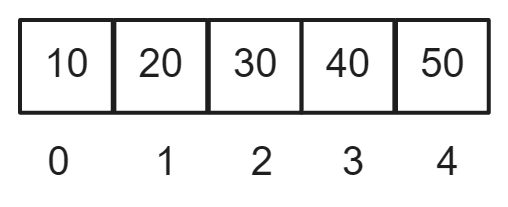

​															图1.1.1

插入元素之前需要先移动元素为新插入的元素腾出位置，元素移动过程中需要定义变量j，j是当前需要移动的元素的下标，j的取值范围是[i-1，length-1]，如图1.1.2所示。

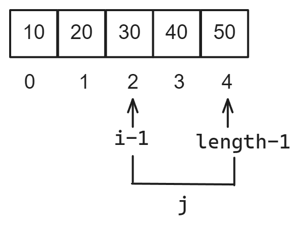

​															图1.1.2

在下标i-1处插入元素26，需要从后往前依次将下标为[ i-1,length-1]中的元素向后移动1个位置，需要从最后1个元素开始向后移动，50移动到下标为5的位置，40移动到下标为4的位置，30移动到下标为3的位置，移动完成之后将26插入在下标i-1的位置，如图1.1.3所示。

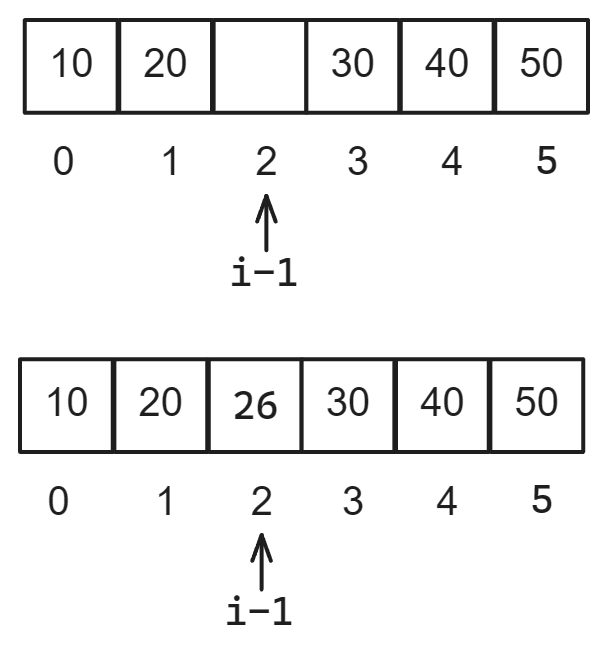

​														图1.1.3

因为是从顺序表中最后1个元素开始向后移动，j的初始值为最后一个元素的下标，最后1个元素的下标为length-1。j 的值是递减的，因此需要设置j--。因为j的值是递减的，所以需要知道j的最小值是多少。j的最小值等于i-1，因此for循环的条件设置为j>=i-1。代码如下：

```c
for(int j=L.length-1;j>=i-1;j--){
    //将下标j指向的元素向后移动1位，移动到j+1处
    //j是当前需要移动的元素下标
    L.R[j+1] = L.R[j];
}
```

如果在顺序表中最后1个元素后面插入元素，则不需要移动任何元素。如图1.1.4所示，在50的后面插入元素就不需要移动任何元素。

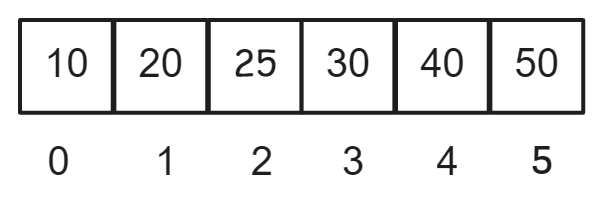

​										图1.1.4

如图1.1.4所示，在顺序表中最后1个元素后面插入元素，插入位置是7，顺序表中元素个数等于6，插入位置等于顺序表元素个数+1，在顺序表中最后1个元素后面插入元素，插入位置等于顺序表元素个数+1。

顺序表中按位置插入元素代码如下：

```c
//在顺序表中第i个位置插入元素key
bool SqListByLocationInsert(SqList &L,int key,int i){
	//判断插入的位置i是否正确
	if(i<1||i>L.length+1){
		return false;
	}
	//判断顺序表是否已满
	if(L.length>=MaxSize){
		return false;
	}
    //如果在顺序表中最后1个元素后面插入元素，则不需要移动任何元素。
    //如果插入位置i等于顺序表元素个数+1说明是在顺序表最后1个元素后面插入元素
    if(i==L.length+1){
        //在下标i-1处插入元素key，这里需要将位置i转换成下标i-1
        L.R[i-1] = key;
        return true;
    }
	//将下标[i-1,length-1]的元素从后往前依次向后移动1个位置
	//j是当前需要移动的元素的下标，j的值是递减的
	//从最后一个元素开始移动，所以j的初始值等于最后一个元素的下标
	//j的最小值为i-1，因此j>=i-1
	for(int j=L.length-1;j>=i-1;j--){
		//将下标j指向的元素向后移动1位，移动到j+1处
		L.R[j+1] = L.R[j];
	}
	//在下标i-1处插入key
	L.R[i-1] = key;
    //顺序表元素个数+1
	L.length++;
	return true;
}
```

​													

### 1.1.5 顺序表的按位置删除元素

在顺序表中第i个位置删除元素key，需要判断位置  i 是否正确，i 的取值范围是[1 , 顺序表元素的个数]，还需要判断顺序表是否为空，如果顺序表为空则不能删除元素。删除完成之后顺序表元素个数减1，删除第 i 个位置的元素就是删除下标为 i -1的元素。

如图1.1.5所示是1个顺序表，i=3，在第i个位置删除元素30，也就是在下标i-1处删除元素30，i-1=2，在下标2处删除元素30。


​								图1.1.5

删除元素需要移动元素，元素移动过程中需要定义变量j，j是当前需要移动的元素的下标，j的取值范围是[i，length-1]，如图1.1.6所示。

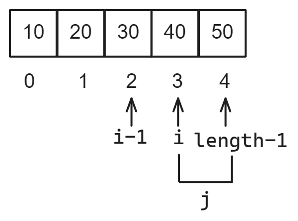

​									图1.1.6

在下标i-1处删除元素30，需要从前往后将下标为[i，length-1]的元素依次向前移动1个位置，需要从删除元素的后继元素开始向前移动，40移动到下标2的位置，50移动到下标3的位置。如图1.1.7所示。

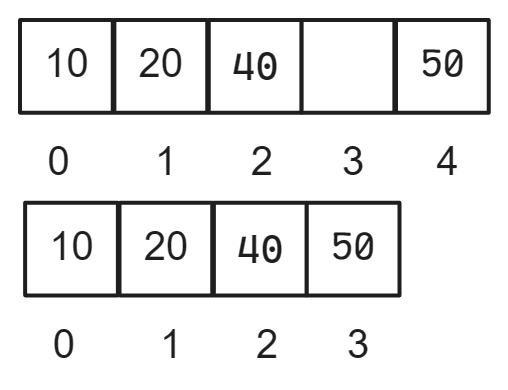

​									图1.1.7

因为是从删除元素的后继元素开始向前移动，j的初始值为删除元素的后继元素的下标，删除元素的后继元素的下标为i。j的值是递增的，因此需要设置j++。因为j的值是递增的，所以需要知道j的最大值是多少。j的最大值等于length-1，因此for循环的条件设置为j<=length-1。代码如下：

```c
for(int j=i;j<=length-1;j++){
    //将下标j指向的元素向前移动1位，移动到j-1处
    //j是当前需要移动的元素的下标
    L.R[j-1] = L.R[j];
}
```

顺序表中按位置删除元素代码如下：

```c
//删除顺序表L中第i个位置的元素
bool SqListByLocationDelete(SqList &L,int i){
	//判断删除的位置是否正确
	if(i<1||i>L.length){
		return false;
	}
	//判断顺序表是否为空
	if(L.length == 0){
		return false;
	}
	//将下标[i,length-1]的元素从前往后依次向前移动1个位置
	//j是当前需要移动的元素的下标，j的值是递增的
	//从要删除的元素的后继元素开始移动，所以j的初始值等于i
	//j的最大值为L.length-1，因此j<=L.length-1
	for(int j=i;j<=L.length-1;j++){
		//将下标j指向的元素向前移动1位，移动到j-1处
		L.R[j-1] = L.R[j];
	}
    //顺序表元素个数-1
	L.length--;	
	return true;
}
```


### 1.1.6 顺序表的按位置修改元素

顺序表的按位置修改元素指的是修改顺序表中第i个位置的元素，i 的取值范围是[1 , 顺序表中元素的个数]，元素的下标等于元素的位置-1，顺序表的按位置修改元素代码如下：

```c
//将顺序表中第i个位置的元素修改成key
//第i个位置就是下标i-1的位置
bool SqListByLocationUpdate(SqList &L,int key,int i){
    //判断修改的位置i是否合法
	if(i<1||i>L.length){
		return false;
	}
    //将下标i-1的元素修改成key
    //将位置i转换成下标i-1
    L.R[i-1] = key;
    return true;
}
```


## 1.2 单链表

### 1.2.1 单链表的定义

什么是单链表？单链表中每个结点由数据域和指针域两个部分组成，数据域用来存放数据元素，指针域用来存放指向下一个结点的指针。为了操作方便通常使用带头结点的单链表。带头结点的单链表有以下特性：（1）头指针L指向头结点。（2）头结点的数据域不存放数据，头结点的指针域存放指向第1个结点的指针。（3）当头结点的指针域为NULL时，说明单链表为空。（4）最后一个结点的指针域为NULL。链表在内存中不需要占用连续的存储空间，每创建1个新结点申请一块内存空间。只要内存容量足够，可以不停的往链表里面插入元素。链表中的结点存储在内存中的任意位置。带头结点的单链表如图1.2.1所示：

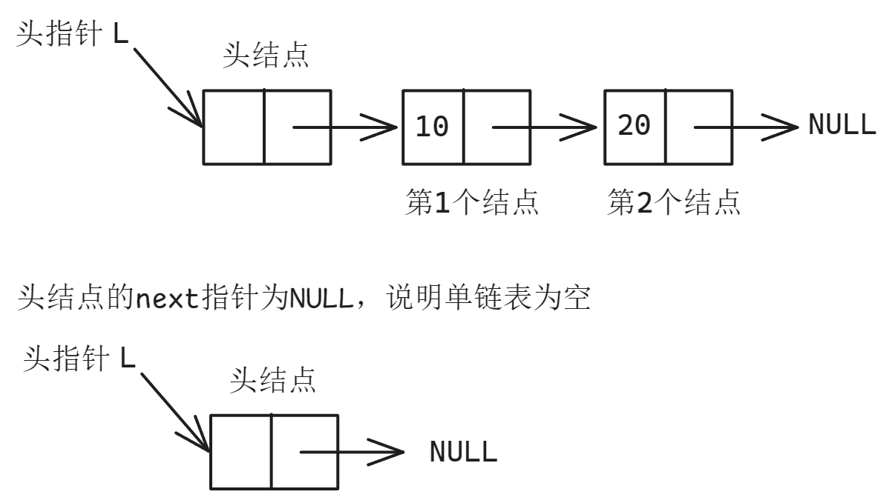

​														图1.2.1

如何使用结构体定义单链表中的结点？需要定义一个int类型的变量data用来存放数据元素，然后定义1个指针用来指向下一个结点。使用结构体定义单链表结点的代码如下:

```c
//定义单链表结点
typedef struct ListNode{
	//数据域
	int data;
	//指针域
	struct ListNode* next;
}ListNode,*LinkList;//*LinkList等价于struct ListNode*
```

还需要定义结构体List用来表示单链表中结点的个数和指向尾部结点的指针，定义指向尾部结点的指针是为了更方便的进行尾插法操作。结构体List的定义如下：

```c
//定义结构体List
typedef struct List{
	//length用来记录单链表中结点的个数
	int length;
	//定义尾指针指向单链表中最后一个结点
	ListNode* rear;
}List;
```


如何判断单链表是否为空？如图1.2.1所示，当头结点的指针域为NULL时，说明单链表为空。判断单链表是否为空的代码如下所示：

```c
//判断单链表是否为空
bool IsEmpty(LinkList &L){
	//单链表为空返回true
	if(L->next==NULL){
		return true;
	//单链表不为空返回false	
	}else{
		return false;
	}
}
```

在往单链表中插入元素之前需要先对单链表进行初始化，单链表初始化需要先创建1个头结点，指向头结点的指针叫做头指针。此时单链表中没有插入元素单链表为空，将头结点的指针域设置为NULL。让尾指针指向头结点，单链表结点个数清零。如图1.2.2所示。

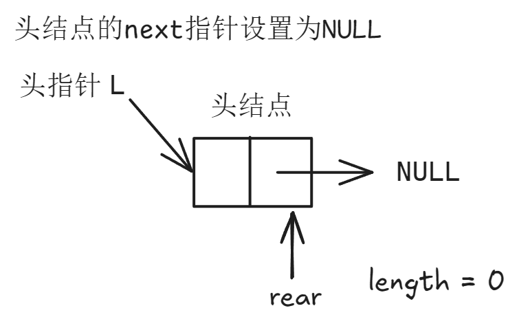

​														图1.2.2

单链表初始化代码如下：

```c
//单链表初始化
void InitList(LinkList &L,List &L2){
	//创建头结点,头指针L指向头结点
	L=(LinkList)malloc(sizeof(ListNode));
    //如果内存满了则申请空间失败
	if(L==NULL){
		return;
	}
	//此时单链表为空，将头结点的指针域设置为NULL
	L->next = NULL;
	//让尾指针指向头结点
	L2.rear = L;
    //此时单链表为空，length设置为0
	L2.length = 0;
}
```


### 1.2.2 单链表的创建

如何创建1个单链表？可以使用头插法或者尾插法，头插法指的是每次在单链表的头结点后面插入新的结点，尾插法指的是每次在单链表的尾部插入新的结点。

使用头插法建立单链表，在头结点后面插入新结点，如图1.2.3，1.2.4所示。

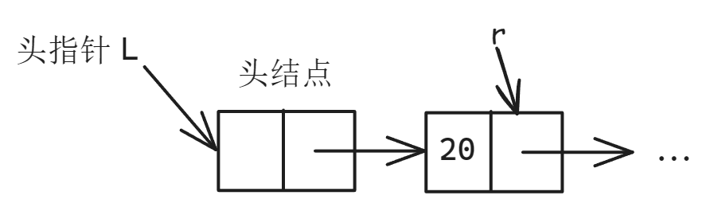

​													图1.2.3

```c
//获取头结点的后继结点
r = L->next;
```

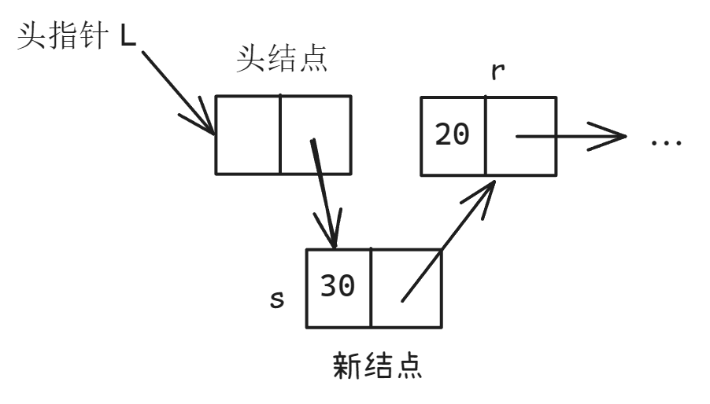

​												  图1.2.4

```c
//给新结点的数据域赋值
s->data = key;
//新结点的next指针指向头结点的后继结点
s->next = r;
//头结点的next指针指向新结点
L->next = s;
```

使用头插法建立单链表的代码如下：

```c
//使用头插法创建单链表
void HeadInsert(LinkList &L,List &L2,int key){
	//获取头结点的后继结点
	LinkList r = L->next;
	//创建新结点
	LinkList s = (LinkList)malloc(sizeof(ListNode));
    //如果内存满了则申请空间失败
	if(s==NULL){
		return;
	}
	//给新结点的数据域赋值
	s->data = key;
	//新结点的next指针指向头结点的后继结点
	s->next = r;
	//头结点的next指针指向新结点
	L->next = s;
	//单链表结点个数+1
	L2.length++;
}
```

使用尾插法建立单链表，在尾结点后面插入新结点，rear指向尾部结点。s指向新结点。

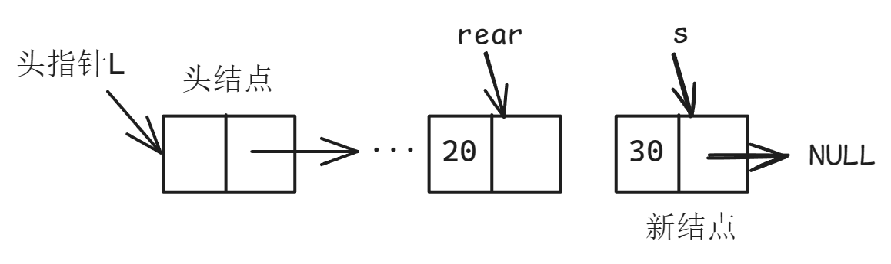

​														图1.2.5

```c
//给新结点的数据域赋值
s->data = key;
//给新结点的指针域赋值,新结点是尾部结点
s->next = NULL;
```

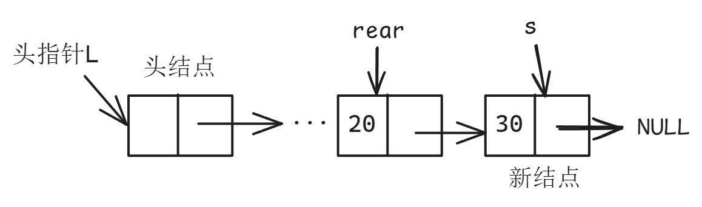

​													图1.2.6

```c
//尾部结点的next指针指向新插入的结点
rear->next = s;
```

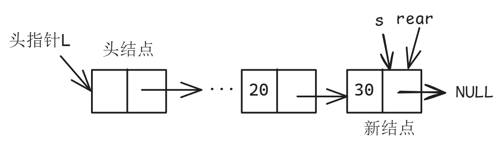

​														图1.2.7

```c
//尾指针指向尾部结点(新插入的结点) 
rear = s;
```

使用尾插法建立单链表的代码如下：

```c
//使用尾插法创建单链表
void RearInsert(LinkList &L,List &L2,int key){
	//创建新结点
	LinkList s = (LinkList)malloc(sizeof(ListNode));
    //如果内存满了则申请空间失败
	if(s==NULL){
		return;
	}
	//给新结点的数据域赋值
	s->data = key;
	//给新结点的指针域赋值,新结点是尾部结点
	s->next = NULL;
	//尾部结点的next指针指向新插入的结点
	L2.rear->next = s;
	//尾指针指向尾部结点
    L2.rear = s;
	//单链表结点个数+1
	L2.length++;
}
```

### 1.2.3 单链表的遍历

单链表的遍历需要定义1个指针p，p指向第一个结点。当p不为NULL时，打印p指向结点的值，然后p指向下一个结点。当p为NULL时，说明单链表遍历完了。单链表的遍历过程如图1.2.8所示，第1次while循环，p指向20，打印结点20的值，
然后p指向下一个结点，第2次while循环，p指向30，打印结点30的值。然后p指向下一个结点。此时p为NULL，while循环结束。单链表遍历完成。

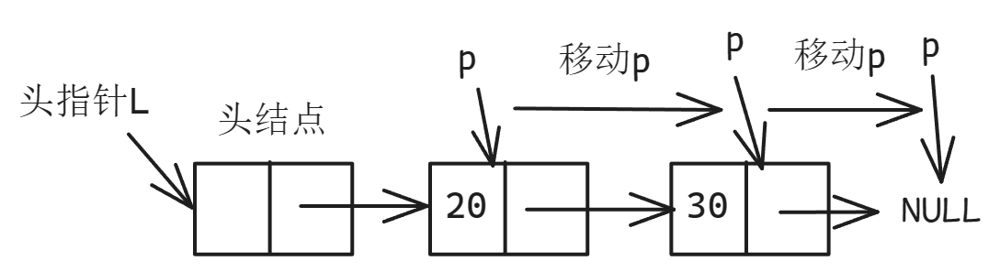

​														图1.2.8	

```c
//获取第一个结点
p = L->next;
//遍历单链表
while(p!=NULL){
    printf("%d" ,p->data);
    p = p->next;
}
```


单链表的遍历代码如下：

```c
//遍历单链表
void ListTraverse(LinkList L){
	//p指向第1个结点
	LinkList p = L->next;
	//当p不为NULL时，说明单链表中还有结点没有遍历
	while(p!=NULL){
		printf("%d ",p->data);
		//p向后移动1位，p指向下一个结点
		p=p->next;	
	}
	printf("\n");
}
```

### 1.2.4 单链表的按位置查找结点的值

单链表的按位置查找结点指的是查找第 i 个结点的值，查找之前需要先判断 i的值是否合法。i 的取值范围是[1 , 单链表中结点个数]。

 查找第i个结点的值，i等于2，头结点看作第0个结点。

（1）j等于0，p指向头结点，0<2， j<i成立执行第1次while循环，p指针移动p指向第1个结点，j++，j等于1。

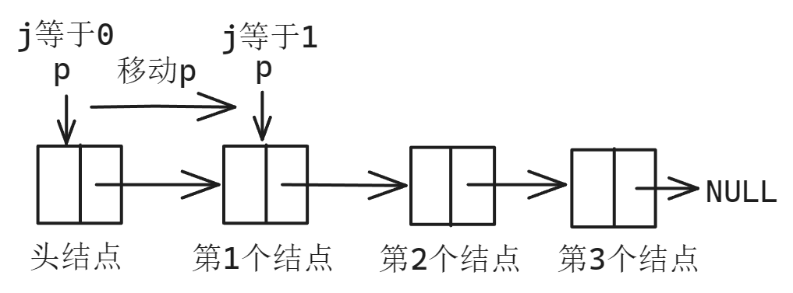

​													图1.2.9

（2）j等于1，p指向第1个结点，1<2， j<i成立执行第2次while循环，p指针移动p指向第2个结点，j++，j等于2。

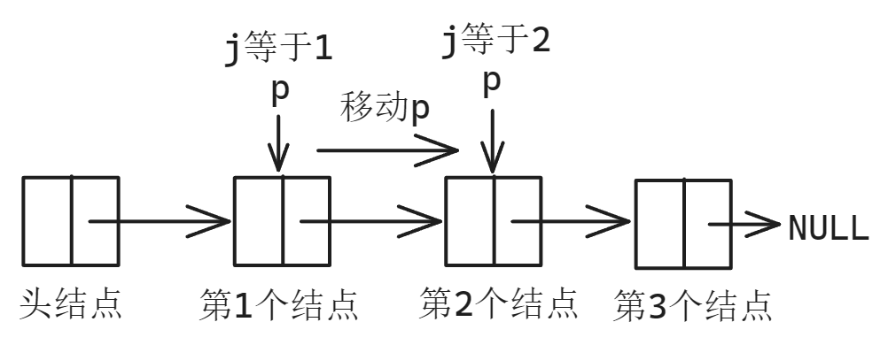

​													  图1.2.10

（3）j等于2，p指向第2个结点，此时j<i不成立while循环结束，此时p指向第i个结点，也就是第2个结点，j等于i说明当前p指向的是第i个结点。

单链表的按位置查找结点代码如下：

```c
//查找第i个结点的值,i的取值范围是[1,单链表中结点个数]
int SelectListByLocation(LinkList L,int i,List &L2){
	//判断i的值是否合法
	if(i<1||i>L2.length){
		return -1;	
	}
	//p指向当前扫描到的结点，while循环开始前，p指向头结点
	LinkList p = L;
	//j用来表示当前p指向的结点是第j个结点，j的初始值为0
	int j = 0;
	//找到第i个结点
	while(j<i){
		//p指向下一个结点
		p=p->next;
		//j指向下一个结点
		j++;
	}
	//程序执行到这里说明j==i，此时p指向第i个结点，获取第i个结点的值
	int key = p->data;
	//返回第i个结点的值
	return key;
}
```

### 1.2.5 单链表的按值查找结点

什么是单链表的按值查找结点？根据数据域的值查找结点。如何按值查找结点？定义指针p，key是要查找的结点的值，p最开始指向第一个结点。如果p指向的结点的值等于key，返回指针p，如果p指向的结点的值不等于key，则p指向下一个结点。如果p等于空，说明key不存在。下面介绍查找成功的例子。

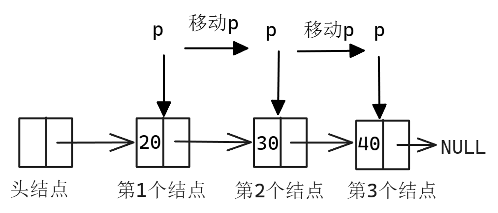

​													 图1.2.11

如图1.2.11所示，查找值为40的结点，while循环开始之前，p指向第1个结点。第1次while循环，p->data==20，p移动p指向第2个结点。第2次while循环，p->data==30，p移动p指向第3个结点。第3次while循环，p->data==40，找到了值为40的结点，此时p指向结点40。

下面介绍查找失败的例子，如图1.2.12所示，查找值为50的结点，while循环开始之前，p指向第1个结点，第1次while循环，p->data==20，p移动p指向第2个结点。第2次while循环，p->data==30，p移动p指向第3个结点。第3次while循环，p->data==40，p移动p指向NULL，说明50在单链表中不存在，查找失败。

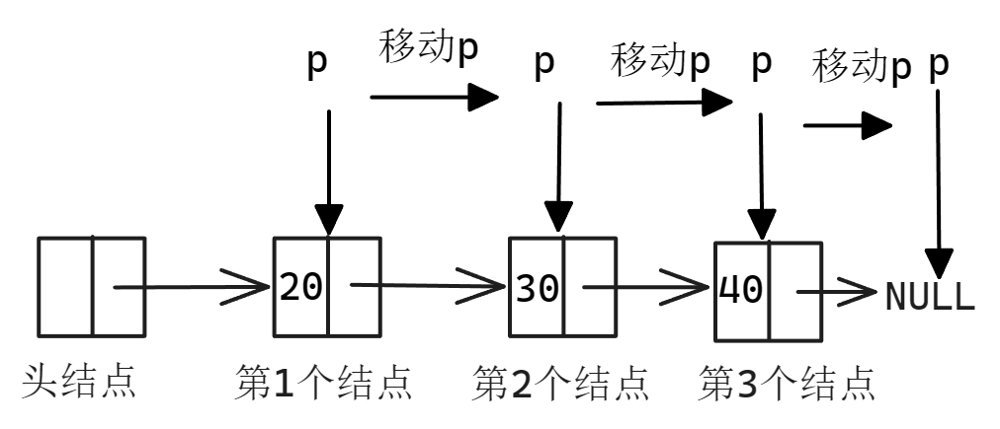


​														图1.2.12


单链表的按值查找结点的代码如下：

```c
//按值查找指定结点，返回值为指向指定结点的指针
LinkList ListByKeySelect(LinkList L,int key){
	//p指向第一个结点
	LinkList p = L->next;
	//查找key
	while(p!=NULL){
		//如果找到了key
		if(p->data ==key){
			return p;
		}else{
			//如果p指向的结点值不为key,则p指向下一个结点
			p = p->next;
		}	
	}
	//程序执行到这里，说明key不存在，此时p等于NULL
	return p;
}
```

### 1.2.6 在单链表指定结点的后面插入结点

在指定结点的后面插入结点，需要先按值查找结点。按值查找结点参见1.2.5小节。找到指定结点后，在指定结点后面插入结点。

在结点p的后面插入新结点q，需要新创建1个新结点q，给q的数据域赋值然后修改指针，如图1.2.13所示。

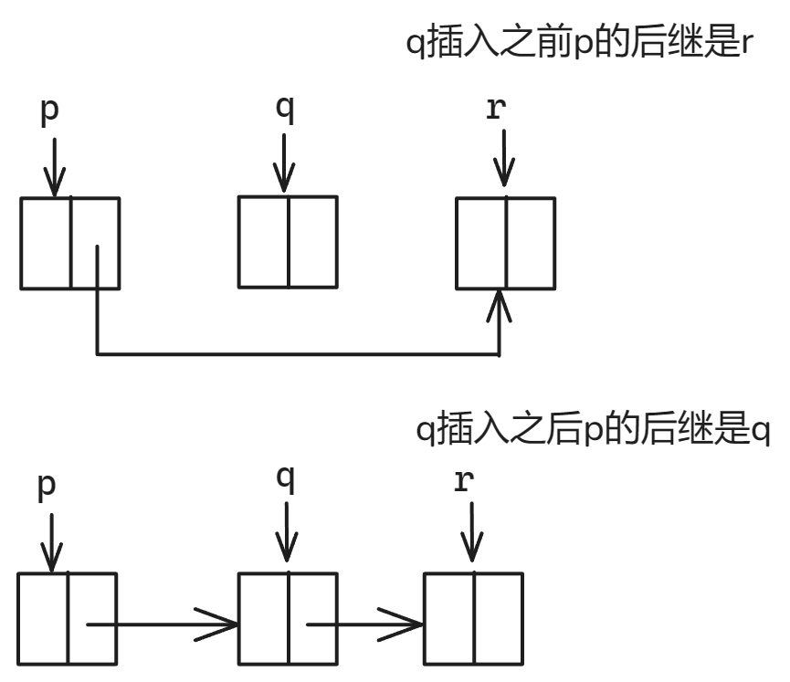

​										                图1.2.13

```c
//给新结点q的数据域赋值
q->data = key;
//获取p的后继结点r
r = p->next;
//新创建的q结点作为r的前驱结点
//q结点的指针域指向r结点
q->next = r;
//新创建的q结点作为p的后继结点
//p结点的指针域指向q
p->next = q;
```

​													

在指定结点p的后面插入结点的代码如下：

```c
LinkList ListNodeBehindInsert(LinkList &p,List &L2,int key){
    //创建1个新结点q
	LinkList q=(LinkList)malloc(sizeof(ListNode));
    //如果内存满了则申请空间失败
	if(q==NULL){
		return NULL;
	}
	//给新结点数据域赋值
	q->data = key;
	//获取p的后继结点r
	LinkList r = p->next;
	//新创建的q结点作为r的前驱结点
	//q结点的指针域指向r结点
	q->next = r;
	//新创建的q结点作为p的后继结点
	//p结点的指针域指向q
	p->next = q;
    //单链表中结点个数+1
	L2.length++;
    //返回新插入的结点q
    return q;
}
```


### 1.2.7 单链表的按位置插入结点

单链表的按位置插入结点指的是在单链表的第i个位置插入结点，在第i个位置插入结点就是在第i - 1个结点后面插入结点，需要先找到第i - 1个结点，查找第i - 1个结点之前需要先判断 i 的值是否正确，i 的取值范围是[1 , 单链表中结点个数+1]。这里的单链表中结点的个数不包括头结点。

```c
//p指向当前扫描到的结点，while循环开始前，p指向头结点
 p = L;
//j用来表示当前p指向的结点是第几个结点，j的初始值为0
//头结点看作第0个结点
j = 0；
//找到第i-1个结点，当j等于i-1时，p指向第i -1个结点
while(j<i-1){
	//p指向下一个结点
	p=p->next;
	j++;
}
```

在第i个位置插入新结点，需要先查找第i-1个结点，i等于3，i-1等于2 ，在第3个位置插入新结点，需要先找到第2个结点。

（1）j等于0，p指向头结点，i -1 = 2 ，j<i-1成立执行第1次while循环，p指针移动p指向第1个结点，j++，j等于1。

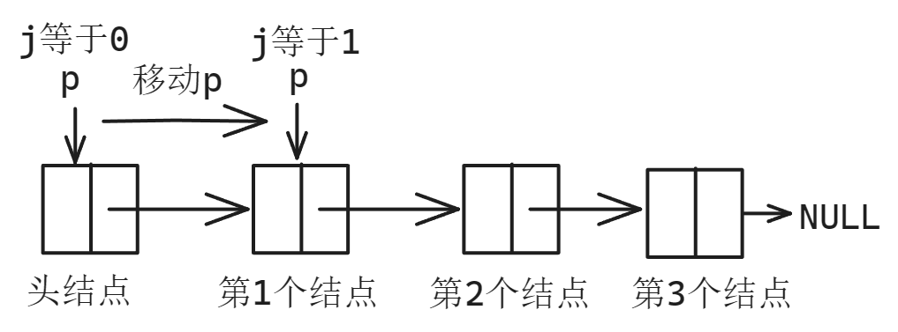

​														  图1.2.14

（2）j等于1，p指向第1个结点，i-1=2， j<i-1成立执行第2次while循环，p指针移动p指向第2个结点，j++，j等于2。


​														图1.2.15

（3）j等于2，p指向第2个结点，此时j<i-1不成立while循环结束，此时p指向第i -1个结点，j等于i-1说明当前p指向的是第i-1个结点。

在单链表的第i个位置插入结点的代码如下：

```c
//在单链表中第i个位置插入结点,i的取值范围是[1,单链表中结点个数+1]
bool ListByLocationInsert(LinkList &L,int i,int key,List &L2){
	//判断i的值是否合法
	if(i<1||i>L2.length+1){
		return false;	
	}
	//p指向当前扫描到的结点，while循环开始前，p指向头结点
	LinkList p = L;
	//j用来表示当前p指向的结点是第j个结点，j的初始值为0
    //头结点看作第0个结点
	int j = 0;
	//找到第i-1个结点
	while(j<i-1){
		//p指向下一个结点
		p=p->next;
		j++;
	}
	//程序执行到这里说明j==i-1，此时p指向第i-1个结点
	//在结点p后面插入新结点
    ListNodeBehindInsert(p,L2,key);
	return true;
}
```


### 1.2.8 单链表的按位置删除结点

单链表的按位置删除结点指的是删除单链表中第i个位置的结点，删除第i个位置结点之前，需要先判断i 的值是否正确，i 的值取值范围是[ 1,单链表中结点的个数 ]。这里的单链表中结点的个数不包括头结点。还需要判断单链表是否为空，如果为空则不能删除。然后查找第 i -1个结点，找到第i-1个结点之后需要修改指针。查找第i-1个结点的方法见1.2.7小节。

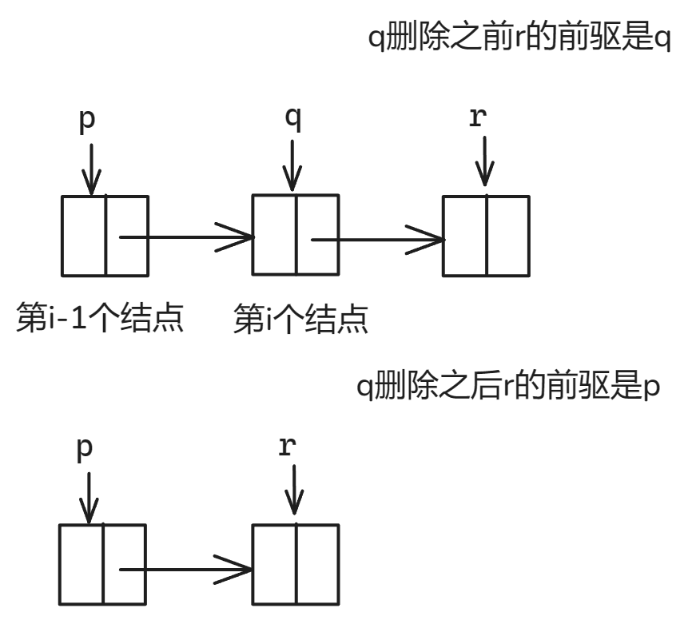

​											          图1.2.16

```c
//p指向第i-1个结点,删除第i个结点
//获取p的后继结点q,q是第i个结点
q = p->next;
//获取q的后继结点r
r = q->next;
//p的指针域指向r，r作为p的后继
p->next = r;
//销毁q结点
free(q);
```


删除单链表中第i个位置的结点代码如下：

```c
//删除单链表中第i个位置的结点,i的取值范围是[1,单链表中结点的个数]。
bool ListByLocationDelete(LinkList &L,int i,List &L2){
	//判断i的值是否合法
	if(i<1||i>L2.length){
		return false;	
	}
    //如果单链表为空，则不能删除
    if(IsEmpty(L)==true){
        return false;
    }
	//p指向当前扫描到的结点，while循环开始前，p指向头结点
	LinkList p = L;
	//j用来表示当前p指向的结点是第j个结点，j的初始值为0
	int j = 0;
	//查找第i-1个结点
	while(j<i-1){
		//p指向下一个结点
		p=p->next;
		j++;
	}
	//程序执行到这里说明j等于i-1,p指向第i-1个结点
	//获取p的后继结点q，q是第i个结点，要删除结点q
	LinkList q = p->next;
	//获取删除结点q的后继结点r
	LinkList r = q->next;
	//p结点的指针域指向结点r
	p->next = r;
	//销毁结点q
	free(q);
    //单链表中结点个数-1
	L2.length--;
	return true;
}
```

### 1.2.9 单链表的按值删除结点

单链表的按值删除结点指的是根据结点数据域的值删除结点。需要先判断单链表是否为空，如果为空则不能删除。按值删除结点需要先找到删除结点的前驱结点。找到前驱结点之后，将前驱结点的next指针指向删除结点的后继结点，最后销毁删除结点。如何找到前驱结点？定义指针p，p最开始指向头结点。定义变量key表示删除结点的值。如果p的后继结点的值等于key，则说明p是删除结点的前驱结点。如果p的后继结点的值不等于key，则p指向下一个结点。如果p的后继结点等于NULL，说明删除结点不存在。

```c
//删除值为key的结点，要求key必须存在
//要找到key的前驱结点
//p最开始指向头结点
 p = L;
//如果p的后继结点不为空并且p的后继结点的值不等于key,则p指向下一个结点
while(p->next!=NULL&&p->next->data!=key){
	p = p->next;
}
//如果p的后继结点等于key，说明p是删除结点key的前驱结点
if(p->next->data==key){
    //获取删除结点q，也就是p的后继结点
    LinkList q = p->next;
    ....
    //删除成功
    return true;
}
//如果p的后继结点为空说明key不存在，此时p指向最后1个结点
if(p->next==NULL){
    //删除失败
    return false;
}
```

删除值为6的结点，此时p指向头结点，p的后继结点的值等于9，9不等于6，p移动p指向第1个结点。

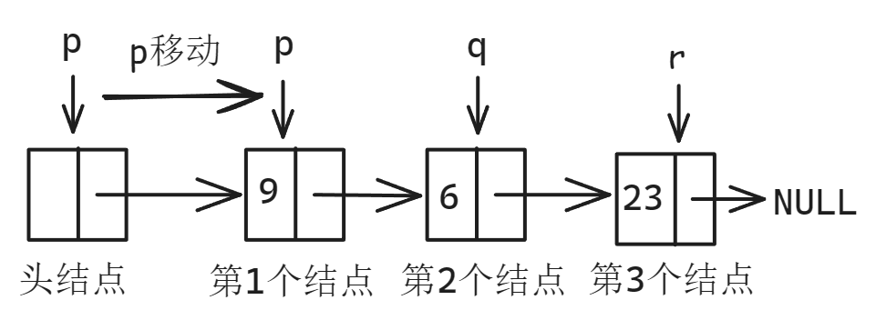

​													  图1.2.17

此时p指向第1个结点，p的后继结点的值等于6，因为要删除的结点的值等于6，此时p指向删除结点的前驱结点。

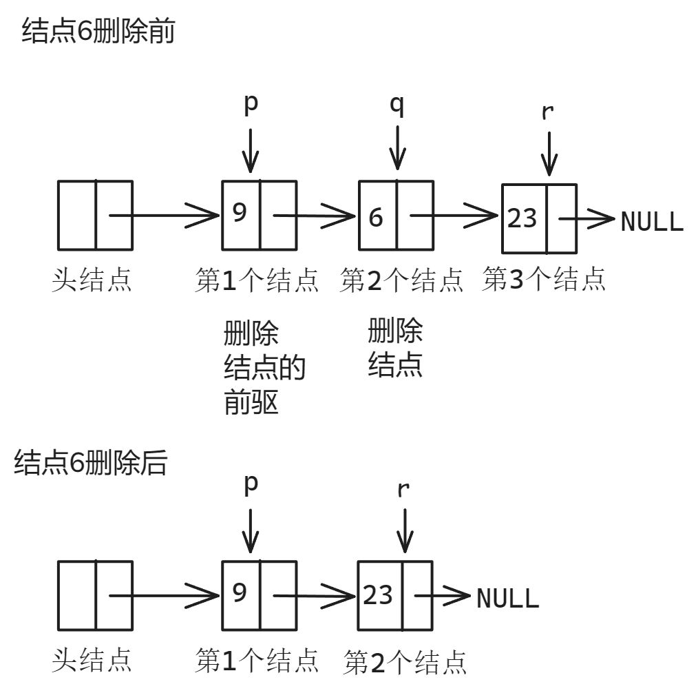

​														图1.2.18

```c
//获取删除结点q
q = p->next;
//获取删除结点q的后继结点r
r = q->next;
//p的next指针指向r
p->next = r;
//销毁q
free(q);
```


单链表的按值删除结点的代码如下：

```c
//删除值为key的结点
bool ListByKeyDelete(LinkList &L,int key,List &L2){
    //如果单链表为空，则不能删除
    if(IsEmpty(L)==true){
        return false;
    }
	//删除值为key的结点，要求key必须存在
	//要找到key的前驱结点
	//p最开始指向头结点
	LinkList p = L;
	//如果p的后继结点不为空并且p的后继结点的值不等于key,则p指向下一个结点
	while(p->next!=NULL&&p->next->data!=key){
		p = p->next;
	}
	//如果p的后继结点等于key，说明p是删除结点key的前驱结点
	if(p->next->data==key){
		//获取删除结点q，也就是p的后继结点
		LinkList q = p->next;
		//获取删除结点q的后继结点r
		LinkList r = q->next;
		//p结点的指针域指向q的后继结点r
		p->next = r;
		//销毁结点q
		free(q);
		L2.length--;
         //删除成功
		return true;
	}
	//如果p的后继结点为空说明key不存在，此时p指向最后1个结点
	if(p->next==NULL){
		//删除失败
		return false;
	}
}
```

### 1.2.10 单链表的按位置修改结点

什么是单链表的按位置修改结点？修改单链表中第i个结点的值。修改单链表中第i个结点的值需要先找到第i个结点，查找第i个结点参见1.2.4小节。找到第i个结点之后，就可以通过指向第i个结点的指针修改结点的值。单链表的按位置修改结点代码如下：

```c
//将单链表中第i个位置的结点修改成key
bool ListByLocationUpdate(LinkList &L,List &L2,int i,int key){
    //判断i的值是否合法
	if(i<1||i>L2.length){
		return false;	
	}
	//p指向当前扫描到的结点，while循环开始前，p指向头结点
	LinkList p = L;
	//j用来表示当前p指向的结点是第j个结点，j的初始值为0
    //头结点看作第0个结点
	int j = 0;
	//查找第i个结点
	while(j<i){
		//p指向下一个结点
		p=p->next;
		//j指向下一个结点
		j++;
	}
    //程序执行到这里说明j==i，此时p指向第i个结点
    //将第i个结点的值修改为key
    p->data = key;
    return true;
}
```


### 1.2.11  单链表的按值修改结点

什么是单链表的按值修改结点？先根据数据域的值查找结点，找到结点之后，就可以通过指向结点的指针修改结点的值。根据数据域的值查找结点参见1.2.5小节。单链表的按值修改结点代码如下：

```c
//单链表的按值修改结点,将value修改为key
bool ListByValueUpdate(LinkList L,int value,int key){
	//p指向第一个结点
	LinkList p = L->next;
	//查找key
	while(p!=NULL){
		//如果找到了value，将value修改为key
		if(p->data ==value){
			//将p指向结点的值修改为key
             p->data = key;
             return true;
		}else{
			//如果p指向的结点值不为key,则p指向下一个结点
			p = p->next;
		}	
	}
	//程序执行到这里，说明key不存在，此时p等于NULL
	return false;
}
```


## 1.3 双向链表

### 1.3.1  双向链表的定义

什么是双向链表？双向链表中每个结点由一个数据域和两个指针域三个部分组成，数据域用来存放数据元素，第一个指针域用来存放指向上一个结点的指针。第二个指针域用来存放指向下一个结点的指针。如图1.3.1所示是双向链表。

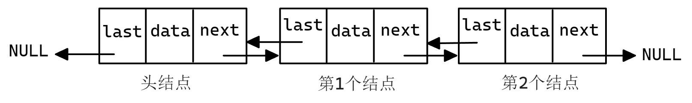

​														图1.3.1

如何使用结构体定义双向链表中的结点？需要定义一个int类型的变量data用来存放数据元素，然后定义1个指针用来指向上一个结点。定义1个指针用来指向下一个结点，使用结构体定义双向链表中的结点代码如下:

```c
//定义双向链表结点
typedef struct DoubleListNode{
	//数据域
	int data;
    //指针last指向上一个结点
    struct DoubleListNode* last;
	//指针next指向下一个结点
	struct DoubleListNode* next;
}DoubleListNode,*LinkList;//LinkList等价于struct DoubleListNode*
```


还需要定义结构体List用来表示双向链表中结点的个数和指向尾部结点的指针，定义指向尾部结点的指针是为了更方便的进行尾插法操作。结构体List的定义代码如下：

```c
//定义结构体List
typedef struct List{
	//length用来记录双向链表中结点的个数
	int length;
	//定义尾指针指向双向链表中最后一个结点
	DoubleListNode* rear;
}List;
```


如何判断双向链表是否为空？当头结点的指针next为NULL时，说明双向链表为空。判断双向链表是否为空的代码如下所示：

```c
//判断双向链表是否为空
bool IsEmpty(LinkList &L){
	//双向链表为空返回true
	if(L->next==NULL){
		return true;
	//双向链表不为空返回false	
	}else{
		return false;
	}
}
```


在往双向链表中插入元素之前需要先对双向链表进行初始化，双向链表初始化需要先创建1个头结点，指向头结点的指针叫做头指针。此时双向链表为空，将头结点的last指针和next指针设置为NULL。让尾指针指向头结点，双向链表结点个数设置为零。双向链表初始化如图1.3.2所示：


​														图1.3.2

双向链表初始化代码如下：

```c
//双向链表初始化
void InitDoubleList(LinkList &L,List &L2){
	//创建头结点,头指针L指向头结点
	L=(LinkList)malloc(sizeof(ListNode));
    //如果内存满了则申请空间失败
	if(L==NULL){
		return;
	}
	//此时双向链表为空，将头结点的指针next设置为NULL
	L->next = NULL;
    //此时双向链表为空，将头结点的指针last设置为NULL
    L->last = NULL;
	//让尾指针指向头结点
	L2.rear = L;
    //单链表结点个数清零
	L2.length = 0;
}
```

### 1.3.2 双向链表的创建

如何创建1个双向链表？可以使用头插法或者尾插法，头插法指的是每次在双向链表的头结点后面插入新的结点，尾插法指的是每次在双向链表的尾部插入新的结点。

使用头插法建立双向链表，在头结点后面插入新结点。


​												     图1.3.3

```c
//获取头结点的后继结点
r = L->next;
```

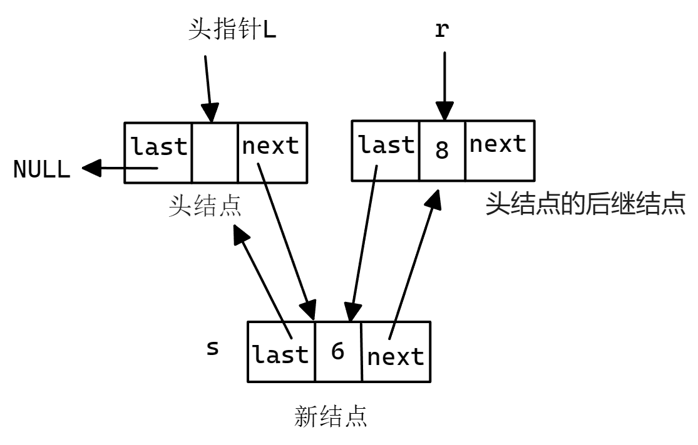

​														图1.3.4

```c
//给新结点的数据域赋值
s->data = key；
//新结点的next指针指向头结点的后继结点
s->next = r;
//新结点的last指针指向头结点
s->last = L;
//头结点的next指针指向新结点
L->next = s;
//如果结点r不为NULL，则结点r的last指针指向新结点
//下面这段代码是为了防止出现空指针异常
//如果插入的新结点是双向链表中第一个结点，则r为NULL
if(r!=NULL){
    r->last = s;
}
```

使用头插法建立双向链表的代码如下：

```c
//使用头插法创建双向链表
void DoubleListHeadInsert(LinkList &L,List &L2,int key){
	//获取头结点的后继结点
	LinkList r = L->next;
	//创建新结点
	LinkList s = (LinkList)malloc(sizeof(ListNode));
    //如果内存满了则申请空间失败
	if(s==NULL){
		return;
	}
	//给新结点的数据域赋值
    s->data = key；
    //新结点的next指针指向头结点的后继结点
    s->next = r;
    //新结点的last指针指向头结点
    s->last = L;
    //头结点的next指针指向新结点
    L->next = s;
   //如果结点r不为NULL，则结点r的last指针指向新结点
   //下面这段代码是为了防止出现空指针异常
   //如果插入的新结点是双向链表中第一个结点，则r为NULL
    if(r!=NULL){
       r->last = s;
    }
	//双向链表结点个数+1
	L2.length++;
}
```

使用尾插法建立双向链表，在尾结点后面插入新结点s，rear指向尾结点。

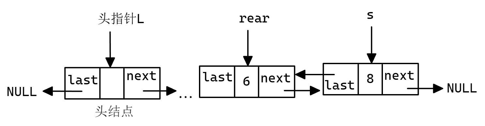

​														图1.3.5

```c
//给新结点s的数据域赋值
s->data = key;
//新结点s是最后一个结点，s的next指针指向NULL
s->next = NULL;
//新结点s的指针last指向尾结点
s->last = rear;
//尾结点rear的next指针指向新结点
rear->next = s;
//rear指针移动，rear指向新结点,新结点成为尾部结点
rear = s;
```

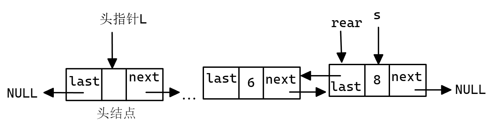

​														图1.3.6

使用尾插法建立双向链表的代码如下：

```c
//使用尾插法创建双向链表
void DoubleListRearInsert(LinkList &L,List &L2,int key){
	//创建新结点
	LinkList s = (LinkList)malloc(sizeof(ListNode));
    //如果内存满了则申请空间失败
	if(s==NULL){
		return;
	}
	//给新结点s的数据域赋值
    s->data = key;
    //新结点s是最后一个结点，s的next指针指向NULL
    s->next = NULL;
    //新结点s的指针last指向尾结点
    s->last = L2.rear;
    //尾结点rear的next指针指向新结点
    L2.rear->next = s;
    //rear指针移动，rear指向新结点,新结点成为尾部结点
    L2.rear = s;
	//双向链表结点个数+1
	L2.length++;
}
```

### 1.3.3 双向链表的遍历

双向链表可以采用从前往后或者从后往前遍历。从前往后遍历和单链表相同。从后往前遍历只适用于尾插法，因为尾插法使用了指针rear，rear指向尾部结点。通过rear可以获取尾部结点，定义指针p，p最开始指向尾部结点，如果p指向的结点的last指针为NULL说明p指向头结点，头结点不存放元素不需要遍历。p指向头结点说明双向链表遍历结束。


​													图1.3.7

如图1.3.7所示，第1次while循环，p指向30，打印结点30的值，然后p指向上一个结点，第2次while循环，p指向20，打印结点20的值。然后p指向上一个结点。此时p->last为NULLwhile循环结束。链表遍历完成。

```c
//获取最后1个结点，p指向尾结点
p = rear;
//遍历单链表
while(p->last!=NULL){
    printf("%d" ,p->data);
    p = p->last;
}
```

双向链表从后往前遍历代码如下：

```c
//遍历双向链表,从后往前遍历,只适用于尾插法创建的链表
void DoubleListTraverse(LinkList L,List L2){
	//p指向尾部结点
	LinkList p = L2.rear;
	//如果p指向的结点的last指针为NULL说明p指向头结点，头结点不存放元素不需要遍历
	while(p->last!=NULL){
		printf("%d ",p->data);
		//p向前移动1位，p指向上一个结点
		p=p->last;	
	}
}
```

双向链表的查找与单链表相同，具体参见1.2.4小节-1.2.5小节

### 1.3.4 在双向链表指定结点的前面或者后面插入结点

在双向链表指定结点的前面或者后面插入结点，需要先按值查找指定结点。按值查找指定结点同单链表，具体参见1.2.5小节。在双向链表指定结点的前面或者后面插入结点需要先调用1.2.5小节的ListByKeySelect函数，ListByKeySelect函数返回值是指向指定结点的指针，需要用变量接收这个返回值。

在结点p的后面插入新结点需要新创建1个新结点q，给q的数据域赋值，然后修改指针。

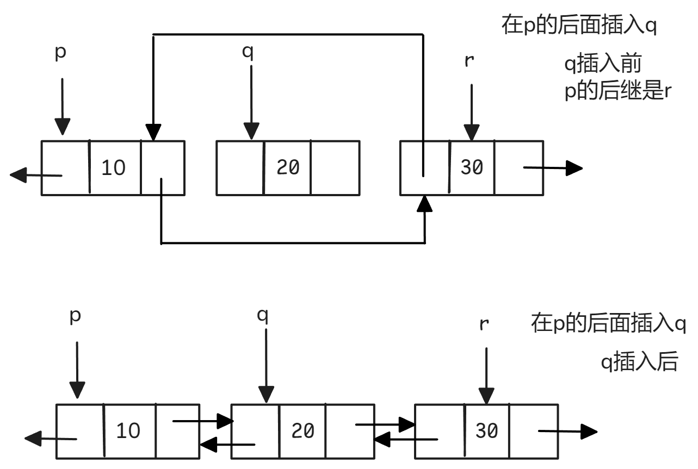

​													  图1.3.8

```c
//获取p的后继结点r
r = p->next;
//给新结点数据域赋值
q->data = key;
//q结点的next指针指向r结点
q->next = r;
//q结点的last指针指向p
q->last = p;
//p结点的next指针指向q
p->next = q;
//如果r不为空，则r结点的last指针指向q
//q插入之前，如果p是最后1个结点，则r为空
//下面这段代码是为了防止空指针异常
if(r!=NULL){
    r->last = q;
}
```

在指定结点后面插入结点的代码如下所示：

```c
LinkList DoubleListNodeBehindInsert(LinkList &p,List &L2,int key){
    //p指向查找到的指定结点，如果p为NULL说明指定结点不存在
    //指定结点如果不存在则无法插入
    if(p==NULL){
        return;
    }
    //创建1个新结点q
	LinkList q = (LinkList)malloc(sizeof(ListNode));
    //如果内存满了则申请空间失败
	if(q==NULL){
		return NULL;
	}
    //获取p的后继结点r
    LinkList r = p->next;
    //给新结点数据域赋值
    q->data = key;
    //q结点的next指针指向r结点
    q->next = r;
    //q结点的last指针指向p
    q->last = p;
    //p结点的next指针指向q
    p->next = q;
    //如果r不为空，则r结点的last指针指向q
    //q插入之前，如果p是最后1个结点，则r为空
    //下面这段代码是为了防止空指针异常
    if(r!=NULL){
        r->last = q;
    }
    //链表中结点个数+1
	L2.length++;
    //返回新插入的结点q
    return q;
}
```

在结点p的前面插入新结点q ，q插入之前p的前驱是r，需要新创建1个新结点q，给q的数据域赋值，然后修改指针。

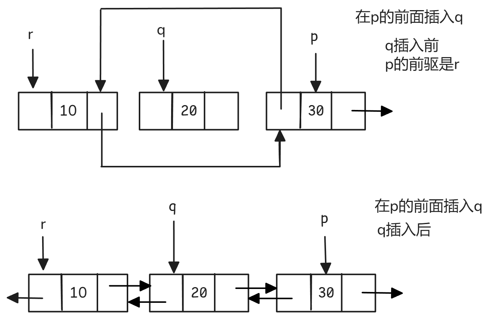

​													图1.3.9

```c
//获取p的前驱结点r
r = p->last;
//给新结点数据域赋值
q->data = key;
//q结点的next指针指向p结点
q->next = p;
//q结点的last指针指向p
q->last = r;
//p结点的last指针指向q
p->last = q;
//r结点的next指针指向q
r->next = q;
```

在指定结点前面插入结点的代码如下：

```c
void DoubleListNodeFrontInsert(LinkList &p,List &L2,int key){
    //p指向查找到的指定结点，如果p为NULL说明指定结点不存在
    //指定结点如果不存在则无法插入
    if(p==NULL){
        return;
    }
    //创建1个新结点q
	LinkList q = (LinkList)malloc(sizeof(ListNode));
    //如果内存满了则申请空间失败
	if(q==NULL){
		return NULL;
	}
    //获取p的前驱结点r
    LinkList r = p->last;
    //给新结点数据域赋值
    q->data = key;
    //q结点的next指针指向p结点
    q->next = p;
    //q结点的last指针指向r
    q->last = r;
    //p结点的last指针指向q
    p->last = q;
    //r结点的next指针指向q
    r->next = q;
    //链表中结点个数+1
    L2.length++;
}
```


### 1.3.5 双向链表的按位置插入结点

双向链表的按位置插入结点指的是在双向链表的第i个位置插入结点，在第i个位置插入结点就是在第i - 1个结点后面插入结点，需要先找到第i - 1个结点，查找第i - 1个结点之前需要先判断 i 的值是否正确，i 的取值范围是[1, 双向链表中结点个数+1]。在第 i个位置插入结点，要求第 i- 1个结点必须存在。双向链表中结点的个数不包括头结点。查找第i - 1个结点的过程参见1.2.7小节 ，当p指向第i  - 1个结点时，此时可以在p的后面插入新的结点。双向链表的按位置插入结点就转变成在指定结点的后面插入结点，在p结点的后面插入结点的过程参见1.3.4小节。

```c
//在双向链表中第i个位置插入结点,i的取值范围是[1,双向链表中结点个数+1]
bool DoubleListByLocationInsert(LinkList &L,int i,int key,List &L2){
	//判断i的值是否合法
	if(i<1||i>L2.length+1){
		return false;	
	}
    //L指向头结点
	//p指向当前扫描到的结点，while循环开始前，p指向头结点
	LinkList p = L;
	//j用来表示当前p指向的结点是第j个结点，j的初始值为0
	int j = 0;
	//找到第i-1个结点
	while(j<i-1){
		//p指向下一个结点
		p=p->next;
		//j的值+1
		j++;
	}
	//程序执行到这里说明j==i-1，此时p指向第i-1个结点
	//在p结点后面插入新结点
    DoubleListNodeBehindInsert(p,L2,key);
    return true;
}
```


### 1.3.6 双向链表的按位置删除结点

双向链表的按位置删除结点指的是删除双链表中第i个位置的结点，删除第i个位置结点之前，需要先判断i 的值是否正确，i 的值取值范围是[ 1,双链表中结点的个数 ]。这里的双链表中结点的个数不包括头结点。然后查找第 i -1个结点，查找第 i -1个结点的过程同单链表具体参见1.2.7小节。

p指向第i -1个结点，删除第i个结点，也就是删除p的后继结点q。

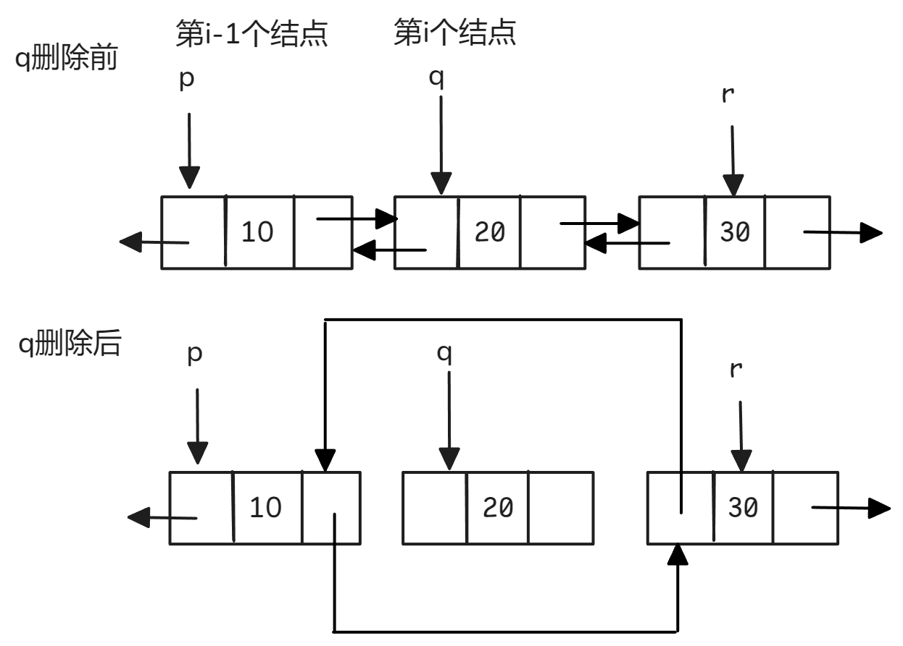

​													图1.3.10

```c
//获取p的后继结点q
q = p->next;
//获取q的后继结点r,q删除之前，r是q的后继
r = q->next;
//p的next指针指向r
p->next = r;
//如果r不为空，则r的last指针指向p
//如果删除的结点q是最后一个结点，则r为空
//下面这段代码是为了防止空指针异常
if(r!=NULL){
    r->last = p;
}
//销毁结点q
free(q);
```

双向链表的按位置删除结点代码如下：

```c
//删除双链表中第i个位置的结点,i的取值范围是[1,双链表中结点的个数]。
bool DoubleListByLocationDelete(LinkList &L,int i,List &L2){
	//判断i的值是否合法
	if(i<1||i>L2.length){
		return false;	
	}
	//p指向当前扫描到的结点，while循环开始前，p指向头结点
    //L指向头结点
	LinkList p = L;
	//j用来表示当前p指向的结点是第j个结点，j的初始值为0
	int j = 0;
	//找到第i-1个结点
	while(j<i-1){
		//p指向下一个结点
		p=p->next;
		//j的值+1
		j++;
	}
	//程序执行到这里说明j等于i-1,p指向第i-1个结点
	//获取p的后继结点q
    LinkList q = p->next;
    //获取q的后继结点r,q删除之前，r是q的后继
    LinkList r = q->next;
    //p的next指针指向r
    p->next = r;
    //如果r不为空，则r的last指针指向p
    //如果删除的结点q是最后一个结点，则r为空
    //下面这段代码是为了防止空指针异常
    if(r!=NULL){
        r->last = p;
    }
    //销毁结点q
    free(q);
    //链表结点个数-1
	L2.length--;
	return true;
}
```

### 1.3.7  双向链表的按值删除结点

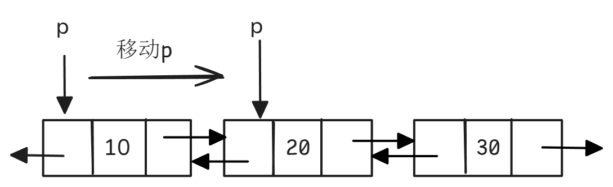

​														图1.3.11

如图1.3.11所示，删除结点20，初始情况下p指向第1个结点10，第1次while循环，p指向的结点值等于10，p移动p指向第2个结点20。第2次while循环，p指向的结点值等于20，p指向的结点就是要删除的结点。然后修改指针。

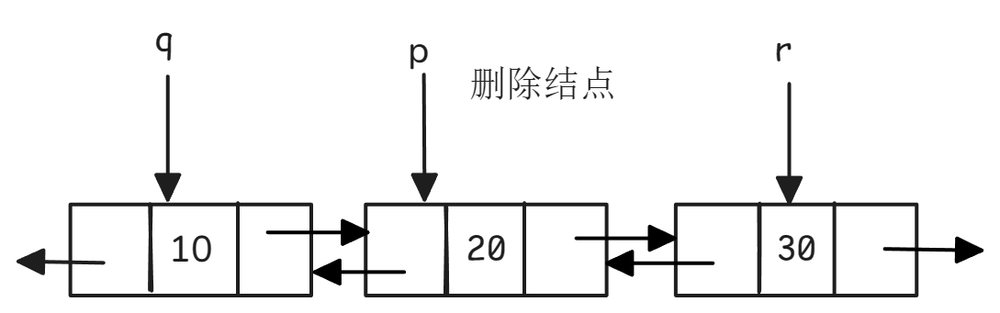

​														图1.3.12

```c
//获取p的前驱结点q
q = p->last;
//获取p的后继结点r
r = p->next;
```

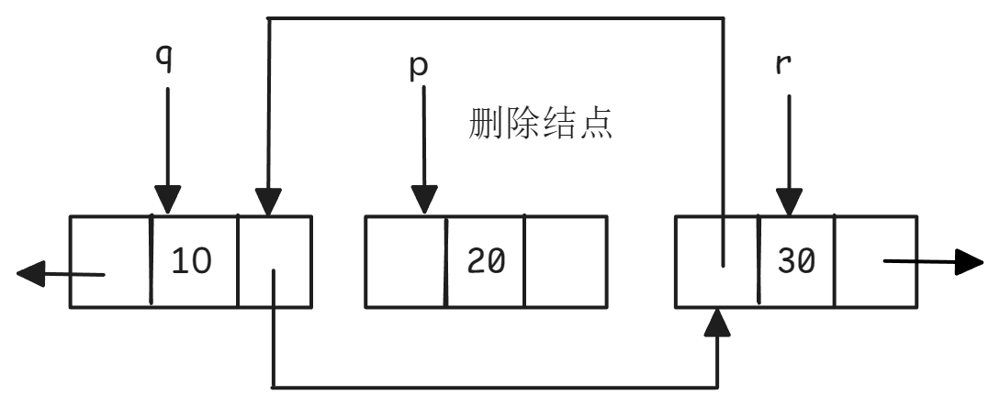

​														图1.3.13

```c
//q的next指针指向r
 q->next = r;
//如果r不为空，则r的last指针指向q
//如果p指向的结点是最后1个结点，则r为空
//下面这段代码是为了防止空指针异常
if(r!=NULL){
    r->last = q;
}
//销毁结点p
free(p);
```

下面介绍删除失败的情况。


​														图1.3.14

删除结点40，初始情况下p指向第1个结点10，第1次while循环，p指向的结点值等于10，p移动p指向第2个结点20。第2次while循环，p指向的结点值等于20，p移动p指向第3个结点30。第3次while循环，p指向的结点值等于30，p移动p指向NULL，说明要删除的结点40不存在。删除失败。

双向链表的按值删除结点代码如下：

```c
//删除值为key的结点
bool DoubleListByKeyDelete(LinkList &L,int key,List &L2){
	//p指向第一个结点
	LinkList p = L->next;
	//查找key
	while(p!=NULL){
		//如果找到了key，此时p指向删除结点
		if(p->data ==key){
			//获取p的前驱结点q
			LinkList q = p->last;
			//获取p的后继结点r
			LinkList r = p->next;
			//q的next指针指向r
			q->next = r;
			//如果r不为空，则r的last指针指向q
			//如果p指向的结点是最后1个结点，则r为空
             //下面这段代码是为了防止空指针异常
			if(r!=NULL){
				r->last = q;
			}
			//销毁结点p
			free(p);
			return true;
		}else{
			//如果p指向的结点值不为key,则p指向下一个结点
			p = p->next;
		}	
	}
	//程序执行到这里，说明key不存在，此时p等于NULL
	return false;
}
```

双向链表的修改同单链表，具体参见1.2.10-1.2.11小节。


