# 第3章 字符串

## 3.1 字符串的简单介绍

### 3.1.1 字符串的基本概念

字符串简称串，字符串是由多个字符组成的有限序列。子串是串中若干个连续的字符组成的有限序列。串通常用双引号括起来。在串"abcdfg"中，"abc" "bcd"  "cdfg"就是子串。


### 3.1.2 串的结构体定义

C语言中使用字符数组存储串中的字符。串的结构体中需要定义两个成员，1个字符数组用来存储字符串，一个int变量length用来存储串中字符的个数。串的结构体定义代码如下：

```c
#define MaxSize 100
//定义字符串的结构体
typedef struct Str{
	//定义字符数组存储字符串
	char ch[MaxSize];
	//定义length存储串中字符的个数
	int length;
}Str;
```

使用strcopy函数可以将一个字符串拷贝到字符数组中，代码如下：

```c
int main(){
    //声明1个字符串
	Str str;
	//使用strcopy函数将字符串"abcdefg"拷贝到字符数组中
	strcpy(str.ch,"abcdefg");
    return 0;
}
```

使用strlen函数可以获取字符串的长度，代码如下：

```c
int main(){
	Str str;
	//使用strcopy函数将字符串"abcdefg"拷贝到字符数组中
	strcpy(str.ch,"abcdefg");
	//使用strlen函数获取字符串的长度
    str.length = strlen(str.ch);
    return 0;
}
```

## 3.2 字符串的朴素模式匹配

被搜索的字符串叫主串，要查找的字符串叫模式串。比如在字符串"abcde"中查找"cde"的位置，"abcde"是主串，"cde"是模式串。字符串的模式匹配指的是在主串中查找模式串，并返回模式串在主串中的位置。字符串的朴素模式匹配是通过暴力求解的方法查找模式串在主串中的位置，将主串中所有长度等于模式串长度的子串依次与模式串进行比较，如果匹配成功则返回模式串在主串中的起始位置。下面通过1个例子讲解字符串的朴素模式匹配算法匹配成功的案例。

定义变量i表示子串中字符的下标，定义变量j表示模式串中字符的下标。定义变量k表示当前与模式串比较的子串的起始下标。也就是说k指向当前子串的起始位置。定义m表示主串的长度，定义n表示模式串的长度，k的最小值是0，k的最大值是m-n，j的最小值是0，j的最大值是n-1，i的最小值是0，i的最大值是m-1。如图3.2.1所示，主串是"bcbcbdf"，模式串是"bcbd"，查找模式串在主串中的起始位置。


​														图3.2.1														 

如图3.2.2所示，进行第1轮比较：
比较主串中的子串"bcbc"与模式串"bcbd"，i=0，j=0，k=0，s.ch[ i ]==t.ch[ j ]，i++，j++，i=1，j=1。

i=1，j=1，s.ch[ i ]==t.ch[ j ]，i++，j++，i=2 ，j=2。

i=2，j=2，s.ch[ i ]==t.ch[ j ]，i++，j++ ，i=3 ，j=3。

i=3，j=3，因为s.ch[ i ]!=t.ch[ j ]，需要修改i和j的值。因为k指向当前子串的起始位置，执行k++，k=1，k指向下一个子串的起始位置，i=k，i=1，i指向下一个子串的起始位置，j指向模式串的起始位置，j=0，继续第2轮比较。

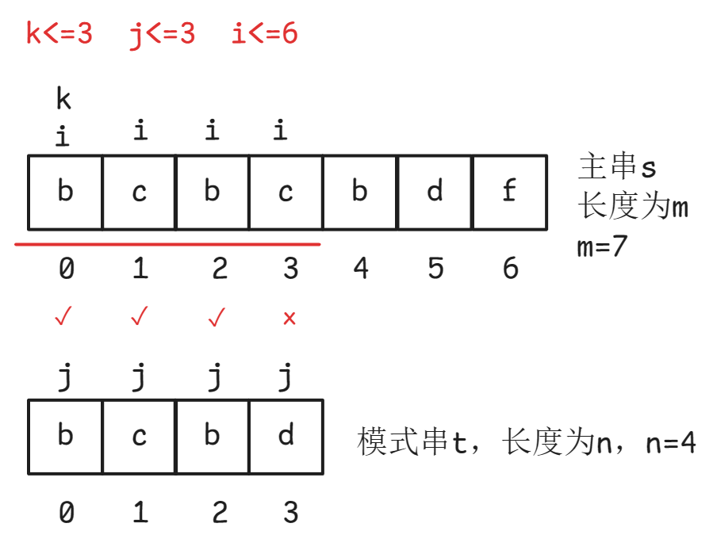

​														图3.2.2

如图3.2.3所示，进行第2轮比较：
比较主串中的子串"cbcb"与模式串"bcbd"，i=1，j=0，k=1，因为s.ch[ i ] != t.ch[ j ]，需要修改i和j的值。因为k指向当前子串的起始位置，执行k++，k=2，k指向下一个子串的起始位置，i=k，i=2，i指向下一个子串的起始位置，j指向模式串的起始位置，j=0，继续第3轮比较。

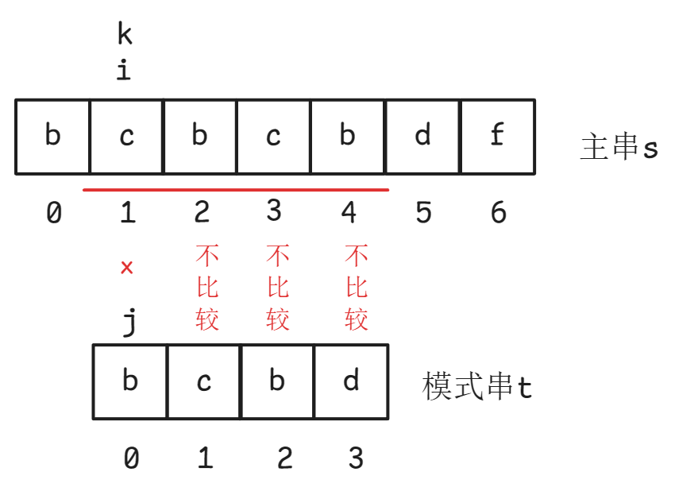

​														图3.2.3

如图3.2.4所示，进行第3轮比较：
比较主串中的子串"bcbd"与模式串"bcbd"，i=2，j=0，k=2，s.ch[ i ]==t.ch[ j ]，i++，j++，i=3，j=1。

i=3，j=1，s.ch[ i ]==t.ch[ j ]，i++，j++，i=4，j=2。

i=4，j=2，s.ch[ i ]==t.ch[ j ]，i++，j++，i=5，j=3。

i=5，j=3，s.ch[ i ]==t.ch[ j ]，i++，j++，i=6，j=4。

j>n-1，j<=n-1不成立，j越界了，此时子串与模式串匹配成功。k的值就是模式串在主串中的起始下标。

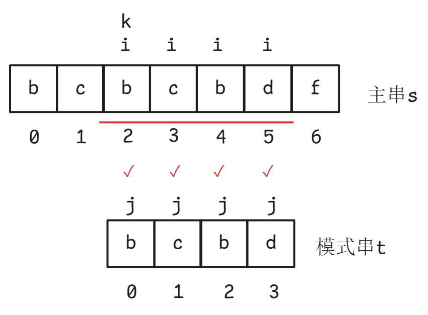

​														图3.2.4

下面通过1个例子讲解字符串的朴素模式匹配算法匹配失败的案例。如图3.2.5所示，主串是"bcbcd"，模式串是"bda"，查找模式串在主串中的起始位置。定义变量i表示子串中字符的下标，定义变量j表示模式串中字符的下标。定义变量k表示当前子串的起始下标。定义m表示主串的长度，定义n表示模式串的长度，k的最小值是0，k的最大值是m-n，j的最小值是0，j的最大值是n-1，i的最小值是0，i的最大值是m-1。

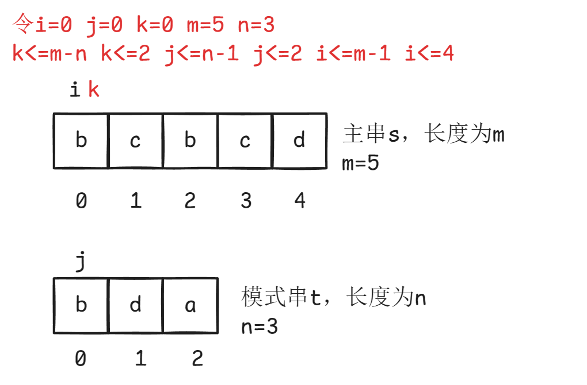

​														 图3.2.5	

如图3.2.6所示，进行第1轮比较：
比较主串中的子串"bcb"与模式串"bda"，i=0，j=0，k=0，s.ch[ i ]==t.ch[ j ]，i++ j++，i=1，j=1。

i=1，j=1，s.ch[ i ]!=t.ch[ j ]，需要修改i和j的值。因为k保存的是当前子串的起始下标，执行k++，k=1，k指向下一个子串的起始位置，i=k，i=1，i指向下一个子串的起始位置，j指向模式串的起始位置，j=0，继续第2轮比较。

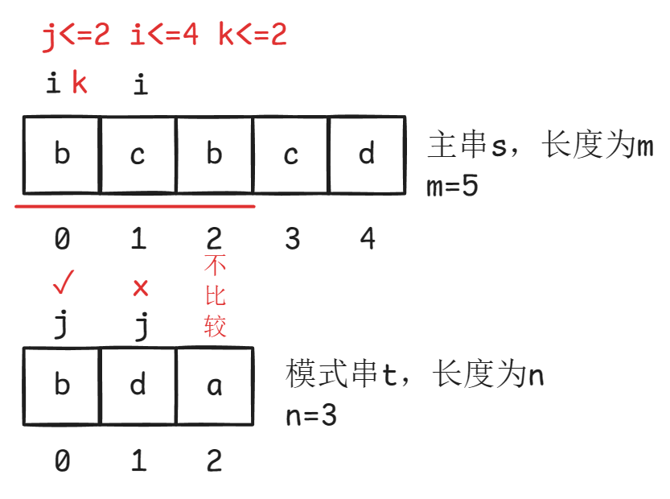

​														图3.2.6

如图3.2.7所示，进行第2轮比较：
比较主串中的子串"cbc"与模式串"bda"，i=1，j=0，k=1，s.ch[ i ]!=t.ch[ j ]。需要修改i和j的值。因为k保存的是当前子串的起始下标，执行k++，k=2，k指向下一个子串的起始位置，i=k，i=2，i指向下一个子串的起始位置，j指向模式串的起始位置，j=0，继续第3轮比较。

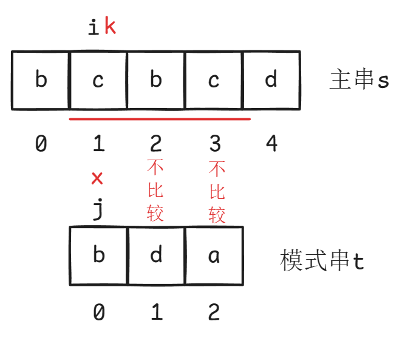

​													      图3.2.7

如图3.2.8所示，进行第3轮比较：
比较主串中的子串"bcd"与模式串"bda"，i=2，j=0，k=2，s.ch[ i ]==t.ch[ j ]，i++，j++，i=3，j=1。

i=3，j=1，s.ch[ i ]!=t.ch[ j ]，需要修改i和j的值。因为k保存的是当前子串的起始下标，执行k++，k=3，k指向下一个子串的起始位置，i=k，i=3，i指向下一个子串的起始位置，j指向模式串的起始位置，j=0，继续第4轮比较。此时k=3，k>m-n，k<=m-n不成立k越界了，此时子串的长度小于模式串的长度无需比较，说明模式串在主串中不存在。


​														图3.2.8

字符串的朴素模式匹配代码如下：

```c
#include <stdio.h>
#include <string.h>
#define MaxSize 100
//定义字符串的结构体
typedef struct Str{
	//定义字符数组存储字符串
	char ch[MaxSize];
	//定义length表示字符串的长度
	int length;
}Str;
//s是主串，t是模式串
int NaiveModeMatching(Str s,Str t){
	//m是主串的长度，n是模式串的长度
	int m = s.length;
	int n = t.length;
	//定义变量i表示子串中字符的下标，定义变量j表示模式串中字符的下标。
	//定义变量k表示当前子串的起始下标。
	int i=0,j=0,k=0;
	//k的最小值是0，k的最大值是m-n,j的最小值是0，j的最大值是n-1
	//i的最小值是0，i的最大值是m-1
	while(k<=m-n&&j<=n-1&&i<=m-1){
		//如果子串中的字符等于模式串中的字符，则i和j都加1，继续比较后续字符
		if(s.ch[i]==t.ch[j]){
			i++;
			j++;
		/*如果子串中的字符不等于模式串中的字符，则需要修改i和j的值，将下一个子串与模式串进行比较。
		因为k保存的是当前子串的起始下标，执行k++，k等于下一个子串的起始下标，k指向下一个子串的起始位置。
		i=k，i指向下一个子串的起始位置，j指向模式串的起始位置，j=0。
		*/
		}else{
		 	k++;
			i=k;
			j=0;
		}
	}
	//如果j>n-1说明j越界了则while循环结束，说明子串与模式串匹配成功
	//k的值就是模式串在主串中的起始下标
	if(j>n-1){
		return k;
	//如果k>m-n则k<=m-n不成立，此时子串的长度小于模式串的长度无需比较，说明模式串在主串中不存在	
	}else{
		return -1;
	}
}
int main(){
	//定义主串
	Str s;
	//使用strcopy函数拷贝字符串
	strcpy(s.ch,"bcbcbdf");
	//使用strlen获取字符串的长度
	s.length = strlen(s.ch);
	//定义模式串
	Str t;
	//使用strcopy函数拷贝字符串
	strcpy(t.ch,"bcbd");
	//使用strlen获取字符串的长度
	t.length = strlen(t.ch);
	//查找模式串在主串中的起始位置
	int index = NaiveModeMatching(s,t);
	printf("%d",index);
	return 0;
}
```

## 3.3 KMP算法

### 3.3.1  最长相等前后缀

前缀是一个字符串中包含首个字符但不包含自身的所有子串。后缀是一个字符串中包含最后1个字符但不包含自身的所有子串。比如字符串"aabaa"，前缀是{"a","aa","aab","aaba"}，后缀是{"a","aa","baa","abaa"}，"aabaa"是字符串本身不是前缀也不是后缀。相等前后缀是一个字符串中前缀与后缀相同的部分。字符串"aabaa"的相等前后缀是"a"和"aa"，最长相等前后缀是一个字符串中前缀与后缀相同的部分中最长的部分。"aabaa"的相等前后缀"a"的长度是1，"aabaa"的相等前后缀"aa"的长度是2，因此"aabaa"的最长相等前后缀是"aa"，"aabaa"的最长相等前后缀的长度是2。通过最长相等前后缀的长度可以提高字符串匹配的速度。

主串是"abcababcabd"，模式串是"abcabd"，i用来表示主串中字符的下标，j用来表示模式串中字符的下标。i==0，j==0时匹配成功，i==1，j==1时匹配成功，i==2，j==2时匹配成功，i==3，j==3时匹配成功，i==4，j==4时匹配成功，i==5，j==5时匹配失败，主串下标i不回退，模式串下标j回退。因为主串中的abcab与模式串abcab已经匹配上了，已经匹配成功的子串abcab的最长相等前后缀是ab，最长相等前后缀的长度是2，主串中下标3-4的字符串等于模式串中下标0-1的字符串，模式串下标j回退到下标2的位置，总结：当主串的某一位字符与模式串的某一位字符匹配失败后，需要利用主串与模式串已经匹配的信息，如果主串与模式串已经匹配的部分最长相等前后缀的长度大于0，主串与模式串已经匹配的部分最长相等前后缀的长度用k表示，则模式串下标j回退到下标k的位置。

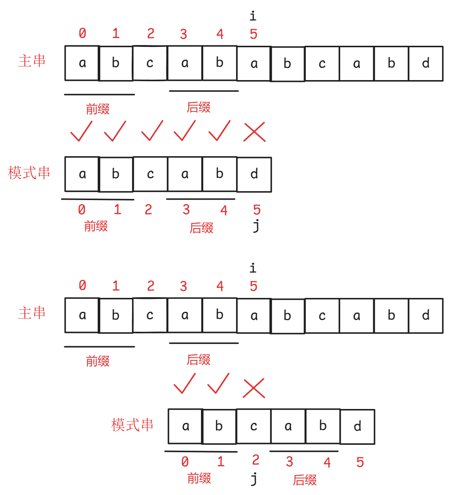

​													图3.3.1

此时i==5，j==2，匹配失败，主串与模式串已经匹配上的部分是ab，已经匹配上的部分ab的最长相等前后缀的长度等于0，因此i不回退，j回退到下标0的位置。总结：当主串的某一位字符与模式串的某一位字符匹配失败后，需要利用主串与模式串已经匹配的信息，如果主串与模式串已经匹配的部分最长相等前后缀的长度等于0，则模式串下标j回退到下标0的位置。如图3.3.2所示，主串中的子串abcabd与模式串abcabd匹配成功。


​															图3.3.2

### 3.3.2 next数组的计算

在3.3.1小节中讲解了在kmp算法中，当出现不匹配时，i 不回退，j 回退的位置就是 j 之前的子串中最长相等前后缀的长度。将模式串中每个字符之前的子串中最长相等前后缀的长度存储在1个数组中，这个数组的名字叫next[ ]数组。在模式串中，如果在下标 j 的位置和主串匹配失败，则 j 回退的位置等于next[ j ] 。next[ j ]存储的是 j 之前的子串中最长相等前后缀的长度。next数组值的计算结果如图3.3.3所示：

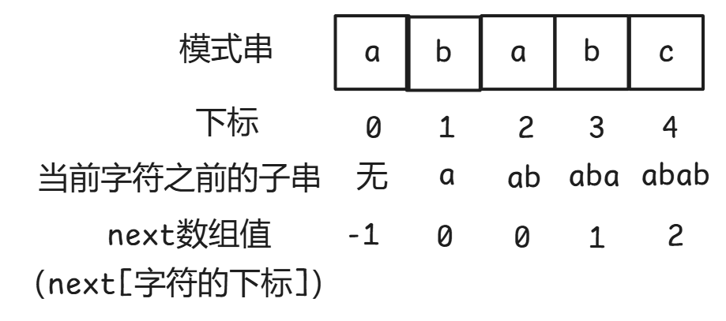

​															图3.3.3

next数组中每个元素的下标就是模式串中每个字符的下标，如图3.3.3所示，next[0] =-1表示下标0对应的字符a之前的子串的最长相等前后缀的长度是0，标记为-1而不是0是为了方便实现代码。next[1]=0表示下标1对应的字符b之前的子串的最长相等前后缀的长度是0，next[2]=0表示下标2对应的字符a之前的子串的最长相等前后缀的长度是0，next[3]=1表示下标3对应的字符b之前的子串的最长相等前后缀的长度是1，next[4]=2表示下标4对应的字符c之前的子串的最长相等前后缀的长度是2。														

如图3.3.3所示，求模式串中每个字符对应的next数组值就是求每个字符之前的子串的最长相等前后缀的长度。下标0对应的字符a之前没有子串，因此next[ 0 ]  = -1，下标1对应的字符b之前的子串是a，子串a没有前缀和后缀因为前缀和后缀不能包含自身。子串a的最长相等前后缀的长度是0，因此next[ 1 ]=0。下标2对应的字符a之前的子串是ab，子串ab的最长相等前后缀的长度是0，因此next[ 2 ] =0。下标3对应的字符b之前的子串是aba，子串aba的最长相等前后缀的长度是1，因此next[ 3 ]=1。下标4对应的字符c之前的子串是abab，子串abab的最长相等前后缀的长度是2，因此next[ 4 ]=2。

### 3.3.3 next数组的实现

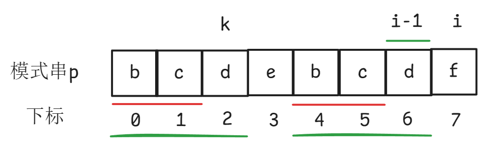

​														图3.3.4

如图3.3.4所示，i = 7，i -1 = 6，已知next[i-1] = 2，k=2，k保存的是i的前一位的next值，求next[ i ]，根据前1位的next值求当前位的next值。因为p[2] =p[6]，所以next[ i ]  =  k+1=3。

总结：已知next[i-1]=k，此时的k保存的是i的前1位的next值 ，如果p[k] = p[i-1]成立，则next[i] =k+1，执行k=next[i]，此时的k保存的是下标为i的字符所对应的next值，执行i++，求下一个字符所对应的next值。此时的k保存的是 i 的前1位的next值。

如图3.3.5所示，i = 7，i -1 = 6，已知next[i-1] =2，k=2，k保存的是i的前一位的next值，求next[i]，根据前1位的next值求当前位的next值。因为p[2] !=p[6]，k=next[k] = next[2] =0，k回退到下标0的位置。如图3.3.6所示。


​														图3.3.5

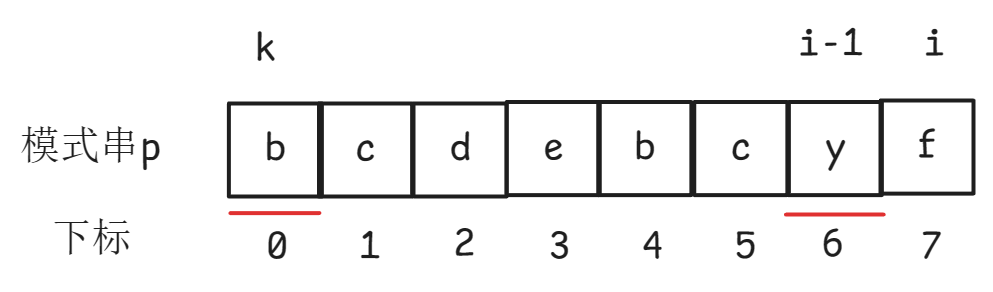

​														 图3.3.6

如图3.3.6所示，此时p[k] != p[ i-1 ] ，k=next[k]=next[0]= -1 ，k回退到下标-1的位置，此时k停止回退，next[ i ]=0。如图3.3.7所示。

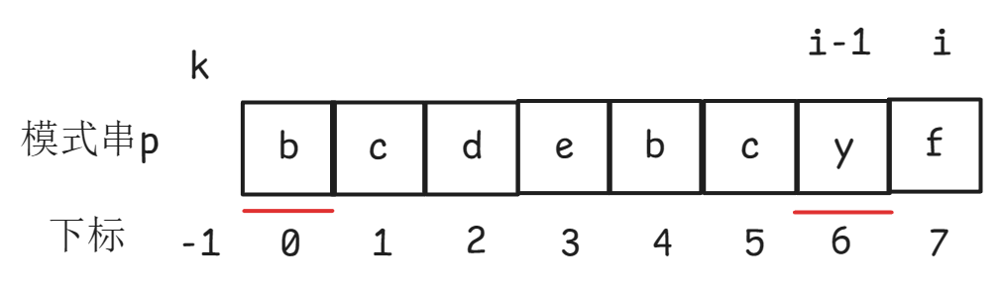

 															图3.3.7

总结：已知next[ i-1]=k ，此时的k保存的是i的前1位的next值 ，如果p[k] ！= p[i-1] ，则k=next[k] ，k回退到下标next[k]的位置 ，如果p[k] ！= p[i-1]，则k一直回退，当k=-1，则k停止回退，next[ i ]=0。执行k=next[i]，此时的k保存的是下标为i的字符所对应的next值，执行i++，求下一个字符所对应的next值。此时的k保存的是i的前1位的next值。


如图3.3.8所示，i = 7，i -1 = 6，已知next[i-1] = 2，k=2，k保存的是i的前一位的next值，求next[ i ]，根据前1位的next值求当前位的next值。因为p[2] ！=p[6]，所以k=next[k]=next[2]=0， k回退到下标0的位置。如图3.3.9所示。

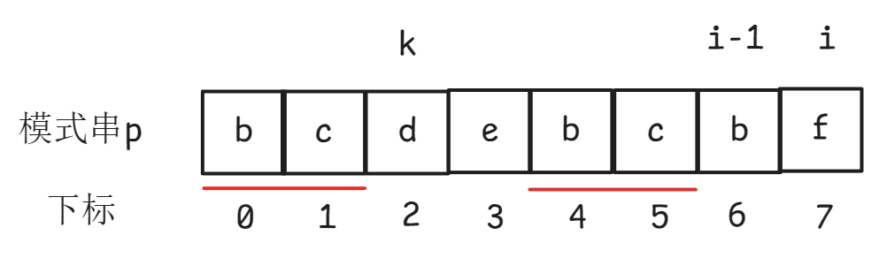

​														  图3.3.8

如图3.3.9所示，此时p[k] = p[i-1] ，k停止回退，next[i]=k+1=1。

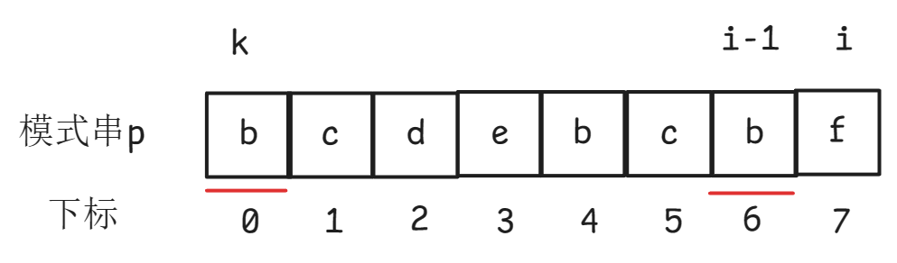

​														    图3.3.9

总结：已知next[i-1]=k ，此时的k保存的是i的前1位的next值，如果p[k] ！= p[i-1] ，则k=next[k]， k回退到下标next[k]的位置 ，当p[k] = p[i-1]，则k停止回退，next[i]=k+1。															

next数组值的计算代码如下：

```c
#include <stdio.h>
#include <string.h>
#define MaxSize 100
//定义字符串的结构体
typedef struct Str{
	//定义字符数组存储字符串
	char ch[MaxSize];
	//定义length表示字符串的长度
	int length;
}Str;
//p代表模式串，len是模式串的长度 根据前1位的next值求当前位的next值
void getNext(Str p,int len,int next[]){
	//next数组下标为0的元素的值设置为-1
	next[0] =-1;
	//next数组下标为1的元素的值设置为0
	next[1] = 0;
	//求下标为2-（len-1）的next值
	int i = 2;
	//k保存的是i的前1位的next值，因为从下标2的位置开始求next值，下标2的前1位的next值是0，因此k的初始值设置为0
	int k = 0;
	while(i<=len-1){
		//如果p.ch[k] ==p.ch[i-1]成立, k不需要回退 ,next[i] =k+1
		if(p.ch[k] ==p.ch[i-1]){
			next[i] = k+1;
			//执行k=next[i]，此时的k保存的是下标为i的字符所对应的next值
			k = next[i];
			//执行i++，求下一个字符所对应的next值。此时的k保存的是i的前1位的next值  
			i++;
		}else if(k==-1){
			//当k=-1，则k不需要回退，next[i]=0
			next[i] = 0;
			//执行k=next[i]，此时的k保存的是下标为i的字符所对应的next值
			k = next[i];
			//执行i++，求下一个字符所对应的next值。此时的k保存的是i的前1位的next值
			i++;
		}else{
			//如果p.ch[k] !=p.ch[i-1],k回退到下标next[k]的位置
			//如果p.ch[k] !=p.ch[i-1] 则k一直回退。
			k = next[k];
		}
	}
}

int main(){
	int next[MaxSize];
	Str p;
	//使用strcopy函数拷贝字符串
	strcpy(p.ch,"aabaaf");
	//使用strlen获取字符串p的长度
	p.length = strlen(p.ch);
	//求next数组
	getNext(p,p.length,next);
	//遍历next数组,next数组元素的个数就是字符串p的长度
	for(int i=0;i<p.length;i++){
		printf("%d ",next[i]);
	}
	return 0;
}
```

### 3.3.4  kmp算法的实现

主串是"bcbcbdf"，模式串是"bcbd"，使用kmp算法查找模式串在主串中的起始位置。定义变量i表示主串中字符的下标，定义变量j表示模式串中字符的下标。主串的长度是m，模式串的长度是n。令i=0 j=0 m=7 n=4 j<=n-1 j<=3 i<=m-1 i<=6。如图3.3.10所示。

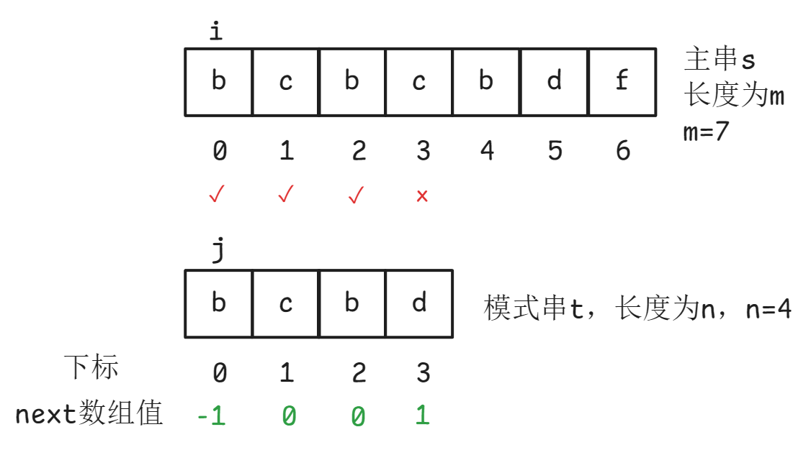

​														图3.3.10

第1轮比较，如图3.3.10所示。
i=0，j=0，s[ i ]==t[ j ]，i++，j++ ，i=1，j=1。
i=1，j=1，s[ i ]==t[ j ]，i++，j++ ，i=2，j=2。
i=2，j=2，s[ i ]==t[ j ]，i++，j++ ，i=3，j=3。
i=3，j=3，因为s[ i ]!=t[ j ]，i不回退，j=next[ j ]=next[3] =1，j回退到下标1的位置。

第2轮比较，如图3.3.11所示。
i=3，j=1，s[ i ]==t[ j ]，i++，j++，i=4，j=2。
i=4，j=2，s[ i ]==t[ j ]，i++，j++，i=5，j=3。
i=5，j=3，s[ i ]==t[ j ]，i++，j++，i=6，j=4。

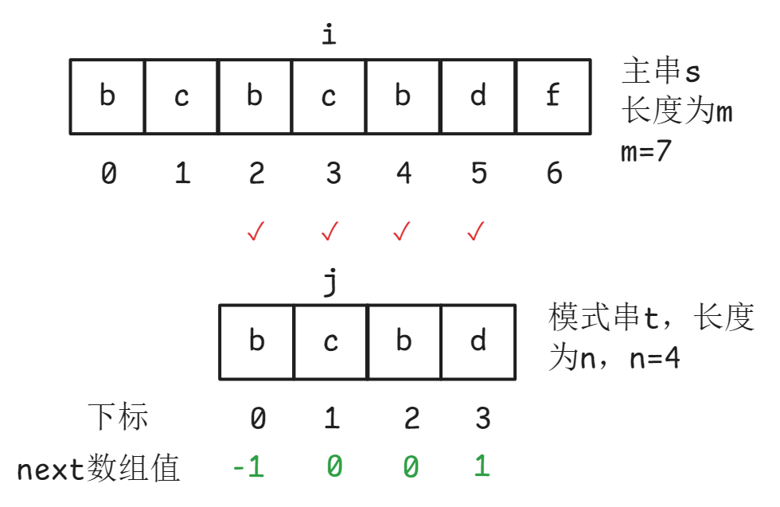

​														图3.3.11

此时j>n-1，j越界了，此时子串与模式串匹配成功。模式串在主串中的起始下标等于 i - 模式串的长度n。当模式串中的非第一个字符与主串中的字符不匹配，i不回退 j 回退，j=next[ j ]，如果主串中的字符和模式串中的字符匹配，则i和j都加1，继续比较后续字符。

主串是"bcbcd"，模式串是"cbb"，使用kmp算法查找模式串在主串中的起始位置。定义变量i表示主串中字符的下标，定义变量j表示模式串中字符的下标。主串的长度是m，模式串的长度是n。令i=0 j=0 m=5 n=3  j<=n-1 j<=2 i<=m-1 i<=4。如图3.3.12所示。

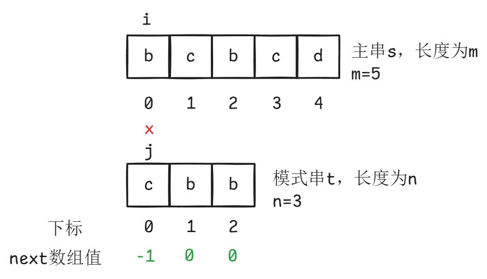

​														图3.3.12

第1轮比较，如图3.3.12所示。
i=0，j=0，s[ i ]!=t[ j ]，当模式串的第一个字符与主串中的字符不匹配，j不回退 j=0，i++， i=1。													

第2轮比较，如图3.3.13所示。
i=1 ，j=0，s[ i ]==t[ j ]，i++， j++， i=2，j=1。
i=2， j=1，s[ i ]==t[ j ]，i++， j++， i=3，j=2。
i=3 ，j=2，s[ i ]!=t[ j ]，j=next[ j ]=next[2]=0，j回退到下标0的位置。

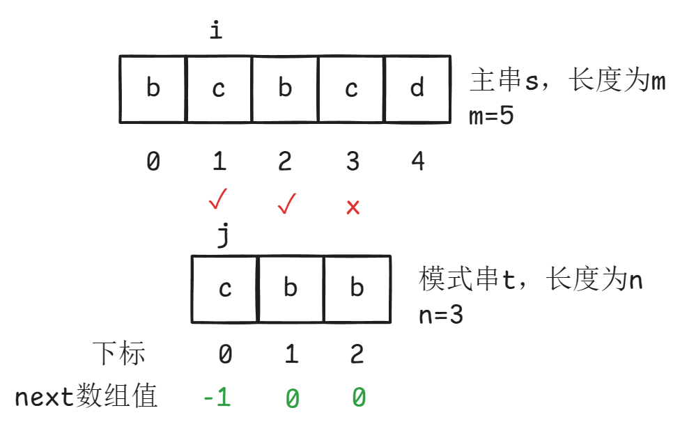

​														图3.3.13

第3轮比较，如图3.3.14所示。
i=3，j=0，s[ i ]==t[ j ]，i++， j++， i=4 ，j=1。
i=4，j=1，s[ i ]!=t[ j ]，j=next[ j ]=next[1]=0，j回退到下标0的位置 ，j=0。

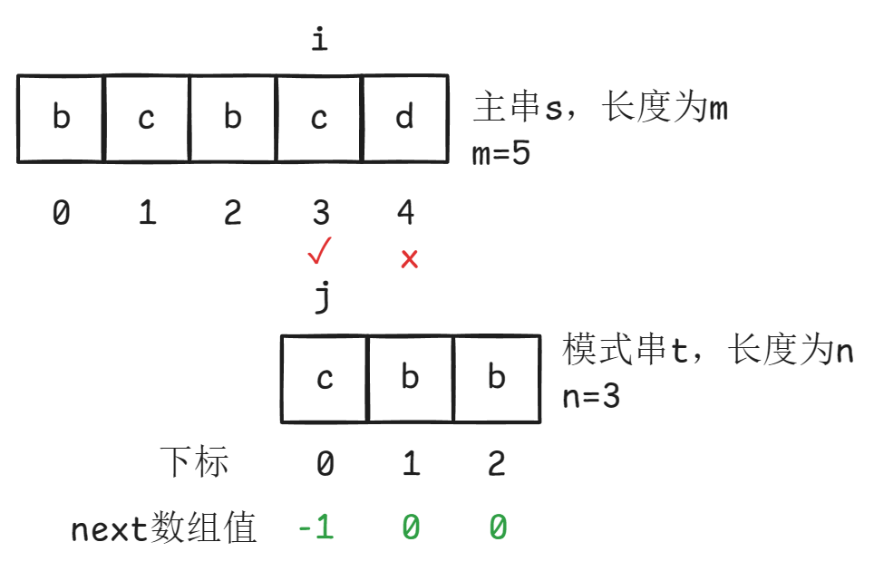

​														图3.3.14

第4轮比较，如图3.3.15所示。
i=4，j=0，s[ i ]!=t[ j ]，当模式串的第一个字符与主串中的字符不匹配，j不回退 j=0，i++，i=5。此时i>m-1， i越界了，i越界说明模式串在主串中不存在。

总结：当模式串的第一个字符与主串中的字符不匹配，j不回退 ，i++。当模式串中的非第一个字符与主串中的字符不匹配，i不回退 j 回退，j=next[ j ]。如果主串中的字符和模式串中的字符匹配，则i和j都加1，继续比较后续字符。

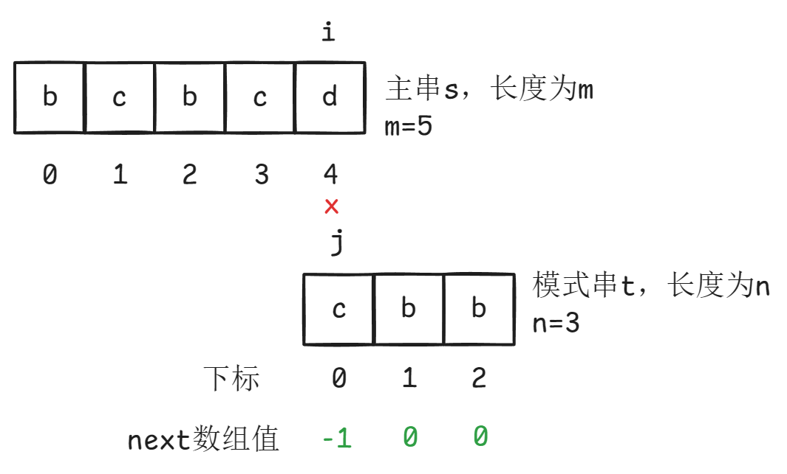

​														图3.3.15

kmp算法实现代码如下：

```c
//s是主串，t是模式串
int kmp(Str s,Str t,int next[]){
	//m是主串的长度，n是模式串的长度
	int m = s.length;
	int n = t.length;
	//定义变量i表示主串中字符的下标，定义变量j表示模式串中字符的下标。
	int i=0,j=0;
	//j的最小值是0，j的最大值是n-1
	//i的最小值是0，i的最大值是m-1
	while(j<=n-1&&i<=m-1){
		//如果主串中的字符和模式串中的字符匹配，则i和j都加1，继续比较后续字符
		if(s.ch[i]==t.ch[j]){
			i++;
			j++;     
		/*程序执行到这里说明模式串中的字符与主串中的字符不匹配
        j==0说明模式串的第一个字符与主串中的字符不匹配，j不回退，j=0，i++，i=1
		*/
	     }else if(j==0){
              i++;
         }else{
        //程序执行到这里说明模式串中的字符与主串中的字符不匹配
    	//当模式串中的非第一个字符与主串中的字符不匹配，i不回退j回退，j=next[j]
              j=next[j];
		}
	}
    //到此while循环结束
	/*如果j>n-1,则j<=n-1不成立,j越界了,说明此时子串与模式串匹配成功。
    模式串在主串中的起始下标等于i-模式串的长度n
    */
	if(j>n-1){
		return i-n;
	//如果i>m-1 则i<=m-1不成立，i越界了，i越界说明模式串在主串中不存在
	}else{
		return -2;
	}
}
```
