# 第6章 查找

## 6.1 折半查找

### 6.1.1 折半查找的思想

折半查找又叫二分查找，仅适用于有序数组的查找，这里的有序指的是数组元素是递增或递减的。折半查找的思路为：假设有一个数组为arr[ ]，数组里面的元素是递增的，需要查找元素key，此时low指向数组第一个元素，high指向数组最后一个元素，计算mid，mid =(low+high)/2，如果key<mid，则说明key在mid左边的区间[low...mid-1]里面，如果key >mid，则说明key在mid右边的区间[mid+1...high]里面，如果key==arr[mid]，说明找到了key，返回key在数组arr中的下标mid，如果low >high说明查找失败，key在数组arr中不存在。二分查找的过程就是查找范围逐渐缩小的过程，通过缩小查找范围可以减少查找次数，提高查找效率。

下面通过1个例子讲解折半查找的具体过程。如图6.1.1.1所示是1个有序数组，使用折半查找查找元素34。low=0，high=10，mid=(low+high)/2 = (0+10)/2 =5。如图6.1.1.1所示。

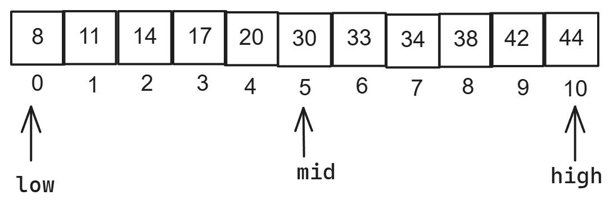

​                                                       图6.1.1.1

arr[mid] = 30 ，34 > arr[mid]，在mid右边的区间继续查找，low = mid+1=6，在区间[mid+1...high]即[6...10]中继续查找。low = 6，high = 10，mid=(low+high)/2 = (6+10)/2 =8，如图6.1.1.2所示。


​															图6.1.1.2

arr[mid] = 38 ，34 < arr[mid]，在mid左边的区间继续查找，high = mid -1 = 7，在区间[low...mid-1]即[6...7]中继续查找。low = 6，high = 7，mid=(low+high)/2 = (6+7)/2 =6。如图6.1.1.3所示。

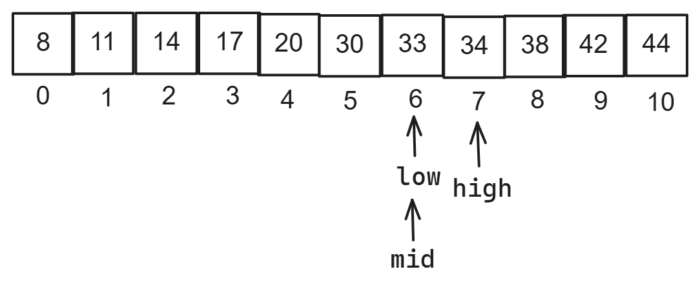

​														图6.1.1.3

arr[mid] = 33  34 > arr[mid]，在mid右边的区间继续查找，low = mid+1 = 7，在区间[mid+1...high]即[7...7]中继续查找。low = 7，high = 7，mid= (low+high)/2 = (7+7)/2 =7。如图6.1.1.4所示。

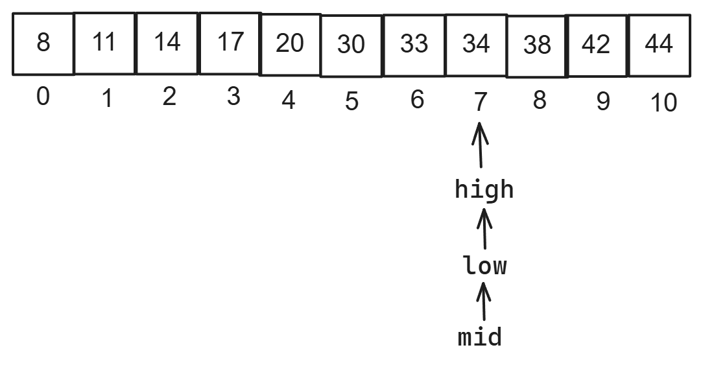

​													    图6.1.1.4

arr[mid] = 34 ，找到了元素34，34的下标是7，查找结束。

下面通过1个例子讲解折半查找失败的情况。如图6.1.1.5所示是1个有序数组，使用折半查找查找元素12。low=0，high=10，mid=(low+high)/2 = (0+10)/2 =5。如图6.1.1.5所示。


​														图6.1.1.5

arr[mid] = 30 ，12 < arr[mid]，在mid左边的区间继续查找，high = mid-1=4，在区间[low...mid-1]即[0...4]中继续查找。low = 0，high = 4，mid=(low+high)/2 = (0+4)/2 =2，如图6.1.1.6所示。

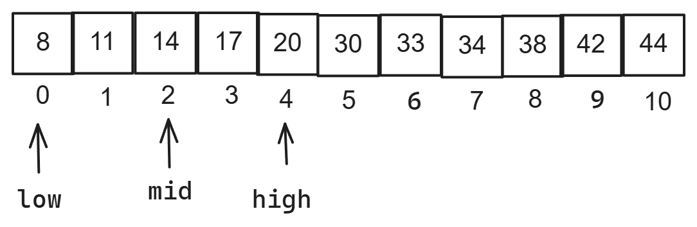

​														图6.1.1.6

arr[mid] = 14，12 < arr[mid]，在mid左边的区间继续查找，high = mid-1=1，在区间[low...mid-1]即[0...1]中继续查找。low = 0，high = 1，mid=(low+high)/2 = (0+1)/2 =0，如图6.1.1.7所示。

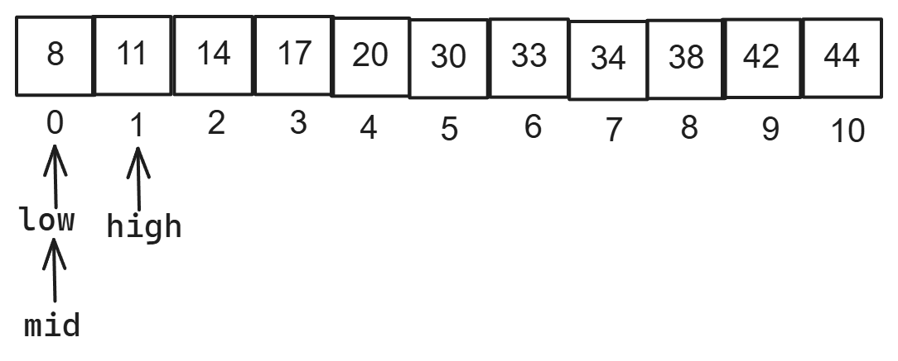

​														图6.1.1.7

arr[mid] = 8，12 > arr[mid]，在mid右边的区间继续查找，low = mid+1=1，在区间[mid+1...high]即[1...1]中继续查找。low = 1，high = 1，mid=(low+high)/2 = (1+1)/2 =1，如图6.1.1.8所示。

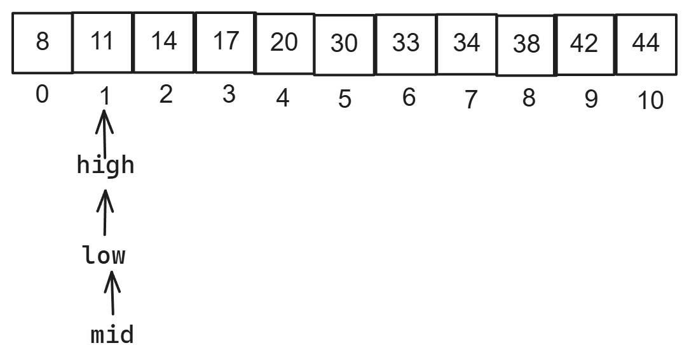

​														图6.1.1.8

arr[mid] = 11，12 > arr[mid]，在mid右边的区间继续查找，low = mid+1=2，high =1，low>high说明12在数组中不存在，查找失败。如图6.1.1.9所示。

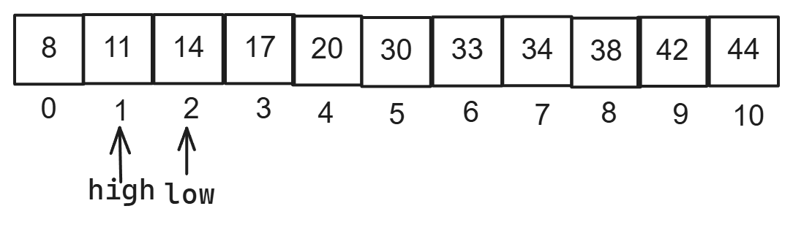

​													图6.1.1.9

### 6.1.2 折半查找的实现

 折半查找的代码如下所示：

```c
//定义折半查找函数,该函数仅适用于递增数组的查找，arr是要查找的数组，low等于0，high等于数组arr的长度-1，key是要查找的元素
int Search(int arr[],int low,int high,int key){
	//mid记录查找区间的中间位置
	int mid;
	//当low >high说明查找失败while循环结束，因此循环条件设置为low<=high
	while(low<=high){
		//计算当前查找区间的中间位置
		mid = (low+high) /2;
		//如果arr[mid]==key说明查找成功，返回key的下标mid
		if(arr[mid]==key){
			return mid;
		//如果key < arr[mid]说明key在mid左边的区间，需要继续在区间[low...mid-1]中继续查找key	
		}else if(key < arr[mid]){
			high = mid -1;
		//如果key > arr[mid]说明key在mid右边的区间，需要继续在区间[mid+1...high]中继续查找key		
		}else{
			low = mid +1;
		}
	}
	//程序执行到这里说明low >high,key不存在查找失败，返回-1
	return -1;
}
```

## 6.2 二叉查找树

### 6.2.1  二叉查找树的定义

​        （1）二叉查找树中的每一个结点的左孩子比这个结点的值小，每一个结点的右孩子比这个结点的值大
​		（2）二叉查找树的左子树上所有结点的值都小于根结点的值
​		（3）二叉查找树的右子树上所有结点的值都大于根结点的值	
​		（4）二叉查找树中序遍历的结果是递增的			

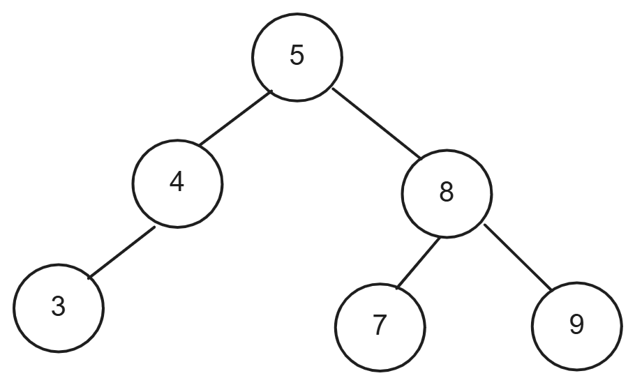

​													图6.2.1.1

插入结点的顺序是5,4,8,3,7,9，插入完成之后如图6.2.1.1所示。
插入5，5作为这个二叉查找树的根结点。
插入4，因为4 < 5，所以4作为5的左孩子。
插入8，因为8 > 5，所以8作为5的右孩子。
插入3，因为3 < 5，3要插在5的左子树上，因为3 < 4，所以3作为4的左孩子。
插入7，因为7 > 5，7要插在5的右子树上，因为7 < 8，所以7作为8的左孩子。
插入9，因为9 > 5，9要插在5的右子树上，因为9 > 8 ，所以9作为8的右孩子。											 

二叉查找树的结点定义与普通二叉树相同，代码如下所示：

```c
//定义二叉查找树中的结点
typedef struct bstNode{
	int data;//结点中存储的关键字
	struct bstNode *left;//左指针
	struct bstNode *right;//右指针
}bstNode;
```

### 6.2.2 二叉查找树的查找

二叉查找树查找结点的算法基本思路为：定义一个指针变量p，定义一个指针变量parent获取key的父亲结点，key表示结点的值，p最开始指向树根，每次查找key都要从树根开始查找，如果p指向结点的值不等于key，则令parent = p，如果key < p指向的结点的值，则p移动p指向p的左孩子，如果key > p指向的结点的值，则p移动p指向p的右孩子，如果p指向结点的值等于key，则说明找到了key，parent指向key的父亲结点。

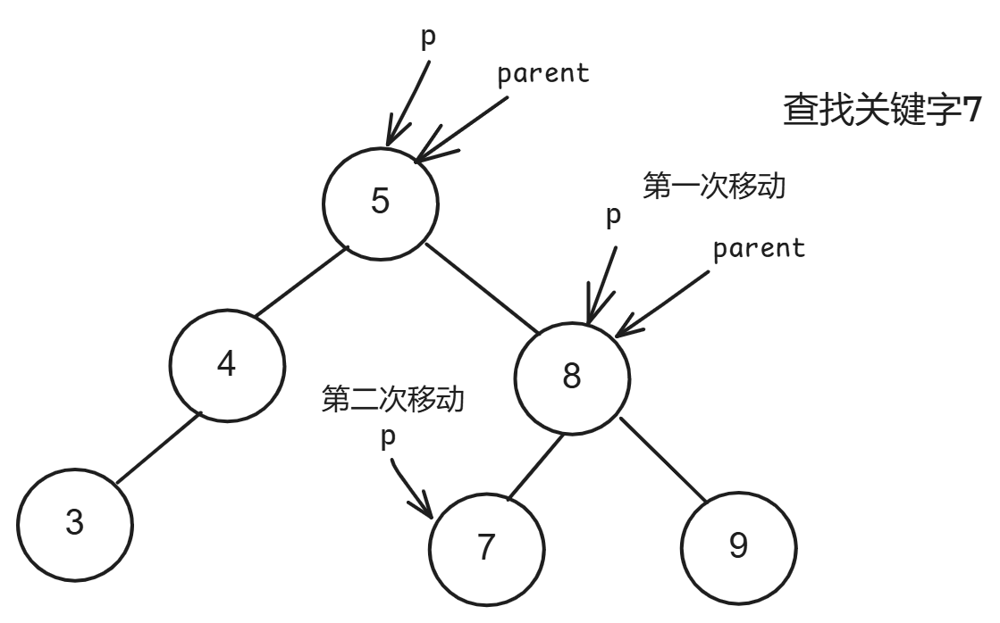

​												   图6.2.2.1

如图6.2.2.1所示，需要在二叉查找树中查找关键字7，key=7。
（1）p指向5，key >5，key的值大于当前p指向的结点的值，令parent = p，
parent指向结点5，p指针移动，p指向p的右孩子，p指向结点8。
（2）p指向8，key <8，key的值小于当前p指向的结点的值，令parent = p，
parent指向结点8，p指针移动，p指向p的左孩子，p指向结点7。
（3）p指向7，key==7，说明找到了结点7，此时parent指向key的父亲结点。

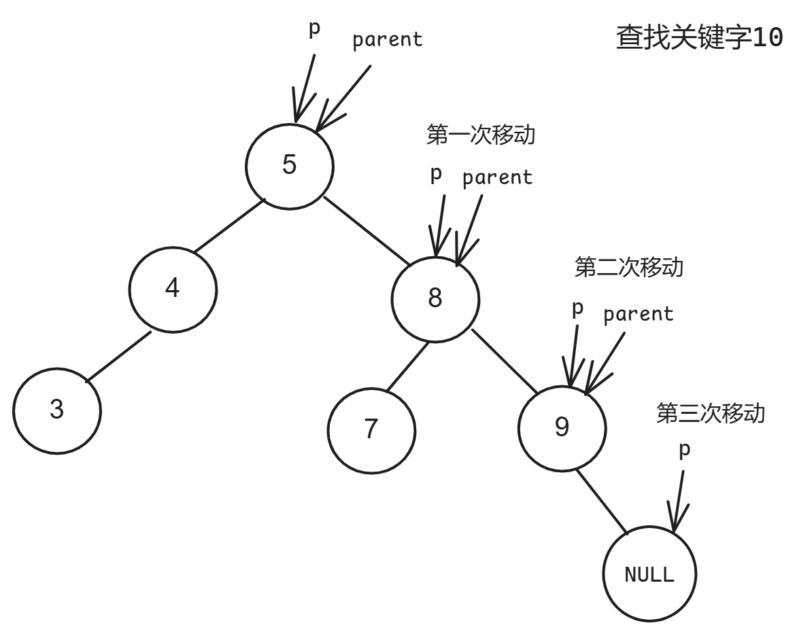

​													图6.2.2.2

如图6.2.2.2所示，需要在二叉查找树中查找关键字10，key=10。
（1）p指向5，key >5，key的值大于当前p指向的结点的值，令parent = p，
parent指向结点5，p指针移动，p指向p的右孩子，p指向结点8。
（2）p指向8，key >8，key的值大于当前p指向的结点的值，令parent = p，
parent指向结点8，p指针移动，p指向p的右孩子，p指向结点9。
（3）p指向9，key>9，key的值大于当前p指向的结点的值，令parent = p，
parent指向结点9，p指针移动，p指向p的右孩子，p指向NULL。
（4）p指向9，key>9，key的值大于当前p指向的结点的值，令parent = p，
parent指向结点9，p指针移动，p指向p的右孩子，p指向NULL。
（5）p指向NULL，说明没有找到key，查找失败。

二叉查找树查找结点代码如下：															

```c
//T指向树根，如果T指向NULL则树为空，如果T不等于NULL则树不为空
//每次查找key都需要从树根开始查找
void bstSelect(bstNode* T,int key){
	//p指向树根
	bstNode* p = T;
	//parent的初始值为NULL，parent用来获取key的父亲结点
	bstNode* parent = NULL;
	//如果p等于NULL说明没有找到key，如果p->data==key说明找到key
	while(p!=NULL && p->data!=key){
        //更新parent
        parent = p;
		//如果key的值大于当前p指向的结点的值，则p指针移动，p指向p的右孩子。	
		if(key > p->data){
			p = p->right;
			//如果key的值小于当前p指向的结点的值，则p指针移动，p指向p的左孩子。		       
		}else{
			p = p->left;
		}
	}
	//如果p等于NULL说明没有找到key。如果p不等于NULL说明找到了key，此时parent指向key的父亲结点
	if(p==NULL){
		printf("没有找到");
	}else{
		printf("找到了");
	}
}
```


### 6.2.3 二叉查找树的插入与创建																	

二叉查找树插入结点非递归实现思路为：如果树为空，则创建1个新结点，新结点作为树根，如果树不为空，则创建1个结点，需要找到这个新结点的父亲结点，在while循环中定义变量parent获取新插入结点的父亲结点，while循环结束之后parent指向新插入结点的父亲结点，然后比较父亲结点的值与插入结点的值，如果插入结点的值小于父亲结点的值，则新插入的结点作为父亲结点的左孩子，如果插入结点的值大于父亲结点的值，则新插入的结点作为父亲结点的右孩子。下面通过1个例子讲解二叉查找树插入元素的具体过程。

使用非递归算法插入元素6，key= 6，while循环开始之前，p指向树根5，令parent = p，parent指向树根5，因为key > 5，key的值大于p指向的结点的值，所以p指针移动，p指向p的右孩子8。

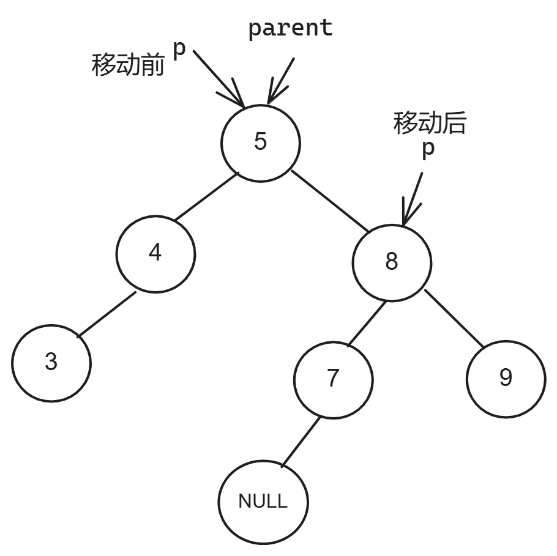

​								图6.2.3.1

p指向8，令parent = p，parent指向8，key= 6，因为key<8，key的值小于p指向的结点的值，p指针移动，p指向p的左孩子7。

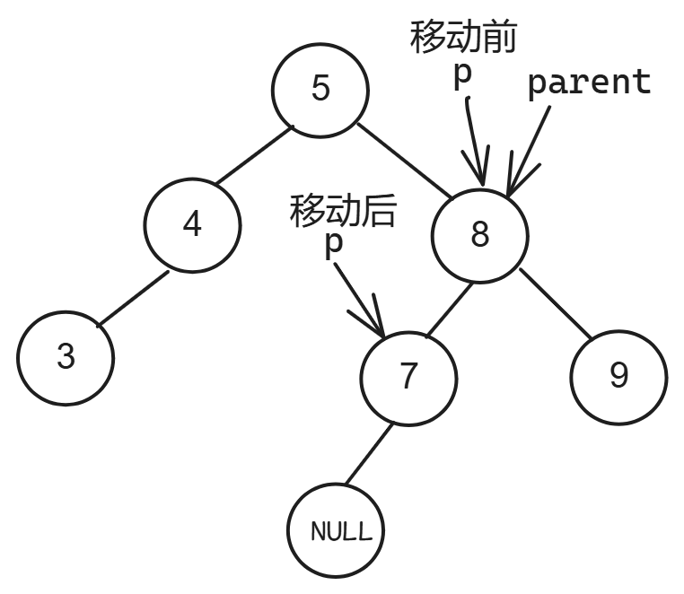

​								图6.2.3.2

p指向7，令parent = p，parent指向7，key= 6，因为key<7，key的值小于p指向的结点的值，p指针移动，p指向p的左孩子，p指向NULL，创建结点6，p指向结点6，parent指向结点6的父亲结点7。因为6<7，结点7的left指针指向结点6。

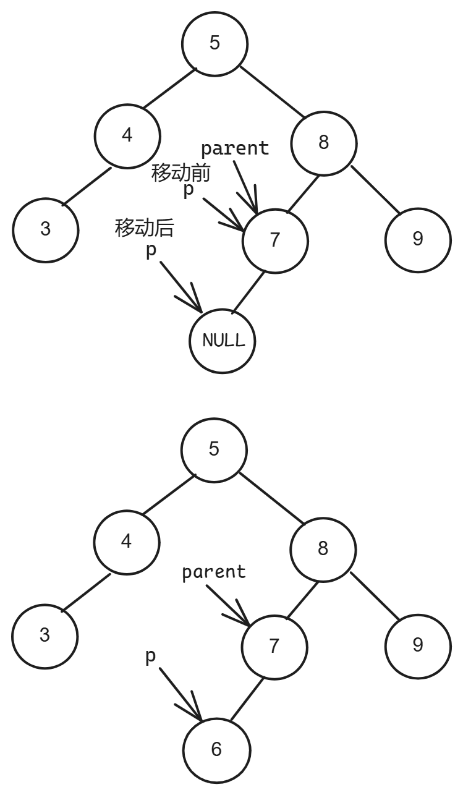

​								图6.2.3.3

下面通过1个例子讲解创建二叉查找树的具体过程。将元素5,4,8,7添加到二叉查找树中。当前树为空，创建结点5，将结点5插入二叉查找树，结点5作为树根。定义变量T指向树根5，如图6.2.3.4所示。


​							 图6.2.3.4

令key = 4，将结点4插入二叉查找树，令p = T，p指向树根5，令parent = p，parent指向树根5，因为key <p指向结点的值，p指针移动，p指向p的左孩子，p指向NULL，创建结点4，p指向结点4，到此结点4的父亲结点找到了，parent指向结点4的父亲结点5，因为4<5，将结点5的left指针指向4。

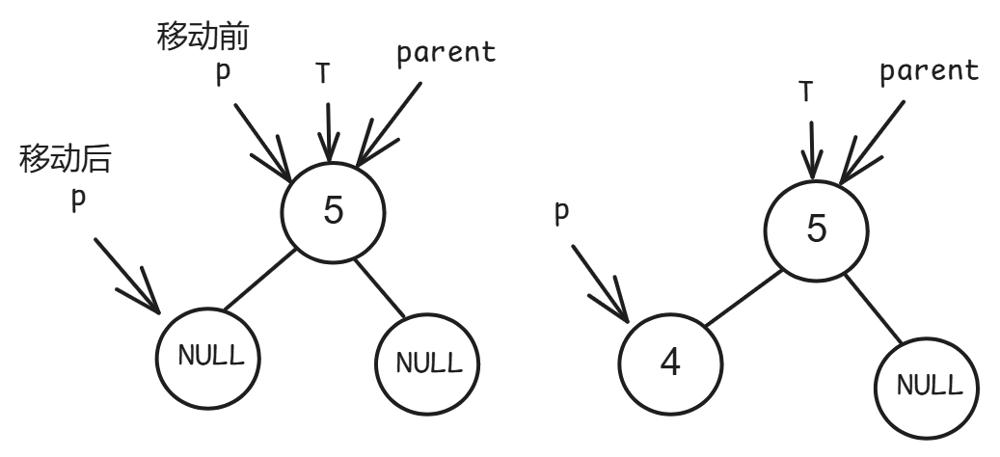

​								图6.2.3.5

令key = 8，将结点8插入二叉查找树，令p = T，p指向树根5，令parent = p，parent指向树根5，因为key >p指向结点的值，p指针移动，p指向p的右孩子，p指向NULL，创建结点8，p指向结点8，到此结点8的父亲结点找到了，parent指向结点8的父亲结点5，因为8>5，将结点5的right指针指向8。

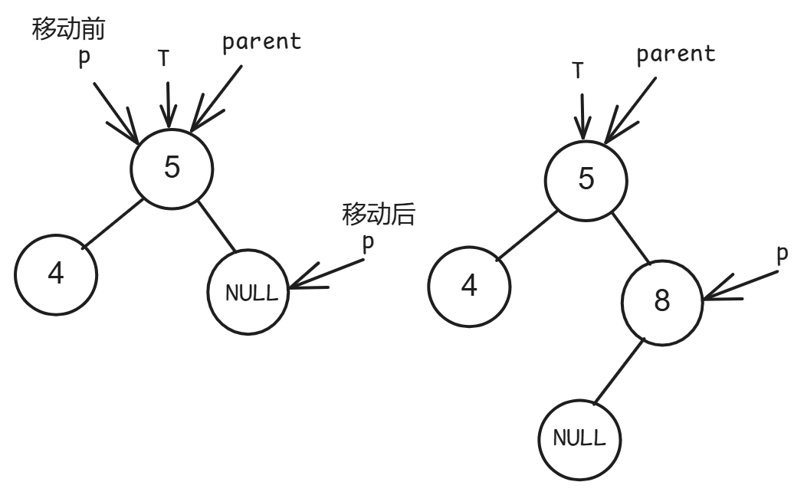

​							 图6.2.3.6

令key = 7，将结点7插入二叉查找树，令p = T，p指向树根5，令parent = p，parent指向树根5，因为key >p指向结点的值，p指针移动，p指向p的右孩子，p指向结点8，令parent = p，parent指向结点8，因为key < p指向结点的值，p指针移动，p指向p的左孩子，p指向NULL，创建结点7，p指向结点7，到此结点7的父亲结点找到了，parent指向结点7的父亲结点8，因为7<8，将结点8的left指针指向结点7。到此二叉查找树创建完成。

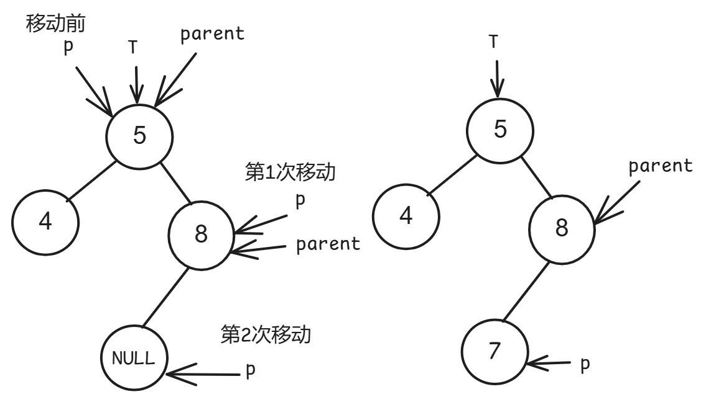

​							图6.2.3.7

​     二叉查找树插入与创建非递归实现代码如下所示：

```c
//key是要插入的的关键字，第一次调用bstInsert函数时T指向NULL，之后调用bstInsert函数时T指向树根
void bstInsert(bstNode* &T,int key){
	//如果T为NULL说明此时树为空，让T指向新创建的结点，也就是让T指向树根
	if(T==NULL){
		T= new bstNode;
		T->data = key;
		T->left = NULL;
		T->right = NULL;
		return;
	}
	//定义指针parent指向新插入结点的父亲结点
	bstNode* parent = NULL;
	//p指向树根
	bstNode* p = T;
    //从树根开始查找新插入结点的父亲结点
	//查找新插入结点的父亲结点，while循环开始之前p指向树根。
	while(p!=NULL){
		//指针parent保存当前p的值
		parent = p;
		//如果key的值在二叉查找树中已存在则取消插入
		if(key==p->data){
			return;
		//如果key大于当前p指向的结点的值，则p指针移动，p指向p的右孩子	
	    }else if(key > p->data){
			p = p->right;
		//如果key小于当前p指向的结点的值，则p指针移动，p指向p的左孩子			
		}else{
			p = p->left;
		}			
	}
    //while循环结束之后，p指向新插入的结点
    p = new bstNode;
	//p结点的左指针和右指针都设置NULL，因为新插入的结点是叶子结点
	p->left = NULL;
	p->right = NULL;
	//将关键字key存入新结点p
	p->data = key;
	//while循环结束之后parent指向新插入结点的父亲结点
	//如果新插入结点的值小于新插入结点的父亲结点的值，则父亲结点的左指针指向新插入的结点
	if(key<parent->data){
		parent->left = p;
	//如果新插入结点的值大于新插入结点的父亲结点的值，则父亲结点的右指针指向新插入的结点
	}else{
		parent->right = p;
	}
}
```

创建二叉查找树就是通过for循环在二叉查找树中插入结点，创建二叉查找树的代码如下：

```c
int main(){
    //定义树根
	bstNode* T = NULL;
	//定义数组
	int R[] = {5,4,8,3,7,9};
	//求数组的长度
	int len = sizeof(R) /sizeof(int);
	//创建二叉查找树
	for(int i=0;i<len;i++){
		//for循环开始之前，T指向树根，第一轮for循环结束之后，T指向树根
		bstInsert(T,R[i]);
	}
    //中序遍历的结果是递增的
    InOrder(T);
    return 0;
}

```


### 6.2.4  二叉查找树结点的删除

二叉查找树的删除需要分三种情况考虑：第一种情况删除的结点是叶子结点，第二种情况删除的结点只有1个孩子，第三种情况删除的结点左右孩子都有。如果删除的结点是叶子结点，删除的叶子结点是父亲结点的左孩子，则将父亲结点的左指针设置为NULL，如果删除的叶子结点是父亲结点的右孩子，则将父亲结点的右指针设置为NULL。如图6.2.4.1所示，需要删除结点3，结点3是叶子结点，parent指向删除结点的父亲结点，p指向要删除的结点，p是parent的左孩子，将parent的left指针设置为NULL，销毁结点3。

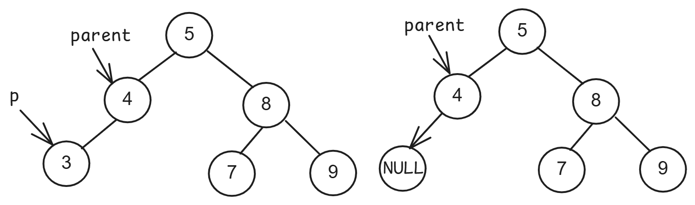

​     							图6.2.4.1

如图6.2.4.2所示，需要删除结点9，结点9是叶子结点，parent指向删除结点的父亲结点，p指向要删除的结点，p是parent的右孩子，将parent的right指针设置为NULL，销毁结点9。

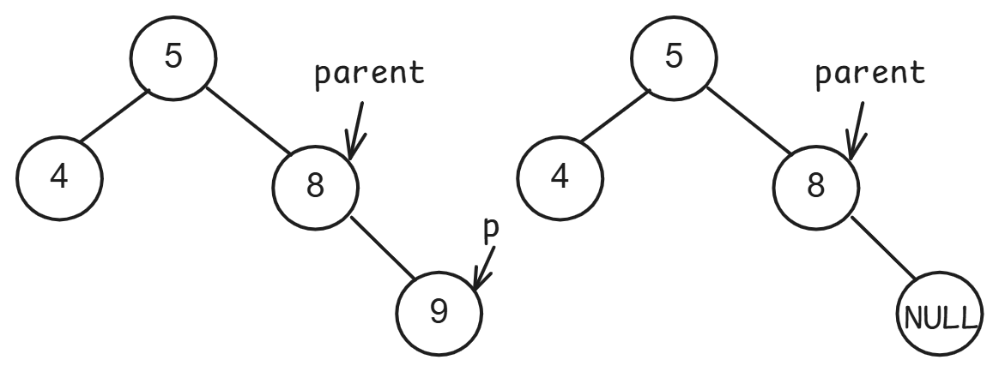

​							 图6.2.4.2

删除的结点是叶子结点的代码如下：

```c
//如果p是叶子结点
if(p->left==NULL&&p->right==NULL){
    //如果p是parent的左孩子
    if(parent->left==p){
        //parent的left指针指向NULL
        parent->left = NULL;
    //如果p是parent的右孩子
    }else{
        //parent的right指针指向NULL
        parent->right = NULL;
    }
    //删除p
    delete(p);
}												
```

如果要删除的结点只有1个孩子，则让删除结点的孩子顶上去，接替删除结点的位置，如图6.2.4.3所示，需要删除结点4，结点4只有1个左孩子结点3，结点4的父亲结点是结点5，将结点5的left指针指向结点3，销毁结点4。parent指向删除结点的父亲结点，p指向删除结点，child指向删除结点的左孩子，parent的left指针指向child。

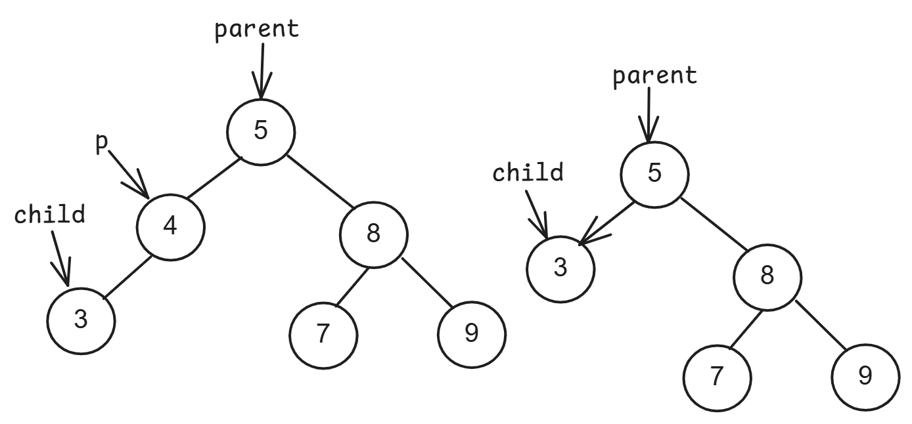

​                                                           图6.2.4.3

如图6.2.4.4所示，需要删除结点8，结点8只有1个右孩子结点9，结点8的父亲结点是结点5，将结点5的right指针指向结点9，销毁结点8。parent指向删除结点的父亲结点，p指向删除结点，child指向删除结点的右孩子，parent的right指针指向child。

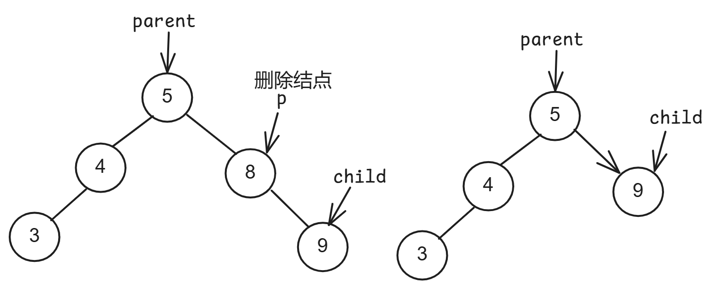

​							 图6.2.4.4

删除的结点只有1个孩子的代码如下：

```c
//如果要删除的结点p只有1个孩子
if(p->left!=NULL&&p->right==NULL || 
p->left==NULL&&p->right!=NULL){
    //获取删除结点的孩子
    //如果删除结点的左孩子存在就获取左孩子
    if(p->left!=NULL){
        child = p->left;
    //如果删除结点的右孩子存在就获取右孩子
    }else{
        child = p->right;
    } 
    //如果删除结点p是parent的左孩子
    if(p==parent->left){
    //将parent的left指向child
        parent->left = child;
        //删除p
        delete(p);
    //如果删除结点p是parent的右孩子
    }else{
        parent->right = child;
        //删除p
        delete(p);
    }
}

```


如果被删除的结点既有左孩子又有右孩子，则需要找到被删除结点在中序遍历下的后继结点，将被删除结点的值修改为后继结点的值，然后删除后继结点，后继结点有可能是叶子结点，也可能是只有右孩子没有左孩子的结点，需要按照第一种或者第二种情况处理。如图6.2.4.5所示，删除结点10，结点10在中序序列下的后继结点是结点17，将结点10的值修改为17，需要删除后继结点17，后继结点17的父亲结点是结点30，后继结点17的右孩子是结点20，将结点30的left指针指向结点20。销毁后继结点17。succeed是parent的左孩子，parent的left指针指向后继结点的右孩子。

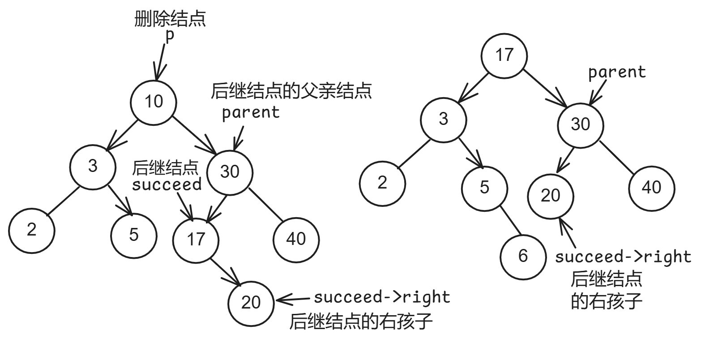

​								图6.2.4.5

如图6.2.4.6所示，删除结点10，需要先找到结点10在中序序列下的后继结点，结点10在中序序列下的后继结点是结点30，后继结点succeed是parent的右孩子，后继结点只有1个右孩子40，将删除结点的值修改为后继结点的值，删除后继结点30，用后继结点的右孩子40接替后继结点30。succeed是parent的右孩子，parent的right指针指向后继结点的右孩子。

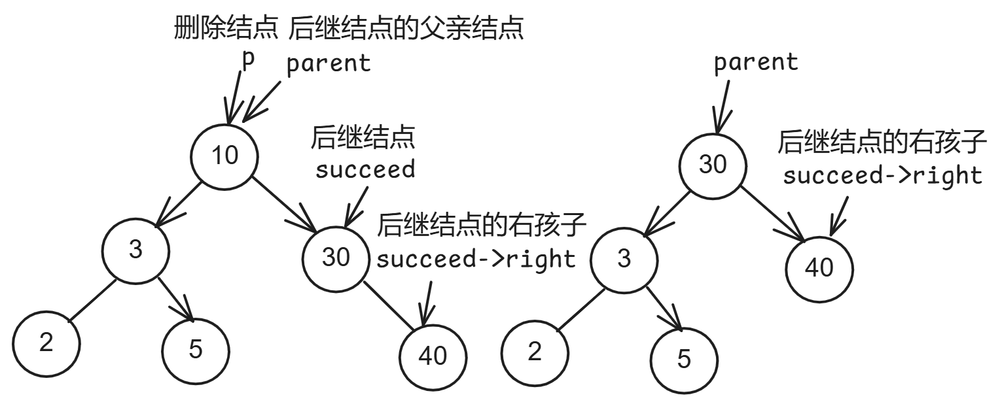

​																   							图6.2.4.6

删除的结点左右孩子都有，需要转化为删除后继结点，后继结点有1个右孩子的情况代码如下：

```c
//获取删除结点的右孩子
succeed = p->right;
//parent的初始值设置为p，parent指向删除结点
parent = p;
/*沿着succeed的left指针向下找，
 直到找到没有左孩子的结点为止，这个
 没有左孩子的结点就是删除结点的后继结点*/                   
while(succeed->left!=NULL){
    parent = succeed;
    succeed = succeed->left;
}
//while循环结束，succeed指向删除结点的后继结点
//while循环结束，parent指向后继结点succeed的父亲结点
//将删除结点的值修改为后继结点的值
p->data = succeed->data;
//如果后继结点的右孩子存在
if(succeed->right!=NULL){
    //如果后继结点succeed是parent的左孩子
    if(succeed==parent->left){
        //parent的left指针指向后继结点的右孩子
        parent->left = succeed->right;
        //如果后继结点succeed是parent的右孩子	
    }else{
        //parent的right指针指向后继结点的右孩子
        parent->right = succeed->right;
    }	
}
//删除后继结点succeed
delete(succeed);	
```


如图6.2.4.7所示，删除结点10，结点10在中序序列下的后继结点是结点17，将结点10的值修改为17，需要删除后继结点17，后继结点17的父亲结点是结点30，将结点30的left指针指向NULL。销毁后继结点17。succeed是parent的左孩子，parent的left指针指向NULL。

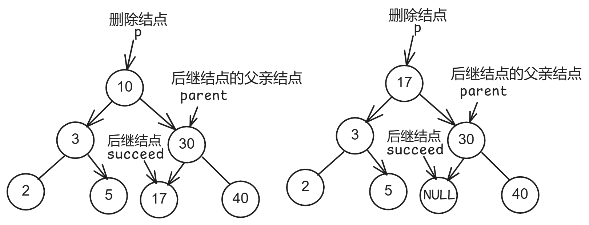

​													                       							图6.2.4.7

如图6.2.4.8所示，删除结点30，结点30在中序序列下的后继结点是结点40，将结点30的值修改为40，需要删除后继结点40，后继结点40是叶子结点，succeed是parent的右孩子，parent的right指针指向NULL。

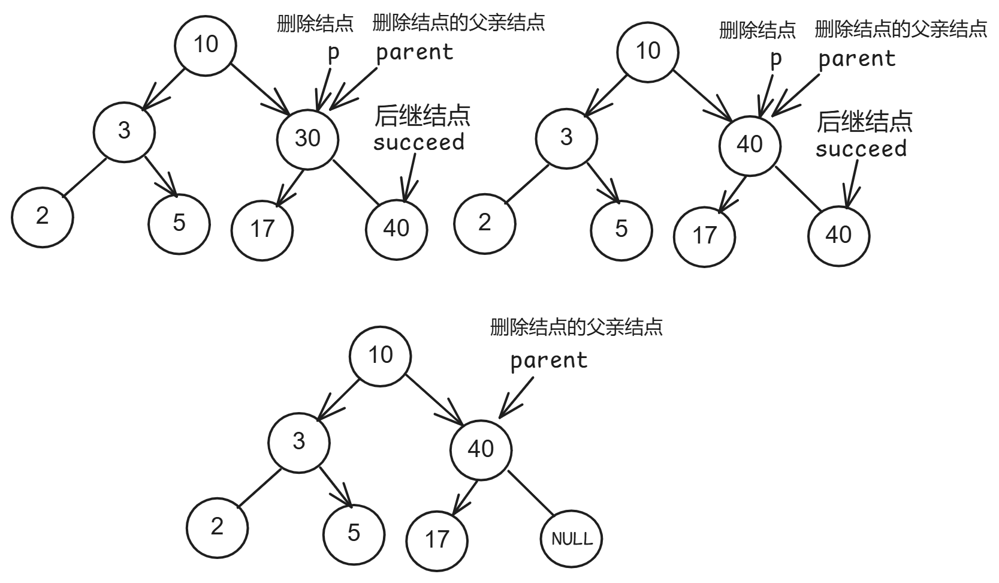

​							图6.2.4.8

删除的结点左右孩子都有，需要转化为删除后继结点，后继结点是叶子结点的情况代码如下：

```c
//获取删除结点的右孩子
succeed = p->right;
//parent的初始值设置为p，parent指向删除结点
parent = p;
/*沿着succeed的left指针向下找，
 直到找到没有左孩子的结点为止，这个
 没有左孩子的结点就是删除结点的后继结点*/                   
while(succeed->left!=NULL){
    parent = succeed;
    succeed = succeed->left;
}
//while循环结束，succeed指向删除结点的后继结点
//while循环结束，parent指向后继结点succeed的父亲结点
//将删除结点的值修改为后继结点的值
p->data = succeed->data;
//如果后继结点是叶子结点
//如果后继结点是parent的左孩子
if(parent->left==succeed){
    //parent的left指针指向NULL
    parent->left = NULL;
    //如果后继结点是parent的右孩子
}else{
    //parent的right指针指向NULL
    parent->right = NULL;
}
//删除后继结点succeed
delete(succeed);	
```

如果删除的结点是叶子结点并且该叶子结点是根结点，删除完该结点之后，树就为空，此时需要更新树根，将树根修改为NULL。如图6.2.4.7所示。删除结点23，23是根结点，23删除之后树为空，需要更新树根，T指向树根，将T修改为NULL。树根的父亲结点为NULL，因为树根没有父亲结点。

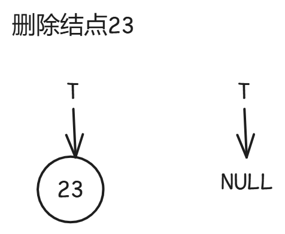

​							图6.2.4.9																											

代码如下：

```c
//如果p是叶子结点
if(p->left==NULL&&p->right==NULL){
    //如果parent为NULL说明删除结点p没有父亲结点，p就是根结点
    //此时p是树中唯一的结点
    if(parent==NULL){
        //删除根结点
        delete(p);
        //此时树中没有结点，T指向NULL
        T = NULL;
        //此时树中没有结点，函数结束
        return;
    }
}
```

如果删除的结点是根结点，并且根节点只有1个孩子，删除完根结点之后，用孩子结点接替根结点，孩子结点成为新的根结点，更新树根。如图6.2.4.8所示，删除结点23，接替删除结点23的是结点15，15成为树根，修改树根，T->15。树根的父亲结点为NULL，因为树根没有父亲结点。

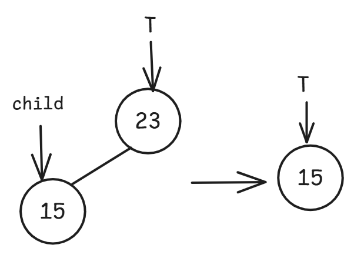

​							图6.2.4.10																				

代码如下：

```c
//如果删除结点p只有1个孩子
if(p->left!=NULL&&p->right==NULL || p->left==NULL&&p->right!=NULL){
    //如果删除结点p没有父亲结点，则p是根结点
    if(parent==NULL){
        //删除根结点p
        delete(p);
        //更新树根,树根是child,child是p的孩子
        T = child;
    }
}
```

二叉查找树删除结点完整代码如下：

```c
void bstDelete(bstNode* &T,int key){
	//child获取要删除结点的孩子
	bstNode* child = NULL;
	//p指向树根
	bstNode* p = T;
	//parent的初始值为NULL，parent用来获取key的父亲结点
	bstNode* parent = NULL;
	//如果p等于NULL说明没有找到key，如果p->data==key说明找到key
	while(p!=NULL && p->data!=key){
		//更新parent
		parent = p;
		//如果key的值大于当前p指向的结点的值，则p指针移动，p指向p的右孩子。
		if(key > p->data){
			p = p->right;
			//如果key的值小于当前p指向的结点的值，则p指针移动，p指向p的左孩子。
		}else{
			p = p->left;
		}
	}
	//如果p等于NULL说明key不存在或者树为空
	if(p==NULL){
		return;
	//如果p不等于NULL说明key存在,p指向要删除的结点
	//parent指向要删除结点的父亲结点
	}else{
		//如果p是叶子结点
		if(p->left==NULL&&p->right==NULL){
			//如果parent为NULL说明删除结点p没有父亲结点，p就是根结点
			//此时p是树中唯一的结点
			if(parent==NULL){
				//删除根结点
				delete(p);
				//此时树中没有结点，T指向NULL
				T = NULL;
				//此时树中没有结点，函数结束
				return;
			}else{
				//如果p是parent的左孩子
				if(parent->left==p){
					//parent的left指针指向NULL
					parent->left = NULL;
					//如果p是parent的右孩子
				}else{
					//parent的right指针指向NULL
					parent->right = NULL;
				}
				//删除p
				delete(p);
			}
			
			
		//如果要删除的结点p只有1个孩子
		}else if(p->left!=NULL&&p->right==NULL || p->left==NULL&&p->right!=NULL){
				//获取要删除结点的孩子
				//如果要删除结点的左孩子存在
				if(p->left!=NULL){
					child = p->left;
				//如果要删除结点的右孩子存在
				}else{
					child = p->right;
				}
				//如果删除结点p没有父亲结点，则p是根结点
				if(parent==NULL){
					//删除根结点p
					delete(p);
					//更新树根，树根是child
					T = child;
					//如果删除结点p是左孩子	
				}else if(p==parent->left){
					//将parent的left指向child
					parent->left = child;
					//删除p
					delete(p);
					//如果删除结点p是右孩子	
				}else{
					//将parent的right指向child
					parent->right = child;
					//删除p
					delete(p);
				}		
			//如果要删除的结点p左右孩子都存在
		}else{
			//获取删除结点的右孩子
			bstNode* succeed = p->right;
			//parent的初始值设置为p，parent指向删除结点
			parent = p;
			/*沿着succeed的left指针向下找，
			直到找到没有左孩子的结点为止，这个
			没有左孩子的结点就是删除结点的后继结点*/
			while(succeed->left!=NULL){
				parent = succeed;
				succeed = succeed->left;
			}
			//while循环结束，succeed指向删除结点的后继结点
			//while循环结束，parent指向后继结点succeed的父亲结点
			//将删除结点的值修改为后继结点的值
			p->data = succeed->data;
			//如果后继结点的右孩子存在
			if(succeed->right!=NULL){
				//如果后继结点succeed是parent的左孩子
				if(succeed==parent->left){
					//parent的left指针指向后继结点的右孩子
					parent->left = succeed->right;
				//如果后继结点succeed是parent的右孩子	
				}else{
					//parent的right指针指向后继结点的右孩子
					parent->right = succeed->right;
				}		
			//如果后继结点是叶子结点
			}else{
					//如果后继结点是parent的左孩子
					if(parent->left==succeed){
						//parent的left指针指向NULL
						parent->left = NULL;
						//如果后继结点是parent的右孩子
					}else{
						//parent的right指针指向NULL
						parent->right = NULL;
					}
			}
			//删除后继结点succeed
			delete(succeed);	
		}
	}
}
```

## 6.3 平衡二叉树

### 6.3.1  平衡二叉树的定义

图6.3.1.1所示是一个普通的二叉查找树，关键字插入的序列是{10，20，30，40，50}，其中结点10查找的次数是1次，20查找的次数是2次，30查找的次数是3次，40查找的次数是4次，50查找的次数是5次，当一个二叉查找树中数据是递增或者递减时，会出现图6.3.1.1所示的链表式二叉树，链表式二叉树每层只有1个结点，树非常高，查找效率低。图6.3.1.2是平衡二叉树，关键字序列是{10，20，30，40，50}，其中结点10查找的次数是2次，20查找的次数是1次，30查找的次数是3次，40查找的次数是2次，50查找的次数是3次，通过比较可以发现平衡二叉树的查找次数更少，平衡二叉树主要是通过降低树高来减少查找次数从而提高查找效率。

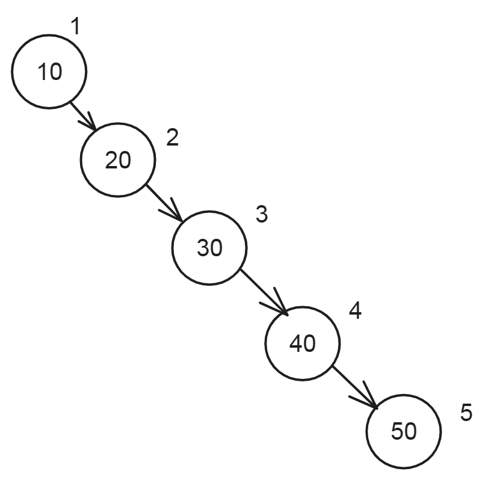

​								图6.3.1.1

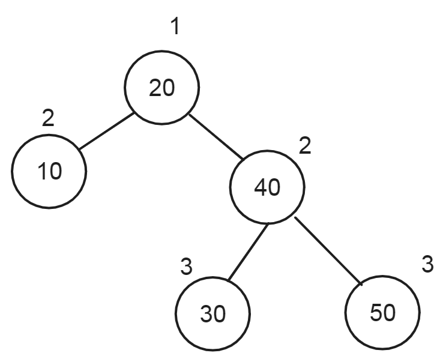

​								图6.3.1.2												

在讲解平衡二叉树的定义之前，需要先讲解平衡因子的定义。平衡二叉树中的每一个结点都有平衡因子，一个结点的平衡因子等于该结点左子树的高度减去该结点右子树的高度。左子树的高度就是以左孩子为根的子树的高度，右子树的高度就是以右孩子为根的子树的高度，平衡二叉树的定义：平衡二叉树是一颗二叉查找树，平衡二叉树中每一个结点的平衡因子的绝对值<=1，平衡二叉树中结点的平衡因子只能是-1,0,1，图6.3.1.2是一颗平衡二叉树，结点20的平衡因子是-1，结点10的平衡因子是0，结点40的平衡因子等于0，结点30的平衡因子等于0，结点50的平衡因子等于0。平衡二叉树结点的定义代码如下：

```c
//定义平衡二叉树结点
typedef struct AVLNode{
    int data;//结点中存储的值
    struct AVLNode *left;//左指针
    struct AVLNode *right;//右指针
    int balance;//平衡因子
}AVLNode;
```

根据平衡因子的定义，要求出每个结点的平衡因子，需要先求出当前结点的左子树的高度和右子树的高度，如何求树高？如果root指向某颗树的树根，求root这颗树的树高，需要先求出root的左子树的高度LeftHeight，然后求出root的右子树的高度RightHeight，root这颗树的高度等于左子树与右子树高度的最大值加上1。即root这颗树的高度 = max{LeftHeight，RightHeight} +1。求树的高度的代码如下所示：

```c
//求当前树的高度，行参root指向树根
//要求哪颗树的高度，调用GetHeight函数就传入这颗树的根结点
int GetHeight(AVLNode* root){
	//如果root指向NULL，说明是空树，空树的高度为0
    if(root==NULL){
        return 0;
	//如果root不为NULL，说明不是空树	
    }else {
        //求root的左子树的高度，root的左子树的根结点是root的左孩子
        int LeftHeight =  GetHeight(root->left);
        //求root的右子树的高度，root的右子树的根结点是root的右孩子
        int RightHeight = GetHeight(root->right);
        //如果左子树的高度大于右子树的高度，则root的高度等于左子树的高度+1
        if(LeftHeight >RightHeight){
            return LeftHeight +1;
        //如果右子树的高度大于左子树的高度，则root的高度等于右子树的高度+1    
        }else{
            return RightHeight +1;
        }
    }
}
```

求结点平衡因子的代码如下所示：

```c
//求当前结点的平衡因子
int GetBalance(AVLNode* root){
	//结点的平衡因子等于结点左子树的高度-结点右子树的高度
    int leftHeight = GetHeight(root->left);
    int rightHeight = GetHeight(root->right);
    return leftHeight - rightHeight; 
}
```

### 6.3.2  平衡二叉树的失衡与调整

在创建平衡二叉树的过程中，每插入1个结点都需要进行检查，判断新结点的插入是否导致平衡二叉树失衡，当平衡二叉树中有1个结点的平衡因子绝对值大于1就说明该平衡二叉树失衡了，如果失衡了就需要调整。平衡二叉树的失衡有4种情况，分别是LL失衡，LR失衡，RR失衡，RL失衡。这四种失衡分别对应4种不同的调整方法，插入1个新结点之后，有可能导致多个结点失衡，只需要调整距离插入结点最近的失衡结点即可。

如图6.3.2.1所示，在平衡二叉树中插入15导致树失衡，其中平衡因子绝对值大于1的结点有3个，分别是11，18，16，只需要调整失衡结点16即可，当以16为根的失衡子树恢复平衡后，整颗二叉树就恢复平衡了。

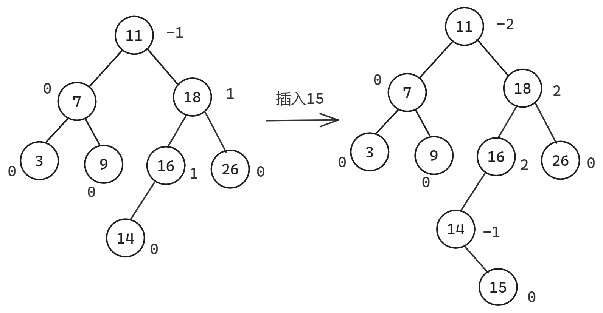

​                                                    图6.3.2.1

RR失衡的定义：插入结点导致平衡二叉树失衡，新插入的结点位于失衡结点的右孩子的右子树上。RR失衡需要对失衡结点进行左旋，调整方法为（1）失衡结点的右孩子作为新根结点。（2）如果新根结点原来有左孩子，原来的左孩子作为失衡结点的右孩子。（3）失衡结点作为新根结点的左孩子。RR失衡失衡结点的平衡因子等于-2，失衡结点右孩子的平衡因子等于-1，如图6.3.2.2是RR失衡的调整过程。root指向失衡结点，newroot指向失衡结点的右孩子。

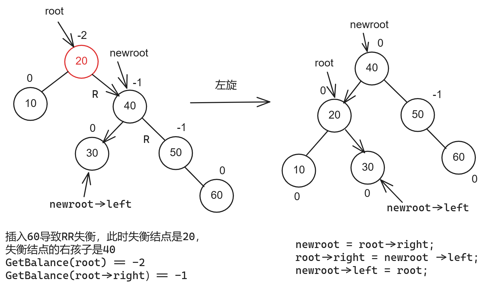

​							图6.3.2.2

RR失衡调整的代码如下所示：

```c
//形参root指向失衡结点，对以root为根的失衡子树进行调整
AVLNode* LeftRotate(AVLNode* &root){
    //失衡结点的右孩子作为新根结点
    AVLNode* newroot = root->right;
    //如果新根结点原来有左孩子，原来的左孩子作为失衡结点的右孩子
    //失衡结点的右指针指向了新根结点的左孩子
    root->right = newroot ->left;
    //失衡结点作为新根结点的左孩子
    //新根结点的左指针指向失衡结点
    newroot->left = root;
    //返回失衡子树恢复平衡后的新根结点
    return newroot;
}
```

LL失衡的定义：插入新结点导致平衡二叉树失衡，新插入的结点位于失衡结点的的左孩子的左子树上。LL失衡需要对失衡结点进行右旋，调整方法为（1）失衡结点的左孩子作为新根结点（2）如果新根结点原来有右孩子，原来的右孩子作为失衡结点的左孩子。（3）失衡结点作为新根结点的右孩子。LL失衡失衡结点的平衡因子等于2，失衡结点左孩子的平衡因子等于1，如图6.3.2.3所示是LL失衡的调整过程。

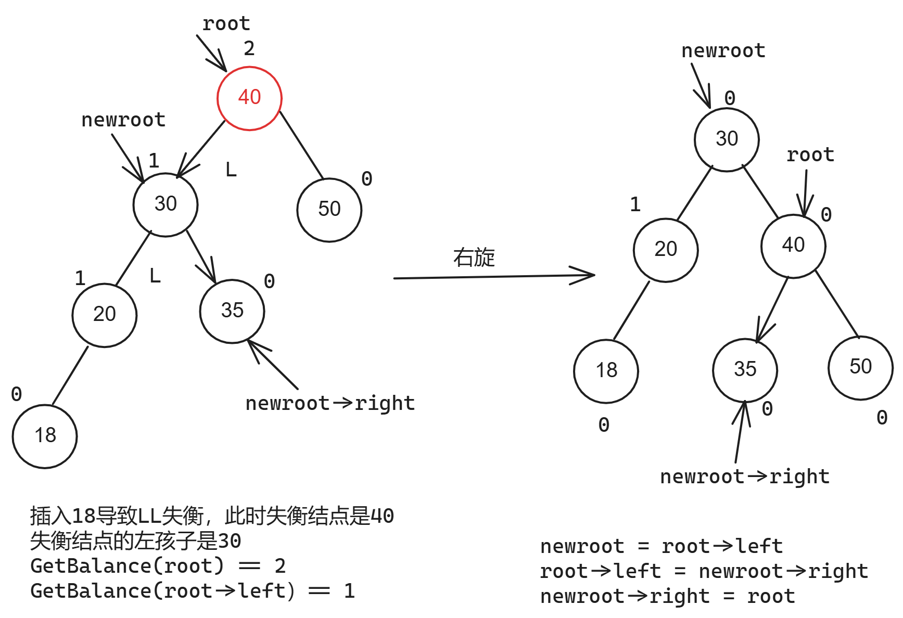

​						图6.3.2.3

​	LL失衡调整的代码如下所示：

```c
//形参root指向失衡结点，对以root为根的失衡子树进行调整
AVLNode* RightRotate(AVLNode* &root){
    //失衡结点的左孩子作为新根结点
    AVLNode* newroot = root->left;
    //如果新根结点原来有右孩子，原来的右孩子作为失衡结点的左孩子
    //失衡结点的左指针指向了新根结点的右孩子
    root->left = newroot ->right;
    //新根结点的右指针指向失衡结点
    newroot->right = root;
    //返回失衡子树恢复平衡后的新根结点
    return newroot;
}
```

LR失衡的定义：插入新结点导致平衡二叉树失衡，新插入的结点位于失衡结点的左孩子的右子树上。LR失衡需要先左旋后右旋，调整方法为（1）先对失衡结点的左孩子进行左旋，转换为LL失衡，让爷爷，父亲，儿子在一条直线上。（2）然后按照LL失衡进行处理，LR失衡失衡结点的平衡因子等于2，
失衡结点左孩子的平衡因子等于-1。LR失衡的调整过程如图6.3.2.4所示。

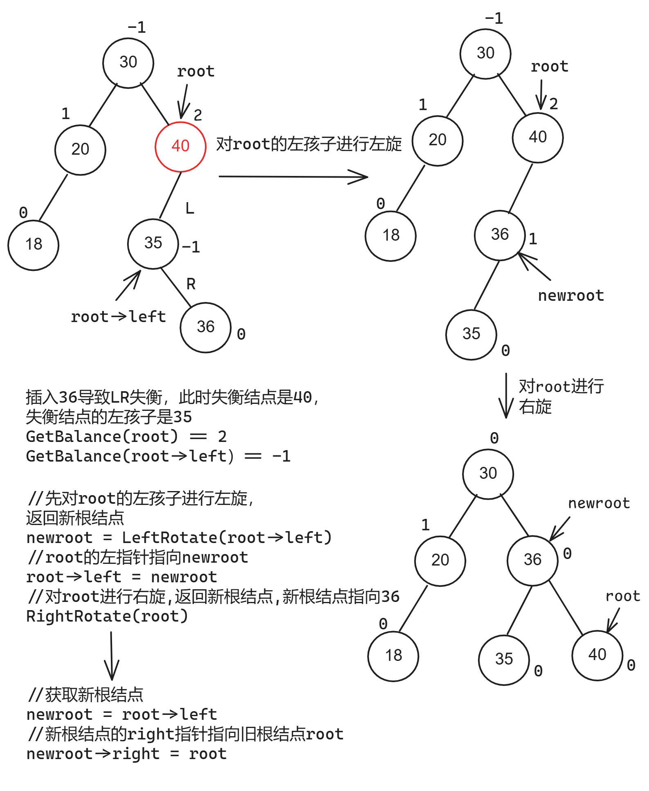

​							图6.3.2.4

LR失衡调整的代码如下所示：

```c
AVLNode* LeftRight(AVLNode* &root){
	//先对root的左孩子进行左旋，返回新根结点
    AVLNode* newroot = LeftRotate(root->left);
	//root的左指针指向newroot
	root->left = newroot;
    //对root进行右旋,返回新根结点
	return RightRotate(root);
}
```

RL失衡的定义：插入结点导致平衡二叉树失衡，该结点位于失衡结点的右孩子的左子树上。RL失衡需要先右旋后左旋，调整方法为：（1）先对失衡结点的右孩子进行右旋，转换为RR失衡，让爷爷，父亲，儿子在一条直线上。（2）然后按照RR失衡进行处理，RL失衡失衡结点的平衡因子等于-2，RL失衡失衡结点的右孩子等于1，RL失衡的调整过程如图6.3.2.5所示。

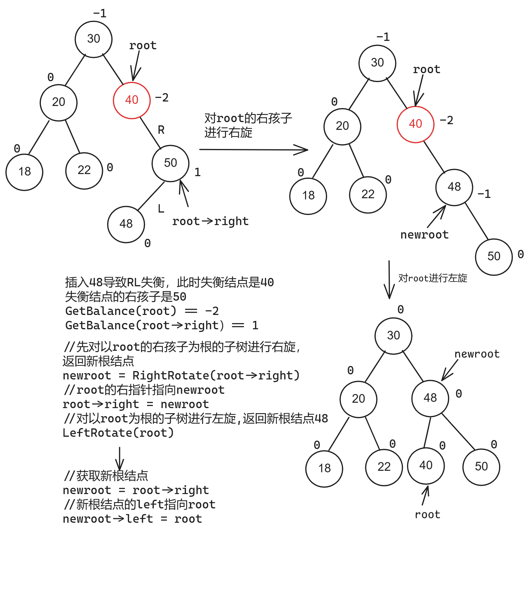

​							图6.3.2.5													

RL失衡调整的代码如下所示：

```c
AVLNode* RightLeft(AVLNode* &root){
  //对root的右孩子进行右旋，返回新根结点
  AVLNode* newroot = RightRotate(root->right);
  //root的右指针指向newroot
  root->right = newroot;
  //对root进行左旋
  return LeftRotate(root);
}
```

### 6.3.3  平衡二叉树结点的插入

平衡二叉树结点的插入和二叉查找树结点的插入相同，区别在于平衡二叉树在插入结点之后需要检查平衡二叉树是否失衡，检查的办法是从插入结点的父亲结点开始，由下往上依次更新结点的平衡因子，如果发现某个结点的平衡因子绝对值>1说明该结点就是离插入结点最近的失衡结点，然后再判断是哪种失衡，根据失衡类型进行调整。如果发现某个结点的平衡因子绝对值大于1，剩下的结点就不需要再去判断。因为平衡二叉树只需要调整离插入结点最近的失衡结点。如果没有发现结点的平衡因子绝对值>1说明平衡二叉树是平衡的。

需要先定义1个指针变量p，p最开始指向树根，定义变量key用来表示需要插入的结点的值，如果key < p指向的结点的值，p移动p指向p的左孩子。如果p不等于NULL，p入栈。如果key >p指向的结点的值，p移动p指向p的右孩子，如果p不等于NULL，p入栈。如图6.3.3.1所示需要在平衡二叉树中插入结点9，需要查找9插入的位置，p最开始指向7，将7入栈。因为9>7，p移动p指向p的右孩子，p指向16，将16入栈。因为9<16，p移动p指向p的左孩子，p指向11，将11入栈。因为9<11，p移动p指向p的左孩子，p指向NULL，while循环结束。插入9，9成为11的左孩子。

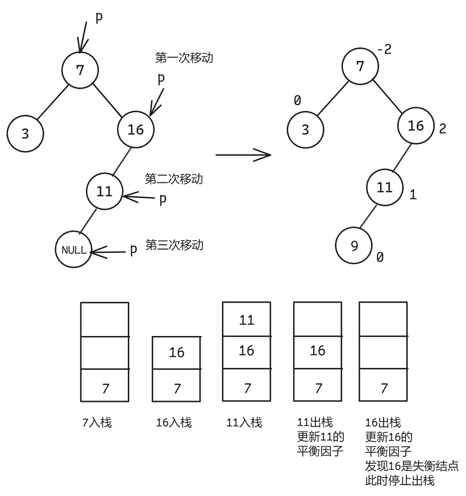

​							  图6.3.3.1

如图6.3.3.1所示，将栈中的结点出栈，更新出栈结点的平衡因子，如果发现某个出栈结点的平衡因子绝对值大于1，说明该出栈结点就是离插入结点最近的失衡结点。结点11出栈，11的平衡因子是1，结点16出栈，16的平衡因子是2，说明16是离插入结点最近的失衡结点。对以16为根的失衡子树进行调整，以16为根的失衡子树恢复平衡后，整颗树就恢复平衡了。此时需要停止出栈，栈中剩余元素不需要更新平衡因子，因为在平衡二叉树插入结点的过程中，如果发生失衡只需要1次调整就可以让整颗树恢复平衡。

如图6.3.3.2所示，将16进行右旋，newroot指向新根结点11，因为栈不为空说明离插入结点最近的失衡结点有父亲结点，需要判断失衡结点是左孩子还是右孩子，如果失衡结点是左孩子，则失衡结点的父亲结点的left指向新根结点，如果失衡结点是右孩子，则失衡结点的父亲结点的right指向新根结点，这里的新根结点是失衡子树恢复平衡后的根结点。

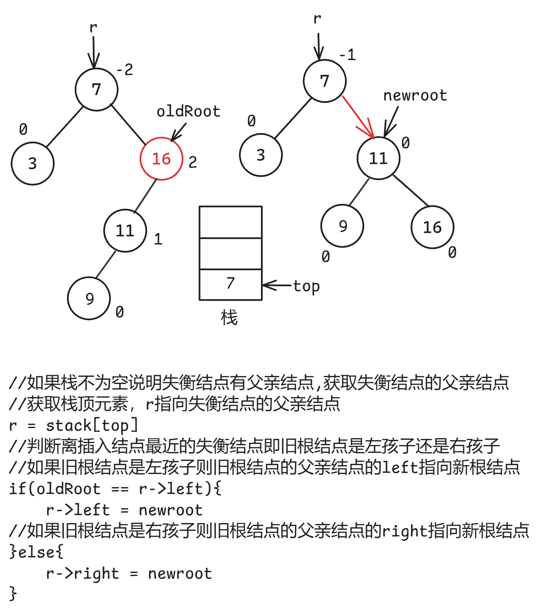

​						图6.3.3.2

失衡子树在恢复平衡后，平衡二叉树的树根如果发生改变了就需要修改树根。先定义1个指针变量p，p最开始指向树根，定义变量key用来表示插入的结点的值，如果key < p指向的结点的值，p移动p指向p的左孩子。如果p不等于NULL，p入栈。如果key >p指向的结点的值，p移动p指向p的右孩子，如果p不等于NULL，p入栈。如图6.3.3.3所示需要在平衡二叉树中插入结点9，需要查找9插入的位置，p最开始指向16，将16入栈。因为9<16，p移动p指向p的左孩子，p指向11，将11入栈。因为9<11，p移动p指向p的左孩子，p指向NULL。while循环结束。插入9，9成为11的左孩子。

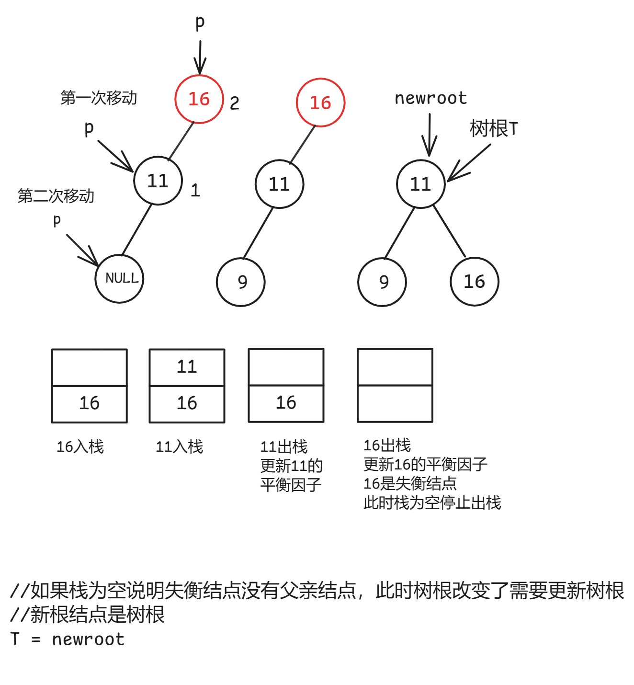

​							图6.3.3.3

如图6.3.3.3所示，将栈中的结点出栈，更新出栈结点的平衡因子，如果发现某个出栈结点的平衡因子绝对值大于1，说明该出栈结点就是离插入结点最近的失衡结点。结点11出栈，11的平衡因子是1，结点16出栈，16的平衡因子是2，说明16是离插入结点最近的失衡结点。对以16为根的失衡子树进行调整，以16为根的失衡子树恢复平衡后，整颗树就恢复平衡了。此时栈为空说明失衡结点16没有父亲结点，对16进行右旋，右旋之后需要更新平衡二叉树的树根，树根变为新根结点，新根结点是11。新根结点11是失衡子树恢复平衡之后的根结点。

平衡二叉树结点的插入代码如下：

```c
//key是要插入的的关键字，第一次调用bstInsert函数时T指向NULL，之后调用bstInsert函数时T指向树根
void AVLInsert(AVLNode* &T,int key){
	//如果T为NULL说明此时树为空，让T指向新创建的结点，也就是让T指向树根
	if(T==NULL){
		T= new AVLNode;
		T->data = key;
		T->left = NULL;
		T->right = NULL;
		return;
	}
	AVLNode* newroot = NULL;
	//定义指针parent指向新插入结点的父亲结点
	AVLNode* parent = NULL;
	//p指向树根
	AVLNode* p = T;
	//定义1个栈，top指向栈顶元素
	AVLNode* stack[MaxSize];
	int top = -1;
	//从树根开始查找新插入结点的父亲结点
	//查找新插入结点的父亲结点，while循环开始之前p指向树根。
	while(p!=NULL){
		//将根结点p入栈
		top++;
		stack[top] = p;
		//指针parent保存当前p的值
		parent = p;
		//如果key的值在二叉查找树中已存在则取消插入
		if(key==p->data){
			return;
			//如果key大于当前p指向的结点的值，则p指针移动，p指向p的右孩子	
		}else if(key > p->data){
			p = p->right;
			//如果key小于当前p指向的结点的值，则p指针移动，p指向p的左孩子			
		}else{
			p = p->left;
		}
	}
	//while循环结束之后，p指向新插入的结点
	p = new AVLNode;
	//p结点的左指针和右指针都设置NULL，因为新插入的结点是叶子结点
	p->left = NULL;
	p->right = NULL;
	//将关键字key存入新结点p
	p->data = key;
	//while循环结束之后parent指向新插入结点的父亲结点
	//如果新插入结点的值小于新插入结点的父亲结点的值，则父亲结点的左指针指向新插入的结点
	if(key<parent->data){
		parent->left = p;
		//如果新插入结点的值大于新插入结点的父亲结点的值，则父亲结点的右指针指向新插入的结点
	}else{
		parent->right = p;
	}
	//查找离插入结点最近的失衡结点
	/*栈中元素出栈,更新出栈结点的平衡因子,如果发现某个出栈结点的平衡因子大于1,说明这个出栈结点就是离插入结点最近的失衡结点，此时停止出栈。*/
	while(top!=-1){
		//获取出栈结点q
		AVLNode* q = stack[top];
		//如果q是失衡结点，oldRoot指向失衡结点即失衡子树未调整前的旧根结点
		AVLNode* oldRoot = q;
		//结点出栈
		top--;
		//求出栈结点q的平衡因子
		int b = GetBalance(q);
		//如果b==2说明是LX失衡，q是距离插入结点最近的失衡结点
		if(b==2){
			//如果是LL失衡,LL失衡失衡结点左孩子的平衡因子等于1
			if(GetBalance(q->left)==1){
				newroot = RightRotate(q);
			//如果是LR失衡	
			}else{
				newroot = LeftRight(q);
			}
			/*如果栈不为空说明失衡结点有父亲结点，需要判断失衡结点是左孩子还是右孩子，如果失衡结点是左孩子，则失衡结点的父亲结点的left指针指向新根结点。如果失衡结点是右孩子，则失衡结点的父亲结点的right指针指向新根结点。*/	
			if(top!=-1){
				//获取失衡结点的父亲结点
				AVLNode* r = stack[top];
				/*如果失衡结点是左孩子，则失衡结点的父亲结点r
				的left指针指向新根结点。*/
				if(oldRoot==r->left){
					r->left = newroot;
				/*如果失衡结点是右孩子，则失衡结点的父亲结点r
				的right指针指向新根结点。*/	
				}else{
					r->right = newroot;
				}
			//如果栈为空说明失衡结点没有父亲结点，此时树根改变了需要更新树根
			//新根结点是树根	
			}else{
				T = newroot;
			}
			//只需要调整离插入结点最近的失衡结点，栈中其它结点无需调整
			break;		
		}
		//如果b==-2说明是RX失衡，q是距离插入结点最近的失衡结点
		if(b==-2){
			//如果是RR失衡，RR失衡失衡结点右孩子的平衡因子等于-1
			if(GetBalance(q->right)==-1){
				 newroot = LeftRotate(q);
			//如果是RL失衡	
			}else{
				 newroot = RightLeft(q);
			}
			/*如果栈不为空说明失衡结点有父亲结点，需要判断失衡结点是左孩子还是右孩子，如果失衡结点是左孩子，则失衡结点的父亲结点的left指针指向新根结点。如果失衡结点是右孩子，则失衡结点的父亲结点的right指针指向新根结点。*/	
			if(top!=-1){
				//获取失衡结点的父亲结点
				AVLNode* r = stack[top];
				/*如果失衡结点是左孩子，则失衡结点的父亲结点r
				的left指针指向新根结点。*/
				if(oldRoot==r->left){
					r->left = newroot;
					/*如果失衡结点是右孩子，则失衡结点的父亲结点r
					的right指针指向新根结点。*/	
				}else{
					r->right = newroot;
				}
				//如果栈为空说明失衡结点没有父亲结点，此时树根改变了需要更新树根
				//新根结点是树根	
			}else{
				T = newroot;
			}
			//只需要调整离插入结点最近的失衡结点，栈中其它结点无需调整
			break;
		}
	}	
}
```

创建平衡二叉树的代码和创建二叉查找树的代码相同， 平衡二叉树的创建需要定义1个for循环，for循环的次数为插入结点的个数，每循环1次将1个关键字插入树中，创建平衡二叉树的代码如下所示：

```c
//定义树根
AVLNode* T = NULL;
//定义数组
int R[] = {14,9,5,17,11,12,7,19,16,27};
//求数组的长度
int len = sizeof(R) /sizeof(int);
//创建平衡二叉树
for(int i=0;i<len;i++){
    //for循环开始之前，T指向树根，第一轮for循环结束之后，T指向树根
    AVLInsert(T,R[i]);
}
```


### 6.3.4 平衡二叉树结点的删除

平衡二叉树结点的删除和二叉查找树结点的删除相同，区别在于平衡二叉树在删除结点之后需要检查平衡二叉树是否失衡，检查的办法是从删除结点的父亲结点开始，由下往上依次更新结点的平衡因子，如果发现某个结点的平衡因子绝对值>1说明该结点就是失衡结点，然后再判断是哪种失衡，根据失衡类型进行调整。平衡二叉树在删除结点之后，需要从删除结点的父亲结点开始，依次更新各祖先结点的平衡因子直到树根，如果发现某个祖先结点是失衡结点就需要调整，如果没有发现结点的平衡因子绝对值>1说明平衡二叉树是平衡的。

平衡二叉树在删除结点后失衡类型的判断与平衡二叉树结点的插入稍有不同，如图6.3.4.1所示，删除60后平衡二叉树出现LL失衡，需要进行调整，此时T指向50，50的平衡因子是2，50是失衡结点，50的左孩子30的平衡因子等于0，平衡二叉树在删除结点之后判断是否为LL失衡的代码与平衡二叉树在插入结点之后判断是否为LL失衡的代码有一点不同。代码如下所示：

```c
//如果T的左孩子的平衡因子>=0说明是LL失衡
if(GetBalance(T->left)>=0){
//LL失衡需要右旋，RightRotate(T)返回newroot，令T = newroot
    newroot = RightRotate(T);
}
```

平衡二叉树插入结点后如果出现LL失衡，失衡结点的平衡因子等于2，失衡结点左孩子的平衡因子等于1，平衡二叉树删除结点后如果出现LL失衡，失衡结点的平衡因子等于2，失衡结点左孩子的平衡因子大于等于0。

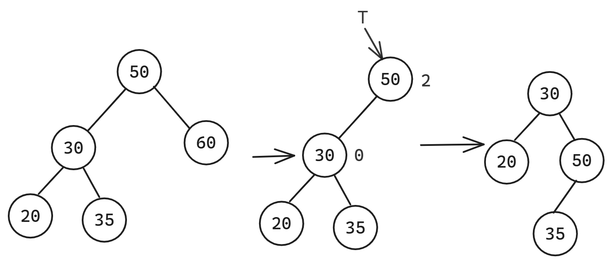

​								图6.3.4.1

如图6.3.4.2所示，删除8后平衡二叉树出现RR失衡，需要进行调整，此时T指向10，10的平衡因子等于-2，10的右孩子20的平衡因子等于0，平衡二叉树在删除结点之后判断是否为RR失衡的代码与平衡二叉树在插入结点之后判断是否为RR失衡的代码有一点不同。代码如下所示：

```c
//如果T的右孩子的平衡因子<=0说明是RR失衡
if(GetBalance(T->right)<=0){
//RR失衡需要左旋，LeftRotate(T)返回newroot
   newroot = LeftRotate(T);
}
```

平衡二叉树插入结点后如果出现RR失衡，失衡结点的平衡因子等于-2，失衡结点右孩子的平衡因子等于-1，平衡二叉树删除结点后如果出现RR失衡，失衡结点的平衡因子等于-2，失衡结点右孩子的平衡因子小于等于0。

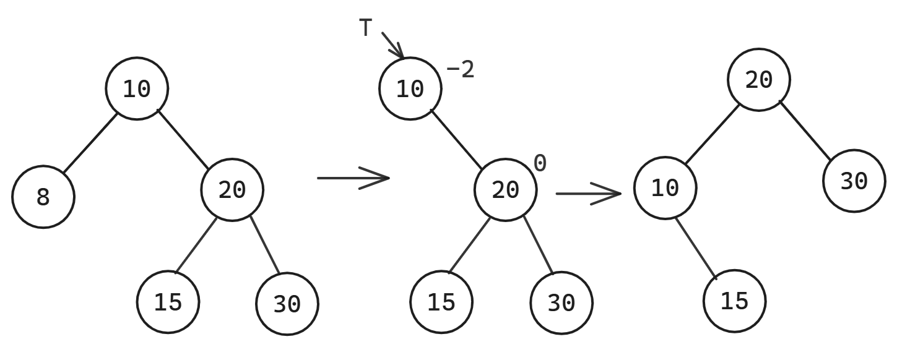

​							图6.3.4.2																					

平衡二叉树结点的删除代码与平衡二叉树结点的插入代码类似，不同的地方在于：（1）LL失衡与RR失衡的判断条件不同（2）平衡二叉树在插入结点之后需要检查平衡二叉树是否失衡，检查的办法是从插入结点的父亲结点开始，由下往上依次更新结点的平衡因子，如果发现某个结点的平衡因子绝对值>1说明该结点就是离插入结点最近的失衡结点，然后进行调整就可以恢复平衡。出栈时如果发现某个结点的平衡因子绝对值>1就需要停止出栈（3）平衡二叉树在删除结点之后，需要从删除结点的父亲结点开始，依次更新各祖先结点的平衡因子直到树根，如果发现某个祖先结点是失衡结点就需要调整，如果没有发现结点的平衡因子绝对值>1说明平衡二叉树是平衡的。当栈为空时停止出栈。

```c
void AVLDelete(AVLNode* &T,int key){
	//child获取要删除结点的孩子
	AVLNode* child = NULL;
	//p指向树根
	AVLNode* p = T;
	AVLNode* newroot = NULL;
	//parent的初始值为NULL，parent用来获取key的父亲结点
	AVLNode* parent = NULL;
	//定义1个栈，top指向栈顶元素
	AVLNode* stack[MaxSize];
	int top = -1;
	//如果p等于NULL说明没有找到key，如果p->data==key说明找到key
	while(p!=NULL && p->data!=key){
		//将根结点p入栈
		top++;
		stack[top] = p;
		//更新parent
		parent = p;
		//如果key的值大于当前p指向的结点的值，则p指针移动，p指向p的右孩子。
		if(key > p->data){
			p = p->right;
			//如果key的值小于当前p指向的结点的值，则p指针移动，p指向p的左孩子。
		}else{
			p = p->left;
		}
	}
	//如果p等于NULL说明key不存在或者树为空
	if(p==NULL){
		return;
		//如果p不等于NULL说明key存在,p指向要删除的结点
		//parent指向要删除结点的父亲结点
	}else{
		//如果p是叶子结点
		if(p->left==NULL&&p->right==NULL){
			//如果parent为NULL说明删除结点p没有父亲结点，p就是根结点
			//此时p是树中唯一的结点
			if(parent==NULL){
				//删除根结点
				delete(p);
				//此时树中没有结点，T指向NULL
				T = NULL;
				//此时树中没有结点，函数结束
				return;
			}else{
				//如果p是parent的左孩子
				if(parent->left==p){
					//parent的left指针指向NULL
					parent->left = NULL;
					//如果p是parent的右孩子
				}else{
					//parent的right指针指向NULL
					parent->right = NULL;
				}
				//删除p
				delete(p);
			}
			
			
			//如果要删除的结点p只有1个孩子
		}else if(p->left!=NULL&&p->right==NULL || p->left==NULL&&p->right!=NULL){
			//获取要删除结点的孩子
			//如果要删除结点的左孩子存在
			if(p->left!=NULL){
				child = p->left;
				//如果要删除结点的右孩子存在
			}else{
				child = p->right;
			}
			//如果删除结点p没有父亲结点，则p是根结点
			if(parent==NULL){
				//删除根结点p
				delete(p);
				//更新树根，树根是child
				T = child;
				//如果删除结点p是左孩子	
			}else if(p==parent->left){
				//将parent的left指向child
				parent->left = child;
				//删除p
				delete(p);
				//如果删除结点p是右孩子	
			}else{
				//将parent的right指向child
				parent->right = child;
				//删除p
				delete(p);
			}		
			//如果要删除的结点p左右孩子都存在
		}else{
			//获取删除结点的右孩子
			AVLNode* succeed = p->right;
			//parent的初始值设置为p，parent指向删除结点
			parent = p;
			/*沿着succeed的left指针向下找，
			直到找到没有左孩子的结点为止，这个
			没有左孩子的结点就是删除结点的后继结点*/
			while(succeed->left!=NULL){
				parent = succeed;
				succeed = succeed->left;
			}
			//while循环结束，succeed指向删除结点的后继结点
			//while循环结束，parent指向后继结点succeed的父亲结点
			//将删除结点的值修改为后继结点的值
			p->data = succeed->data;
			//如果后继结点的右孩子存在
			if(succeed->right!=NULL){
				//如果后继结点succeed是parent的左孩子
				if(succeed==parent->left){
					//parent的left指针指向后继结点的右孩子
					parent->left = succeed->right;
					//如果后继结点succeed是parent的右孩子	
				}else{
					//parent的right指针指向后继结点的右孩子
					parent->right = succeed->right;
				}		
				//如果后继结点是叶子结点
			}else{
				//如果后继结点是parent的左孩子
				if(parent->left==succeed){
					//parent的left指针指向NULL
					parent->left = NULL;
					//如果后继结点是parent的右孩子
				}else{
					//parent的right指针指向NULL
					parent->right = NULL;
				}
			}
			//删除后继结点succeed
			delete(succeed);	
		}
	}
	/*沿着查找平衡二叉树删除结点的路径的倒序依次更新各个结点的平衡因子，
	stack出栈元素组成的序列就是查找平衡二叉树删除结点的路径的倒序。
	*/
	while(top!=-1){
		//获取出栈结点q
		AVLNode* q = stack[top];
		//如果q是失衡结点，oldRoot指向失衡结点即失衡子树未调整前的旧根结点
		AVLNode* oldRoot = q;
		//结点出栈
		top--;
		//求出栈结点q的平衡因子
		int b = GetBalance(q);
		//如果b==2说明是LX失衡，q是失衡结点
		if(b==2){
		//如果失衡结点的左孩子的平衡因子>=0说明是LL失衡
			if(GetBalance(q->left)>=0){
				newroot = RightRotate(q);
				//如果是LR失衡	
			}else{
				newroot = LeftRight(q);
			}
			/*如果栈不为空说明失衡结点有父亲结点，需要判断失衡结点是
			左孩子还是右孩子，如果失衡结点是左孩子，则失衡结点的父亲结点
			的left指针指向新根结点。如果失衡结点是右孩子，则失衡结点的父亲结点
			的right指针指向新根结点。
			*/
			if(top!=-1){
				//获取失衡结点的父亲结点
				AVLNode* r = stack[top];
				/*如果失衡结点是左孩子，则失衡结点的父亲结点r
				的left指针指向新根结点。*/
				if(oldRoot==r->left){
					r->left = newroot;
					/*如果失衡结点是右孩子，则失衡结点的父亲结点r
					的right指针指向新根结点。*/	
				}else{
					r->right = newroot;
				}
				//如果栈为空说明失衡结点没有父亲结点，此时树根改变了需要更新树根
				//新根结点是树根	
			}else{
				T = newroot;
			}
		}
		//如果b==-2说明是RX失衡，q是距离插入结点最近的失衡结点
		if(b==-2){
			//如果失衡结点的右孩子的平衡因子<=0说明是RR失衡
			if(GetBalance(q->right)<=0){
				newroot = LeftRotate(q);
				//如果是RL失衡	
			}else{
				newroot = RightLeft(q);
			}
			/*如果栈不为空说明失衡结点有父亲结点，需要判断失衡结点是
			左孩子还是右孩子，如果失衡结点是左孩子，则失衡结点的父亲结点
			的left指针指向新根结点。如果失衡结点是右孩子，则失衡结点的父亲结点
			的right指针指向新根结点。
			*/
			if(top!=-1){
				//获取失衡结点的父亲结点
				AVLNode* r = stack[top];
				/*如果失衡结点是左孩子，则失衡结点的父亲结点r
				的left指针指向新根结点。*/
				if(oldRoot==r->left){
					r->left = newroot;
					/*如果失衡结点是右孩子，则失衡结点的父亲结点r
					的right指针指向新根结点。*/	
				}else{
					r->right = newroot;
				}
				//如果栈为空说明失衡结点没有父亲结点，此时树根改变了需要更新树根
				//新根结点是树根	
			}else{
				T = newroot;
			}
		}
	}	
}
```

如图6.3.4.3所示，删除平衡二叉树中的结点60，需要从删除结点的父亲结点50开始从下往上依次更新各祖先结点的平衡因子，因为50的平衡因子是2，50的左孩子的平衡因子等于0，说明平衡二叉树出现LL失衡，调整完成之后树根发生改变，树根修改成结点30。如图6.3.4.3所示。

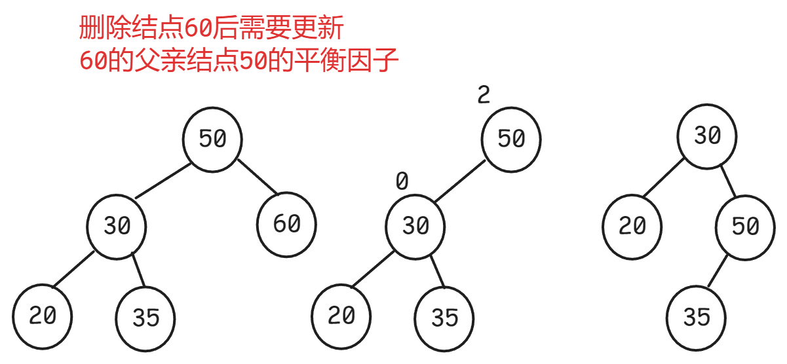

​							图6.3.4.3

如图6.3.4.4所示，删除平衡二叉树中的结点90，需要从删除结点的父亲结点80开始从下往上依次更新各祖先结点的平衡因子，因为80的平衡因子是2，80的左孩子的平衡因子等于1，说明平衡二叉树出现LL失衡，调整完成之后新根结点55连接上了结点50，50的平衡因子等于0不需要调整。如图6.3.4.4所示。

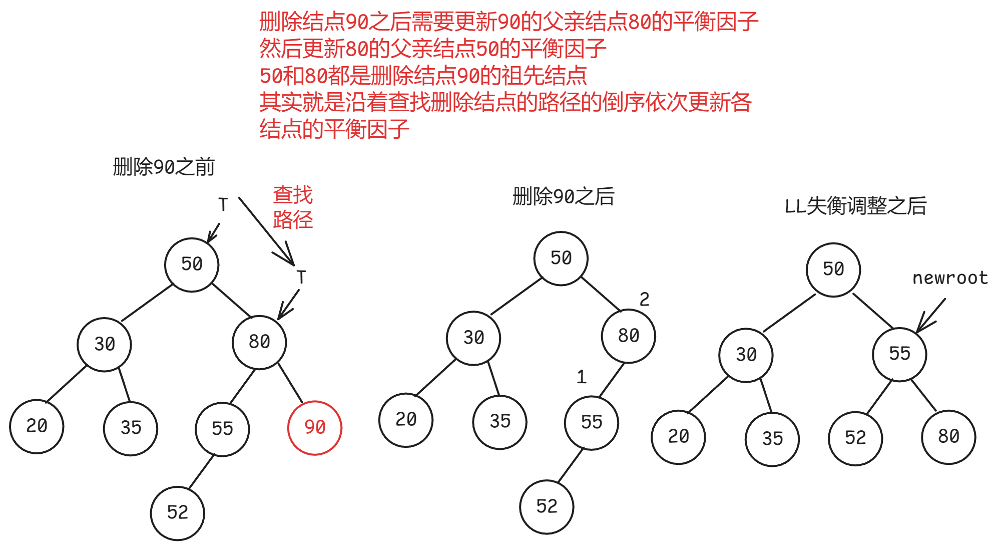

​							图6.3.4.4

## 6.4 红黑树

### 6.4.1  红黑树的特性

红黑树有四个特性，（1）红黑树是1个二叉查找树（2）红黑树的树根和叶子结点（NULL结点）是黑色，简称根叶黑（3）不存在连续两个红色的结点，简称不红红（4）任意一个结点到NULL结点的所有路径黑结点数量相同，简称黑路同。在红黑树中叶子结点是指NULL结点。在普通的二叉查找树中叶子结点是指没有左右孩子的结点。图6.4.1.1是1个红黑树。

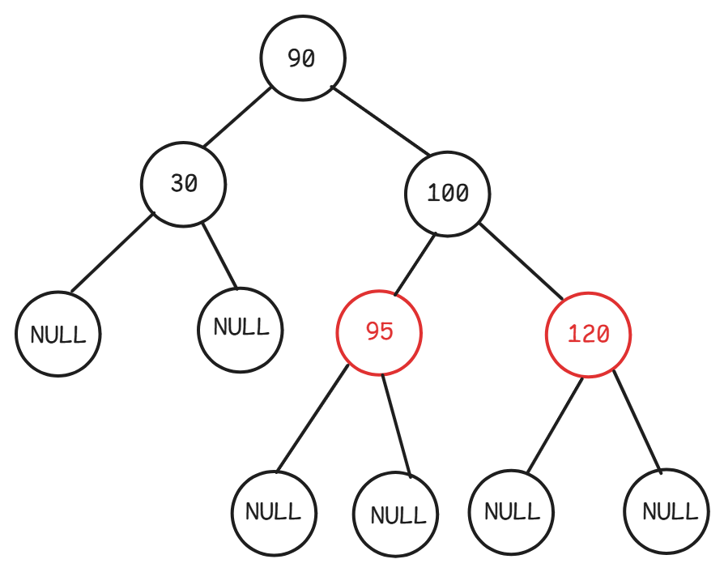

​							   图6.4.1.1

红黑树中插入的结点应该是什么颜色？如果插入的新结点是黑色，则会破坏黑路同，导致插入结点所在的路径上的黑色结点比其他路径多一个，需要进行调整。如果插入的结点是红色并且插入的结点的父亲结点也是红色则会破坏不红红，导致出现两个连续的红色结点需要进行调整。如果插入的结点是红色并且插入的结点的父亲结点是黑色则不会破坏红黑树的特性，不需要进行调整。由此可知插入的结点只能是红色，因为插入的结点是红色有可能不会破坏红黑树的特性，如果插入的结点是黑色则肯定会破坏红黑树的特性，每插入一个黑色结点都要进行调整。

红黑树结点的定义与二叉查找树类似，唯一的区别就是红黑树结点中增加了父指针，因为红黑树在插入后需要调整，调整时需要获取插入结点的父亲结点，叔叔结点，爷爷结点，通过父指针可以非常方便的获取插入结点的父亲结点，叔叔结点，爷爷结点。红黑树结点的定义代码如下：

```c
#define RED 1
#define BLACK 2
//定义红黑树结点
typedef struct rbtreeNode{
	int key;//结点中存储的关键字
	struct rbtreeNode *left;//左指针，指向当前结点的左孩子
	struct rbtreeNode *right;//右指针，指向当前结点的右孩子
	int color;//定义结点的颜色，1代表红色，2代表黑色
	struct rbtreeNode *parent;//父指针，指向当前结点的父亲
}rbtreeNode;
```

在红黑树插入与删除操作中，NULL结点统一使用nil结点代替，nil结点的创建代码如下：nil结点可以避免空指针异常，还可以非常方便的获取删除结点的父亲结点。

```c
//创建nil结点，代替NULL结点，nil结点是黑色
rbtreeNode node = {-1,NULL,NULL,BLACK,NULL};
rbtreeNode* nil = &node;
```


### 6.4.2  红黑树的失衡与调整

红黑树中插入的结点只能是红色，当插入的结点的父亲结点也是红色时才会破坏红黑树的特性，才需要进行调整。因为插入结点导致红黑树的特性被破坏叫做红黑树失衡。红黑树插入结点后的失衡调整可以分为四种情况：（1）插入的结点是树根，直接将结点变黑（2.1）如果插入结点父亲结点是左孩子，叔叔是右孩子，插入结点的叔叔是红色，将叔叔父亲爷爷变色，爷爷结点看作插入结点。（2.2）如果插入结点父亲结点是左孩子，叔叔是右孩子，插入结点的叔叔是黑色，需要判断是LL LR失衡情况中的哪一种，然后变色。然后进行旋转。（3.1）如果插入结点父亲结点是右孩子，叔叔是左孩子，插入结点的叔叔是红色，将叔叔父亲爷爷变色，爷爷结点看作插入结点。（3.2）如果插入结点父亲结点是右孩子，叔叔是左孩子，插入结点的叔叔是黑色，需要判断是RR RL失衡情况中的哪一种，然后变色。然后进行旋转。

（1）插入的结点是树根，直接将结点变黑，如图6.4.2.1所示，插入的结点20是红黑树的树根，此时需要将结点20变为黑色。

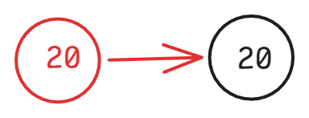

​							 图6.4.2.1

如果插入结点不是根结点并且插入结点的父亲结点是红色会破坏不红红特性，需要进行失衡调整，根据不同的情况进行调整，调整方法见下面的2.1，2.2，3.1，3.2。

（2.1）如果插入结点父亲结点是左孩子，叔叔是右孩子，插入结点的叔叔是红色，将叔叔父亲爷爷变色，爷爷结点看作插入结点。如图6.4.2.2所示，插入结点6后导致红黑树失衡，将结点6的叔叔结点25变成黑色，将结点6的父亲结点10变成黑色，将结点6的爷爷结点20变成红色，将爷爷结点20看作插入结点，如果插入结点cur不是根结点并且cur的父亲结点为红色就需要继续while循环判断是哪种失衡。如果插入结点cur是根结点直接变黑，如果插入结点cur的父亲结点是黑色不需要调整，因为爷爷结点20是根结点，因此将爷爷结点20变成黑色。用cur表示当前插入的结点，f表示父亲结点，u表示叔叔结点，g表示爷爷结点。

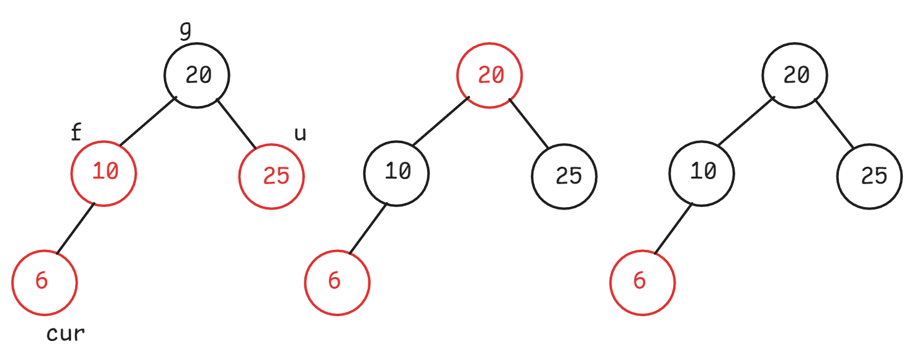

​							图6.4.2.2

```c
//通过cur->parent获取父亲结点
//通过cur->parent->parent获取爷爷结点
//如果父亲结点是左孩子
if(cur->parent==cur->parent->parent->left){
    //获取叔叔结点u,叔叔是爷爷的右孩子
    u = cur->parent->parent->right;
    //获取父亲结点f
    f = cur->parent;
    //获取爷爷结点g
    g = cur->parent->parent;
    //如果叔叔是红色
    if(u->color==RED){
        //叔叔变黑
        u->color = BLACK;
        //父亲变黑
        f->color = BLACK;
        //爷爷变红
        g->color = RED;
        //将爷爷结点看作插入结点cur
        //如果插入结点cur不是根结点并且cur的父亲结点为红色就
        //需要继续while循环判断是哪种失衡
        //如果插入结点cur是根结点直接变黑
        //如果插入结点cur的父亲结点是黑色也不需要调整
        cur = g；
    }
}
```

（2.2）如果插入结点父亲结点是左孩子，叔叔是右孩子，插入结点的叔叔是黑色，需要判断是LL LR失衡情况中的哪一种，然后变色。然后进行旋转。如图6.4.2.3所示，插入结点6后导致LL失衡，LL失衡的定义：在红黑树中插入1个新结点，插入结点的叔叔是黑色，插入结点的父亲结点是红色导致违反不红红特性，插入结点是左孩子，插入结点的父亲结点是左孩子。如图6.4.2.3所示，插入结点6，父亲结点10变黑，爷爷结点20变红，对爷爷进行右旋。

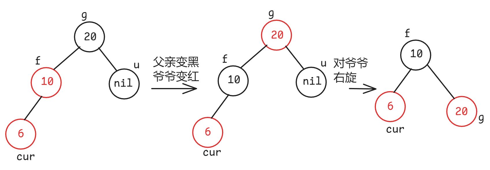

​							 图6.4.2.3

```c
//如果父亲结点是左孩子
if(cur->parent==cur->parent->parent->left){
    //获取叔叔结点u,叔叔是爷爷的右孩子
    u = cur->parent->parent->right;
    //获取父亲结点f
    f = cur->parent;
    //获取爷爷结点g
    g = cur->parent->parent;
    //此时叔叔结点是黑色说明是LL或者LR失衡
    //如果插入结点cur是左孩子则说明是LL失衡
    if(cur==f->left){
        //父亲变黑
        f->color = BLACK;
        //爷爷变红
        g->color = RED;
        //右旋爷爷,T指向树根
        RightRotate(g,T);
    }
}    
```

（2.2）如果插入结点父亲结点是左孩子，叔叔是右孩子，插入结点的叔叔是黑色，需要判断是LL LR失衡情况中的哪一种，然后变色。然后进行旋转。LR失衡的定义：在红黑树中插入1个新结点，插入结点的叔叔是黑色，插入结点的父亲结点是红色导致违反不红红特性，插入结点是右孩子，插入结点的父亲结点是左孩子。如图6.4.2.4所示，插入结点12导致红黑树发生LR失衡，将插入结点12变黑，爷爷结点20变红，左旋父亲结点10，右旋爷爷结点20。

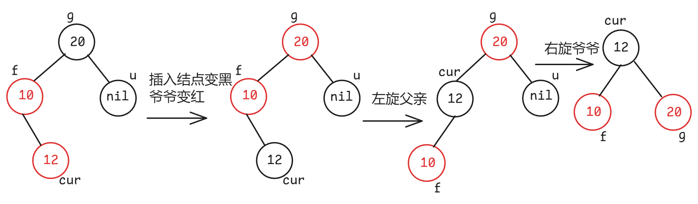

​							  图6.4.2.4

```c
//如果父亲结点f是左孩子
if(cur->parent==cur->parent->parent->left){
    //获取叔叔结点u,叔叔是爷爷的右孩子
    u = cur->parent->parent->right;
    //获取父亲结点f
    f = cur->parent;
    //获取爷爷结点g
    g = cur->parent->parent;
    //叔叔是黑色说明是LL或者LR失衡
    //如果插入结点cur是右孩子则说明是LR失衡
    if(cur==f->right){
        //插入结点变黑
        cur->color = BLACK;
        //爷爷变红
        g->color = RED;
        //左旋父亲
        LeftRotate(f);
        //右旋爷爷
        RightRotate(g);
    }
}    
```

（3.1）如果插入结点父亲结点是右孩子，叔叔是左孩子，插入结点的叔叔是红色，将叔叔父亲爷爷变色，爷爷结点看作插入结点。如图6.4.2.5所示，父亲结点f是爷爷的右孩子，叔叔结点u是爷爷的左孩子。插入结点26导致破坏不红红特性，将叔叔结点10变黑，将父亲结点25变黑，将爷爷结点20变红，将爷爷结点20看成插入结点，因为爷爷结点20是根结点，将爷爷结点20变成黑色。

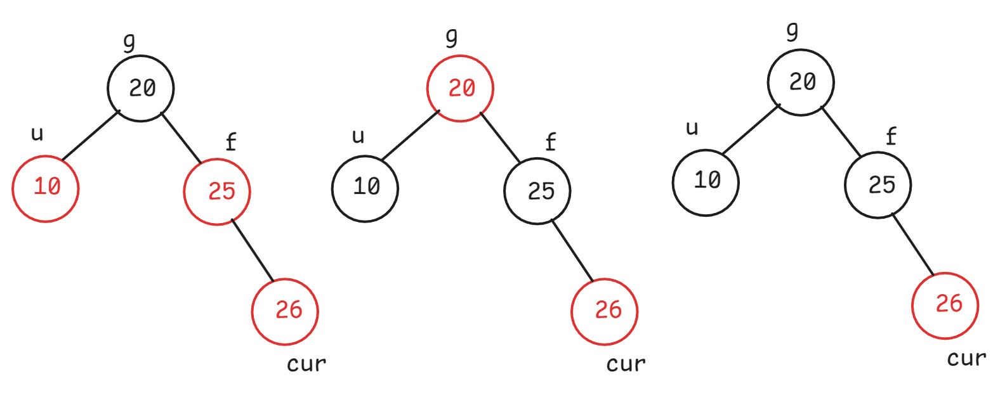

​							 图6.4.2.5

```c
//判断父亲结点f是爷爷结点g的左孩子还是右孩子
//如果父亲结点f是右孩子
if(cur->right==cur->parent->parent->right){
    //获取叔叔结点u,叔叔是爷爷的左孩子
    u = cur->parent->parent->left;
    //获取父亲结点f
    f = cur->parent;
    //获取爷爷结点g
    g = cur->parent->parent;
    //如果叔叔是红色
    if(u->color==RED){
        //叔叔变黑
        u->color = BLACK;
        //父亲变黑
        f->color = BLACK;
        //爷爷变红
        g->color = RED;
        //将爷爷结点看作插入结点cur
        //如果插入结点cur不是根结点并且cur的父亲结点为红色就
        //需要继续while循环判断是哪种失衡
        //如果插入结点cur是根结点直接变黑
        //如果插入结点cur的父亲结点是黑色也不需要调整
        cur = g;
    }
}
```

（3.2）如果插入结点父亲结点是右孩子，叔叔是左孩子，插入结点的叔叔是黑色，需要判断是RR RL失衡情况中的哪一种，然后变色。然后进行旋转。如图6.4.2.6所示，插入结点30后导致RR失衡，RR失衡的定义：在红黑树中插入1个新结点，插入结点的叔叔是黑色，插入结点的父亲结点是红色导致违反不红红，插入结点是右孩子，插入结点的父亲结点是右孩子。如图6.4.2.6所示，插入结点30，父亲结点25变黑，爷爷结点20变红，左旋爷爷结点20。

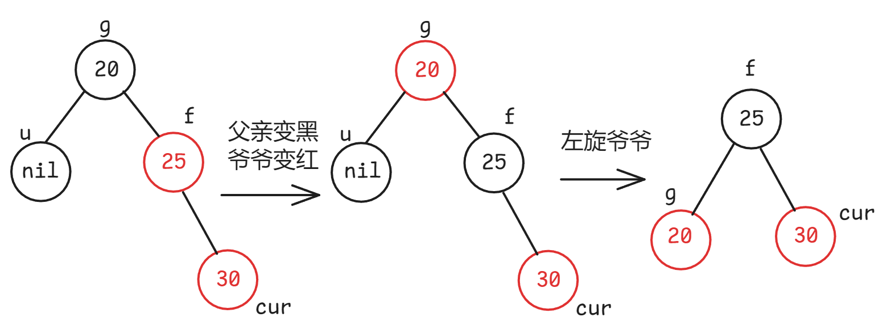

​							图6.4.2.6

```c
//RR失衡调整
//如果父亲结点f是右孩子
if(cur->parent==cur->parent->parent->right){
    //获取叔叔结点u,叔叔是爷爷的左孩子
    u = cur->parent->parent->left;
    //获取父亲结点f
    f = cur->parent;
    //获取爷爷结点g
    g = cur->parent->parent;
    //此时叔叔结点是黑色说明是RR或者RL失衡
    //如果插入结点cur是右孩子则说明是RR失衡
    if(cur==f->right){
        //父亲变黑
        f->color = BLACK;
        //爷爷变红
        g->color = RED;
        //左旋爷爷，T指向树根
        LeftRotate(g,T);
    }
}    
```

​																							

（3.2）如果插入结点父亲结点是右孩子，叔叔是左孩子，插入结点的叔叔是黑色，需要判断是RR RL失衡情况中的哪一种，然后变色。然后进行旋转。如图6.4.2.7所示，插入结点25后导致RL失衡，RL失衡的定义：在红黑树中插入1个新结点，插入结点的叔叔是黑色，插入的新结点的父亲结点是红色导致违反不红红，插入结点是左孩子，插入结点的父亲结点是右孩子。如图6.4.2.7所示，插入结点25导致出现RL失衡，插入结点25变黑，爷爷结点20变红，右旋父亲结点30，左旋爷爷结点20。

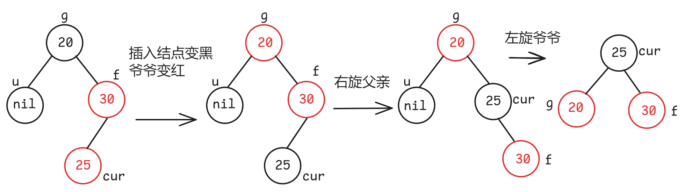

​							图6.4.2.7

```c
//RL失衡调整
//如果父亲结点f是右孩子
if(cur->parent==cur->parent->parent->right){
    //获取叔叔结点u,叔叔是爷爷的左孩子
    u = cur->parent->parent->left;
    //获取父亲结点f
    f = cur->parent;
    //获取爷爷结点g
    g = cur->parent->parent;
    //因为叔叔是黑色说明是RR或者RL失衡
    //如果插入结点cur是左孩子则说明是RL失衡
    if(cur==f->left){
        //插入结点变黑
        cur->color = BLACK;
        //爷爷变红
        g->color = RED;
        //右旋父亲
        RightRotate(f);
        //左旋爷爷
        LeftRotate(g);
    }
}    
```


### 6.4.3   红黑树插入结点的实现

红黑树在插入结点过程中需要进行左旋或者右旋操作，因此需要定义左旋和右旋函数，红黑树的旋转操作和平衡二叉树类似，区别就是红黑树在旋转操作完成之后需要更新部分结点的父指针，还需要更新新根结点的父亲结点的左指针或者右指针。红黑树的右旋操作如图6.4.2.8所示，插入结点10之后发生LL失衡，爷爷结点30变红，父亲结点20变黑，爷爷结点30右旋，右旋操作和平衡二叉树相同，右旋之后需要更新结点40的left指针，结点40的left指向新根结点20，结点20和结点30的父亲结点改变了，需要更新结点20和30的parent指针，令root->parent = newroot ，newroot->parent = q。如果q等于NULL，说明newroot没有父亲结点，newroot是红黑树的树根，更新树根。

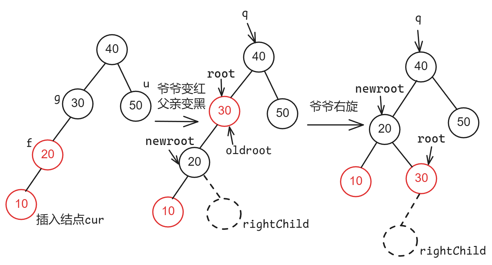

​							图6.4.2.8

```c
//LL失衡需要右旋
//获取root的父亲结点q
q = root->parent;
//获取旧根结点
oldroot = root;
//获取新根结点
newroot = root->left;
//获取新根结点的右孩子
rightChild = newroot->right;
//root的left指向新根结点的右孩子
root->left = rightChild;
//newroot的right指向root
newroot->right = root;
//如果q为nil,说明newroot是红黑树的树根，修改树根
if(q==nil){
    T = newroot;
//如果旧根结点是左孩子
}else if(oldroot == q->left){
    //q的left指向newroot
    q->left = newroot;
    //如果旧根结点是右孩子
}else{
    //q的right指向newroot
    q->right = newroot;
}
//修改新根结点的父指针
newroot->parent = q;
//修改旧根结点的父指针
root->parent = newroot;
if(rightChild!=nil){
     rightChild->parent = root;
}
```

红黑树的左旋操作如图6.4.2.9所示，插入结点70之后发生RR失衡，爷爷结点50变红，父亲结点60变黑，爷爷结点50左旋，左旋操作和平衡二叉树相同，左旋之后需要更新结点40的right指针，结点40的right指针指向新根结点60，结点50和结点60的父亲结点改变了，需要更新结点50和60的parent指针，令root->parent = newroot ，newroot->parent = q。如果q等于NULL，说明newroot没有父亲结点，newroot是红黑树的树根，更新树根。

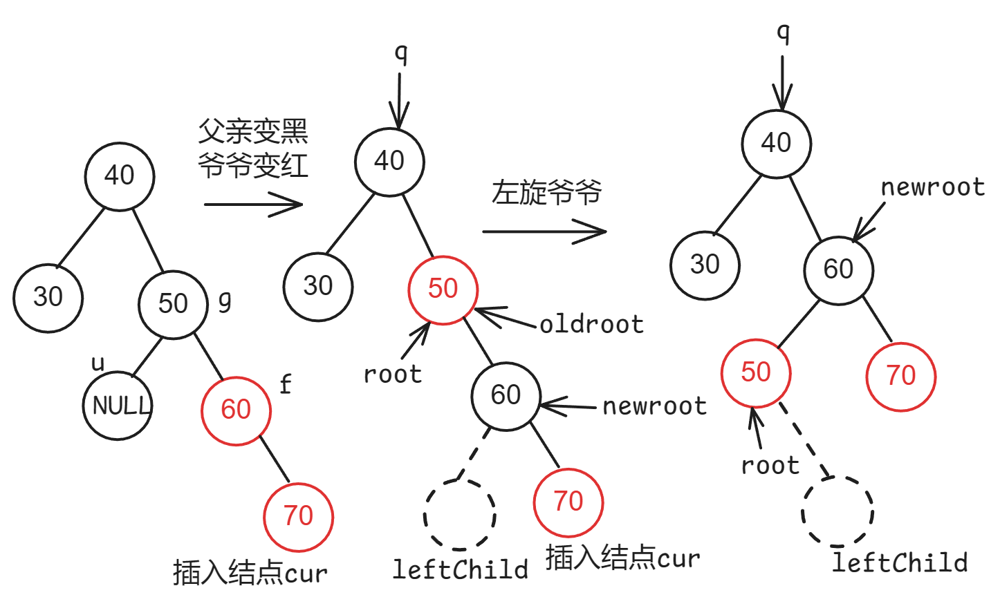

​							图6.4.2.9

```c
//RR失衡需要左旋，左旋爷爷，root指向爷爷
//获取root的父亲结点q，
q = root->parent;
//获取旧根结点
oldroot = root;
//获取新根结点
newroot = root->right;
//获取新根结点的左孩子
leftChild = newroot->left;
//root的right指向新根结点的左孩子
root->right = leftChild; 
//newroot的left指向root
newroot->left = root;
//如果q为NULL,说明newroot是红黑树的树根，修改树根
if(q==nil){
    T = newroot;
//如果旧根结点是左孩子
}else if(oldroot == q->left){
    //q的left指向newroot
    q->left = newroot;
    //如果旧根结点是右孩子
}else{
    //q的right指向newroot
    q->right = newroot;
}
//修改新根结点的父指针
newroot->parent = q;
//修改旧根结点的父指针
root->parent = newroot;
if(leftChild!=nil){
     leftChild->parent = root;
}
```

红黑树左旋与右旋函数内部修改的是root指向的结点的left，right，parent指针，root没有指向其它结点，因此root不使用引用类型，T指向树根，左旋和右旋函数内部需要修改树根T，并且在main函数中需要访问修改后的树根，因此T使用引用类型。如果函数内部需要修改指针本身（让指针指向另一个结点），并且希望这个修改在函数外部生效（在函数外部访问修改后的变量），那么就需要引用传递。

红黑树左旋与右旋函数的代码如下所示：

```c
//右旋函数
//定义右旋函数
void RightRotate(rbtreeNode* root,rbtreeNode* &T){
	//LL失衡需要右旋
	//获取root的父亲结点q
	rbtreeNode * q = root->parent;
	//获取旧根结点
	rbtreeNode * oldroot = root;
	//获取新根结点
	rbtreeNode * newroot = root->left;
	//获取新根结点的右孩子
	rbtreeNode * rightChild = newroot->right;
	//root的left指向新根结点的右孩子
	root->left = rightChild;
	//newroot的right指向root
	newroot->right = root;
	//如果q为nil,说明newroot是红黑树的树根，修改树根
	if(q==nil){
		T = newroot;
	//如果旧根结点是左孩子
	}else if(oldroot == q->left){
		//q的left指向newroot
		q->left = newroot;
		//如果旧根结点是右孩子
	}else{
		//q的right指向newroot
		q->right = newroot;
	}
	//修改新根结点的父指针
	newroot->parent = q;
	//修改旧根结点的父指针
	root->parent = newroot;
	if(rightChild!=nil){
		rightChild->parent = root;
	}
}

//左旋函数
//定义左旋函数
void LeftRotate(rbtreeNode* root,rbtreeNode* &T){
	//RR失衡需要左旋，左旋爷爷，root指向爷爷
	//获取root的父亲结点q，
	rbtreeNode* q = root->parent;
	//获取旧根结点
	rbtreeNode* oldroot = root;
	//获取新根结点
	rbtreeNode* newroot = root->right;
	//获取新根结点的左孩子
	rbtreeNode* leftChild = newroot->left;
	//root的right指向新根结点的左孩子
	root->right = leftChild; 
	//newroot的left指向root
	newroot->left = root;
	//如果q为nil,说明newroot是红黑树的树根，修改树根
	if(q==nil){
		T = newroot;
	//如果旧根结点是左孩子
	}else if(oldroot == q->left){
		//q的left指向newroot
		q->left = newroot;
		//如果旧根结点是右孩子
	}else{
		//q的right指向newroot
		q->right = newroot;
	}
	//修改新根结点的父指针
	newroot->parent = q;
	//修改旧根结点的父指针
	root->parent = newroot;
	if(leftChild!=nil){
		leftChild->parent = root;
	}
}
```

红黑树插入结点的函数需要使用非递归，因为非递归可以非常方便的获取插入结点的父亲结点，可以非常方便的获取插入结点的插入位置。红黑树插入结点非递归代码与二叉查找树插入结点非递归代码类似，区别在于红黑树插入的每个结点需要设置为红色。如果插入结点是根结点，此时需要将这个结点颜色修改为黑色，然后将这个结点的parent指针设置为NULL，因为根结点没有父亲结点。如果插入的结点是红黑树的根结点，不需要调用调整红黑树的代码。如果插入的结点不是红黑树的根结点，每次都需要调用调整红黑树的代码，判断插入的结点是否导致红黑树失衡。红黑树插入结点的代码和调整红黑树的代码如下所示：

```c
//cur指向插入结点，T指向树根
//插入后调整红黑树
void rbtreeAdjust(rbtreeNode* cur,rbtreeNode* &T){
	//如果插入结点不是根结点并且插入结点的父亲结点是红色需要进行调整
	while(cur!=T && cur->parent->color==RED){
		//如果插入结点的父亲是左孩子
		//通过cur->paren获取父亲结点
		//通过cur->parent->parent获取爷爷结点
		if(cur->parent==cur->parent->parent->left){
			//获取叔叔结点u,叔叔是爷爷的右孩子
			rbtreeNode* u = cur->parent->parent->right;
			//获取父亲结点f
			rbtreeNode* f = cur->parent;
			//获取爷爷结点g
			rbtreeNode* g = cur->parent->parent;
			//如果叔叔是红色
			if(u->color==RED){
				//叔叔变黑
				u->color = BLACK;
				//父亲变黑
				f->color = BLACK;
				//爷爷变红
				g->color = RED;
				//将爷爷结点看作插入结点cur
				//如果插入结点cur不是根结点并且cur的父亲结点为红色就继续while循环
				//如果插入结点cur是根结点直接变黑
				//如果插入结点cur的父亲结点是黑色也不需要调整
				cur = g;
				//如果叔叔是黑色，判断是LL还是LR失衡
			}else{
				//如果插入结点是左孩子说明是LL失衡
				if(cur==f->left){
					//父亲变黑
					f->color =BLACK;
					//爷爷变红
					g->color = RED;
					//右旋爷爷
					RightRotate(g,T);
					//调整完成
					break;
					//如果插入结点是右孩子说明是LR失衡	
				}else{
					//插入结点变黑
					cur->color = BLACK;
					//爷爷变红
					g->color= RED;
					//左旋父亲
					LeftRotate(f,T);
					//右旋爷爷
					RightRotate(g,T);
					//调整完成
					break;
				}
			}
			//如果插入结点的父亲结点是右孩子
		}else{
			//获取叔叔结点u,叔叔是爷爷的左孩子
			rbtreeNode* u = cur->parent->parent->left;
			//获取父亲结点f
			rbtreeNode* f = cur->parent;
			//获取爷爷结点g
			rbtreeNode* g = cur->parent->parent;
			//如果叔叔是红色
			if(u->color==RED){
				//叔叔变黑
				u->color = BLACK;
				//父亲变黑
				f->color = BLACK;
				//爷爷变红
				g->color = RED;
				//将爷爷结点看作插入结点cur
				//如果插入结点cur不是根结点并且cur的父亲结点为红色就继续while循环
				//如果插入结点cur是根结点直接变黑
				//如果插入结点cur的父亲结点是黑色也不需要调整
				cur = g;
				//如果叔叔是黑色，判断是RR还是RL失衡
			}else{
				//如果插入结点是右孩子，则说明是RR失衡
				if(cur==f->right){
					//父亲变黑
					f->color = BLACK;
					//爷爷变红
					g->color = RED;
					//左旋爷爷
					LeftRotate(g,T);
					//调整完成
					break;
					//如果插入结点是左孩子，则说明是RL失衡	
				}else{
					//插入结点变黑
					cur->color = BLACK;
					//爷爷变红
					g->color = RED;
					//右旋父亲
					RightRotate(f,T);
					//左旋爷爷
					LeftRotate(g,T);
					//调整完成
					break;
				}
			}
		}	
	}
	//根结点设置为黑色
	T->color = BLACK;
}
	
//红黑树插入结点代码
//key是要插入的的关键字，第一次调用rbtreeNodeInsert函数时T指向NULL，之后调用rbtreeNodeInsert函数时T指向树根
void rbtreeNodeInsert(rbtreeNode* &T,int key){
	//如果T为nil说明此时树为空，让T指向新创建的结点，也就是让T指向树根
	if(T==nil){
		T= new rbtreeNode;
		T->key = key;
		T->left = NULL;
		T->right = NULL;
		//树根变为黑色
		T->color =BLACK;
		//根结点的父亲结点为NULL
		T->parent = NULL;
		return;
	}
	//定义指针father指向新插入结点的父亲结点
	rbtreeNode* father = NULL;
	//p指向树根
	rbtreeNode* p = T;
	//从树根开始查找新插入结点的父亲结点
	//查找新插入结点的父亲结点，while循环开始之前p指向树根。
	while(p!=nil){
		//指针father保存当前p的值
		father = p;
		//如果key的值在二叉查找树中已存在则取消插入
		if(key==p->key){
			return;
			//如果key大于当前p指向的结点的值，则p指针移动，p指向p的右孩子
		}else if(key > p->key){
			p = p->right;
			//如果key小于当前p指向的结点的值，则p指针移动，p指向p的左孩子
		}else{
			p = p->left;
		}
	}
	//while循环结束之后，p指向新插入的结点
	p = new rbtreeNode;
	//p结点的左指针和右指针都设置为nil，因为新插入的结点是叶子结点
	p->left = nil;
	p->right = nil;
	//将关键字key存入新结点p
	p->key = key;
	//设置p的颜色为红色
	p->color =RED;
	//while循环结束之后father指向新插入结点p的父亲结点
	//如果新插入结点的值小于新插入结点的父亲结点的值，则父亲结点的左指针指向新插入的结点
	if(key<father->key){
		father->left = p;
		//如果新插入结点的值大于新插入结点的父亲结点的值，则父亲结点的右指针指向新插入的结点
	}else{
		father->right = p;
	}
	//p的parent指向父亲father
	p->parent = father;
	//调用红黑树插入调整函数
	rbtreeInsertAdjust(p,T);
}
```


红黑树中序先序遍历与main函数代码如下所示：

```c
//中序遍历
void InOrder(rbtreeNode* T){
	if(T!=nil){
		InOrder(T->left);
		printf("key:%d,color:%d,parent:%d/n",T->key,T->color,T->parent->key);
		InOrder(T->right);
	}
}
//先序遍历
void PreOrder(rbtreeNode* T){
	if(T!=nil){
		printf("key:%d,color:%d,parent:%d/n",T->key,T->color,T->parent->key);
		PreOrder(T->left);
		PreOrder(T->right);
	}
}

int main(){
	//定义树根
	rbtreeNode* T = NULL;
	//定义数组
	int R[] = {17,18,23,34,27,15,9,6,8,5,25};
	//求数组的长度
	int len = sizeof(R) /sizeof(int);
	for(int i=0;i<len;i++){
		rbtreeNodeInsert(T,R[i]);
	}
	InOrder(T);
	printf("/n");
	PreOrder(T);
	return 0;
}
```

​																	

### 6.4.4 红黑树结点的删除

红黑树结点的删除与二叉查找树相同，区别在于删除完成之后可能会破坏红黑树的特性，需要进行旋转和变色，使其恢复红黑树的特性。如果删除的结点左右孩子都有，则会转换成删除没有孩子的结点或者转换成删除只有一个孩子的结点。如果删除的是没有孩子的红色结点，则直接删除不会破坏红黑树的特性。

如果删除结点只有左孩子或者右孩子，则会出现如图6.4.1.1所示的情况。

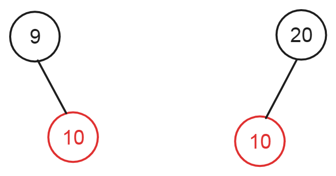

​							图6.4.4.1

红色结点不可能只有左孩子或者右孩子，如果红色结点只有左孩子或者右孩子，则会破坏红黑树的特性。如图6.4.4.2所示，红色结点只有1个孩子，但是从根结点到NULL结点的路径黑色结点数目不相等，违反了红黑树的特性。

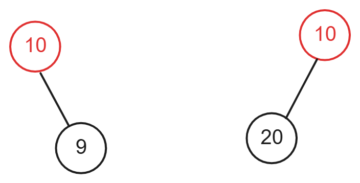

​							图6.4.4.2																							

如图6.4.4.3所示，删除的是没有孩子的红色结点，直接删除不会破坏红黑树的特性。


​							图6.4.4.3

如图6.4.4.4所示，删除结点52，删除的是只有1个孩子的黑色结点，则将删除结点的孩子55顶替上去，将顶替上去的结点55变成黑色。

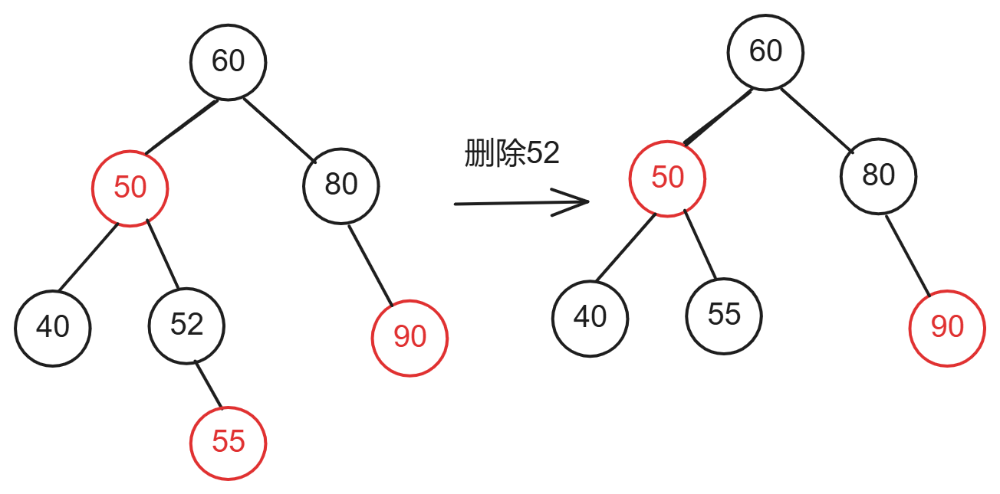

​							图6.4.4.4

删除没有孩子的黑色结点情况比较复杂，这里需要引入一个概念叫双黑结点，双黑结点指的是没有孩子的黑色结点删除之后，接替这个黑色结点的NULL结点，这个NULL结点叫做双黑结点。删除没有孩子的黑色结点过程中，双黑结点有可能会上移，也就是说双黑结点会发生改变，这个双黑结点最终需要消除，消除双黑结点意味着红黑树恢复了平衡。删除没有孩子的黑色结点需要分两种情况进行讲解。（1）双黑结点的兄弟结点是左孩子（2）双黑结点的兄弟结点是右孩子。这两种情况内部又细分为四种情况。

(1.1) 双黑结点的兄弟结点是左孩子，兄弟结点是黑色，当兄弟结点的左孩子是红色，右孩子颜色任意，说明是LL型。LL型调整方法为：兄弟结点s的左孩子变黑，兄弟结点s变成父亲结点p的颜色，父亲结点p变成黑色，右旋父亲结点p。 如图6.4.4.5所示。

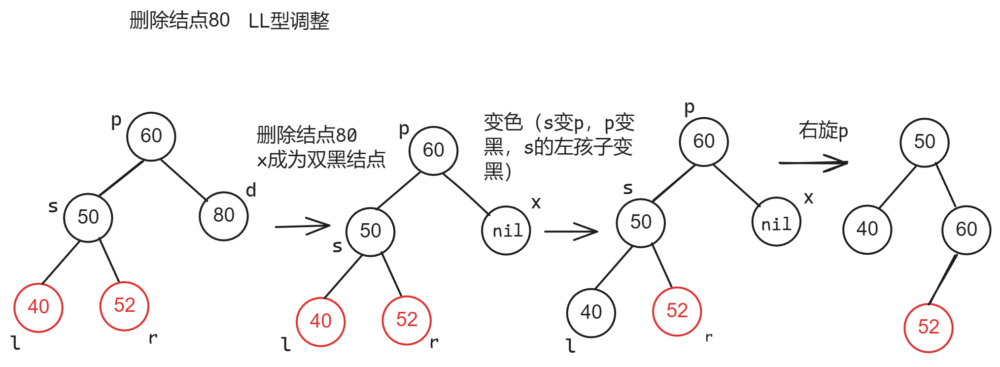

​								 图6.4.4.5

```c
//如果双黑结点x是右孩子，则兄弟结点是左孩子
if(x==x->parent->right){
    //获取父亲结点
    p = x->parent;
    //获取兄弟结点
    s = p->left;
    //兄弟结点左孩子是红色说明是LL型
    if(s->left->color==RED){
        //s变p
        s->color = p->color;
        //p变黑
        p->color = BLACK;
        //s的左孩子变黑
        s->left->color = BLACK;
        //右旋p
        RightRotate(p, T);
        break; // 调整结束
    }
}
```

(1.2) 双黑结点的兄弟结点是左孩子，兄弟结点是黑色，兄弟结点的左孩子是黑色，右孩子是红色，说明是LR型，LR型需要转变成LL型，按照LL型规则进行调整。LR型调整方法为：兄弟结点s的右孩子变黑，兄弟结点s变红，左旋兄弟结点s，更新兄弟结点，兄弟结点s成为p的左孩子，接着按照LL型处理。 如图6.4.4.6所示。

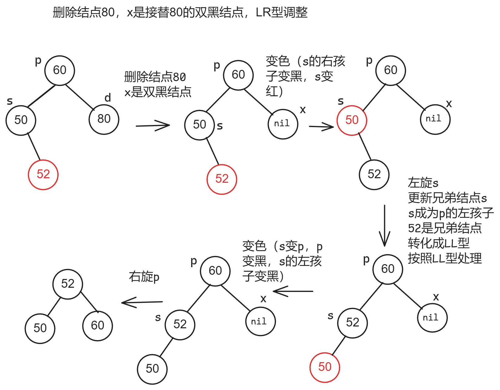

​							 图6.4.4.6

```c
//如果双黑结点x是右孩子，则兄弟结点s是左孩子
if(x==x->parent->right){
    //获取父亲结点
    p = x->parent;
    //获取兄弟结点
    s = p->left;
    //兄弟结点左孩子是黑色说明是LR型
    //兄弟结点左孩子是红色说明是LL型
    //LL与LR通过左孩子颜色进行区分
    //LR型
    if (s->left->color == BLACK) {
        //s的右孩子变黑
        s->right->color = BLACK;
        //s变红
        s->color = RED;
        //左旋s
        LeftRotate(s, T);
        //更新兄弟结点s
        //s是p的左孩子
        //按照LL型规则进行调整
        s = p->left;
    }        
    //LL型调整
    //s变p
    s->color = p->color;
    //p变黑
    p->color = BLACK;
    //s的左孩子变黑
    s->left->color = BLACK;
    //右旋p
    RightRotate(p, T);
    break; // 调整结束
}
```

（1.3）兄弟结点是黑色，兄弟结点的左右孩子都是黑色，需要将兄弟变红，双黑结点上移，更新双黑结点继续调整。如果双黑结点是红色或者根结点，则将双黑结点变为黑色，到此调整完成。

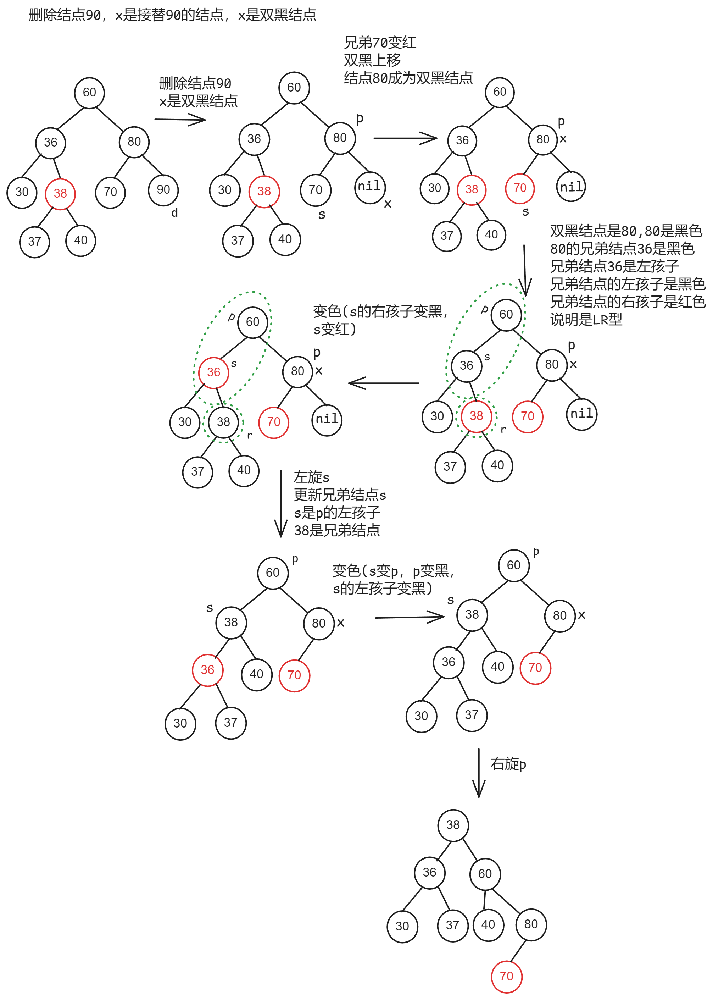

​							图6.4.4.7

```c
//在双黑结点上移的过程中，如果双黑结点是非根非红的结点就需要继续调整
//T指向树根，继续调整就是继续执行while循环
while(x!=T && x->color==BLACK){
    //如果双黑结点x是右孩子，则兄弟结点s是左孩子
    if(x==x->parent->right){
        //获取父亲结点
        p = x->parent;
        //获取兄弟结点
        s = p->left;
        //获取兄弟结点的左孩子
        l = s->left;
        //获取兄弟结点的右孩子
        r = s->right;
        //Case 2: 兄弟是黑色且兄弟的两个孩子都是黑色
    if (s->left->color == BLACK && s->right->color == BLACK) {
            //兄弟变红
            s->color = RED;
            //双黑结点上移
            x = p;
      }
   }  
}
//如果双黑结点x是红色结点或者根结点，就将该结点改为黑色
if(x!=nil){
    x->color = BLACK;
}
```

（1.3）在双黑结点上移的过程中，如果发现双黑结点是红色需要将双黑结点变为黑色，然后消除双黑结点。如图6.4.4.8所示，删除结点90，x成为接替90的双黑结点，将兄弟结点70变红，双黑上移，将双黑结点更新为80，因为双黑结点80是红色，将80变黑，消除双黑结点80，到此调整完成。

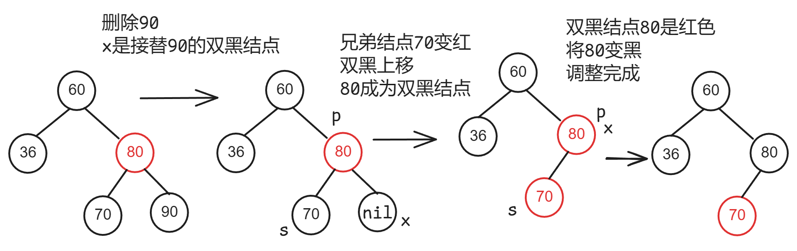

​								图6.4.4.8

```c
//在双黑结点上移的过程中，如果双黑结点是非根非红的结点就需要继续调整
//T指向树根，继续调整就是继续执行while循环
while(x!=T && x->color==BLACK){
   ....
}
//如果双黑结点x是红色结点或者根结点，就将该结点改为黑色
if(x!=nil){
    x->color = BLACK;
}
```

（1.3）在双黑结点上移的过程中，如果发现双黑结点是根结点需要将双黑结点变为黑色，然后消除双黑结点。如图6.4.4.9所示，删除结点90，x成为接替90的双黑结点，将兄弟结点70变红，双黑上移，将双黑结点更新为80，因为双黑结点80是红色，将80变黑，消除双黑结点80，到此调整完成。

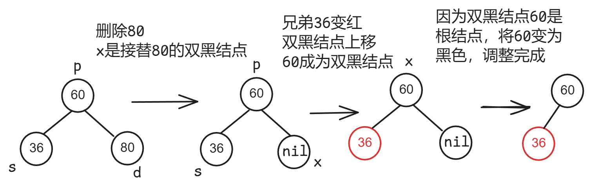

​								图6.4.4.9

```c
//在双黑结点上移的过程中，如果双黑结点是非根非红的结点就需要继续调整
//T指向树根，继续调整就是继续执行while循环
while(x!=T && x->color==BLACK){
   ....
}
//如果双黑结点x是红色结点或者根结点，就将该结点改为黑色
if(x!=nil){
    x->color = BLACK;
}
```

（1.4）兄弟结点是红色，父亲变红，兄弟变黑，右旋父亲结点，更新兄弟结点，兄弟结点成为父亲结点的左孩子，双黑结点保持不变，按照兄弟结点是黑色的调整规则继续调整。如图6.4.4.10所示。

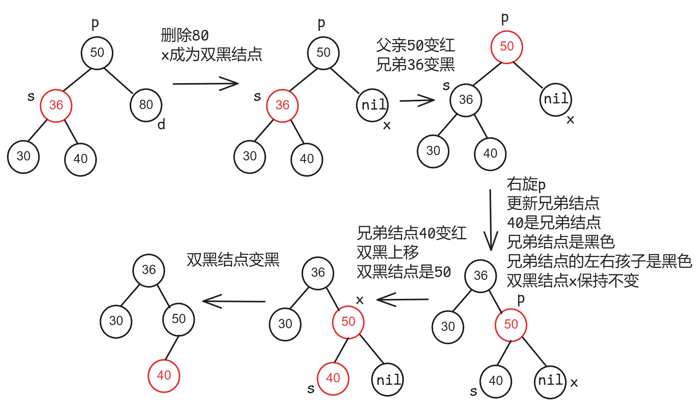

​							图6.4.4.10

```c
//在双黑结点上移的过程中，如果双黑结点是非根非红的结点就需要继续调整
//T指向树根，继续调整就是继续执行while循环
while(x!=T && x->color==BLACK){
   //如果双黑结点x是右孩子，则兄弟结点s是左孩子
    if(x==x->parent->right){
        //获取父亲结点
        p = x->parent;
        //获取兄弟结点
        s = p->left;
        //获取兄弟结点的左孩子
        l = s->left;
        //获取兄弟结点的右孩子
        r = s->right;
        //如果兄弟结点是红色
        if(s->color==RED){
            //父亲变红
            p->color = RED;
            //兄弟变黑
            s->color = BLACK;
            //右旋p，T指向树根
            RightRotate(p,T);
            //更新兄弟结点s，兄弟结点是p的左孩子
            s = p->left;
      }
   }

}
//如果双黑结点x是红色结点或者根结点，就将该结点变为黑色，到此调整结束
if(x!=nil){
    x->color = BLACK;
}
```

(2.1) 双黑结点的兄弟结点是右孩子，兄弟结点是黑色，兄弟结点的左孩子颜色任意，右孩子是红色，说明是RR型，RR型调整方法为：兄弟结点s变成父亲结点p的颜色，父亲结点p变成黑色，s的右孩子变黑，左旋父亲结点p。 如图6.4.4.11所示。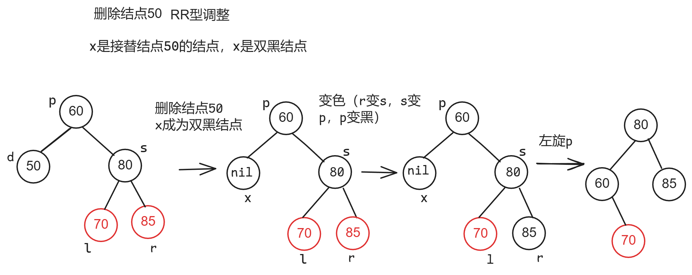

​							图6.4.4.11

```c
//如果双黑结点x是左孩子，则兄弟结点s是右孩子
if(x==x->parent->left){
    //获取父亲结点
    p = x->parent;
    //获取兄弟结点
    s = p->right;
    //获取兄弟结点的左孩子
    l = s->left;
    //获取兄弟结点的右孩子
    r = s->right; 

    // Case 4: 当兄弟结点的右孩子是红色，说明是RR型
    //s的颜色变成p的颜色
    s->color = p->color;
    //p变黑
    p->color = BLACK;
    //s的右孩子变黑
    s->right->color = BLACK;
    //左旋p
    LeftRotate(p, T);
    break; // 调整结束
}
```

(2.2) 双黑结点的兄弟结点是右孩子，兄弟结点是黑色，兄弟结点的左孩子是红色，右孩子是黑色，说明是RL型，RL型调整方法为：兄弟结点s的左孩子变黑，兄弟结点s变红，右旋兄弟结点s，更新兄弟结点，s成为p的右孩子。按照RR型调整规则进行调整， 如图6.4.4.12所示。

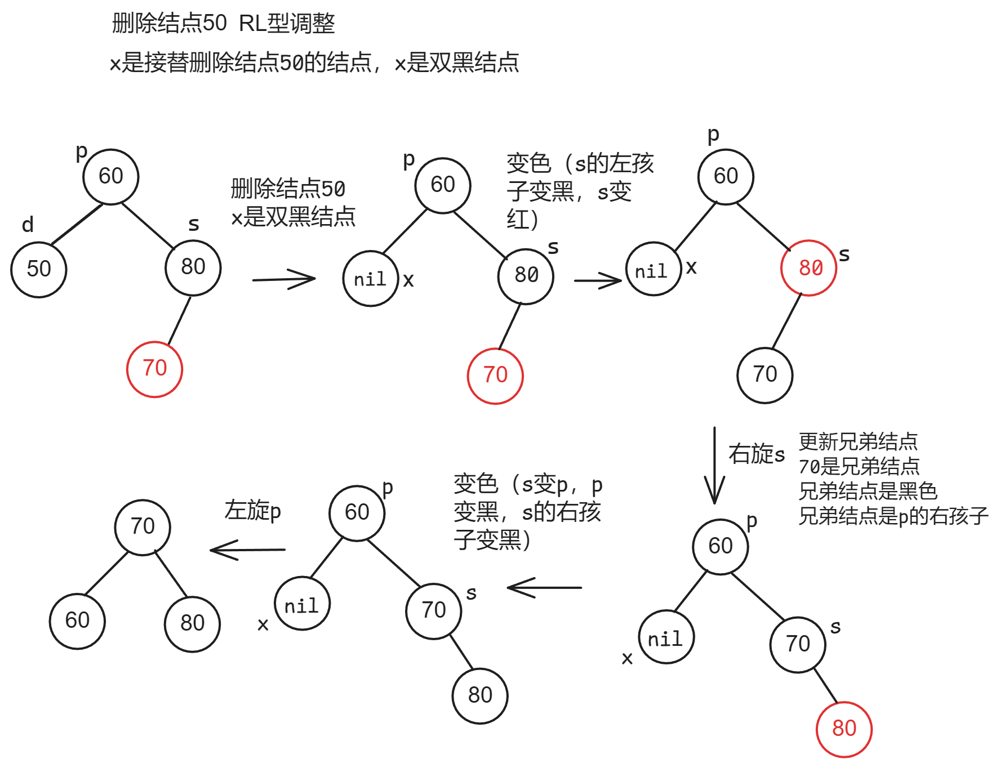

​							图6.4.4.12

```c
//如果双黑结点x是左孩子，则兄弟结点s是右孩子
if(x==x->parent->left){
    //获取父亲结点
    p = x->parent;
    //获取兄弟结点
    s = p->right;
    // Case 3: 当兄弟结点的右孩子是黑色，说明是RL型
    if (s->right->color == BLACK) {
        //s的左孩子变黑
        s->left->color = BLACK;
        //s变红
        s->color = RED;
        //右旋s
        RightRotate(s, T);
        //更新兄弟结点，s成为p的右孩子
        //RL型转变成RR型，按照RR型调整规则进行调整
        s = p->right;
    }
    
    // Case 4: 当兄弟结点的右孩子是红色，说明是RR型
    //s的颜色变成p的颜色
    s->color = p->color;
    //p变黑
    p->color = BLACK;
    //s的右孩子变黑
    s->right->color = BLACK;
    //左旋p
    LeftRotate(p, T);
    break; // 调整结束  
}
```

（2.3）兄弟结点是右孩子，兄弟结点是黑色，兄弟结点的左右孩子都是黑色，需要将兄弟变红，双黑结点上移，更新双黑结点继续调整。如果双黑结点是红色或者根结点，则将双黑结点变为黑色，到此调整完成。操作过程见图6.4.4.7-图6.4.4.9。

（2.4）兄弟结点是右孩子，兄弟结点是红色，父亲变红，兄弟变黑，左旋父亲结点，更新兄弟结点，兄弟结点是父亲结点的右孩子，双黑结点保持不变，按照兄弟结点是黑色的调整规则继续调整。如图6.4.4.13所示。

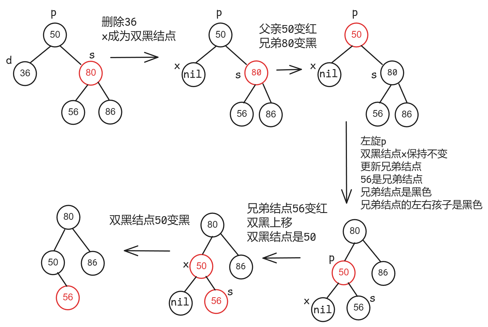

​						 图6.4.4.13

```c
//在双黑结点上移的过程中，如果双黑结点是非根非红的结点就需要继续调整
//T指向树根，继续调整就是继续执行while循环
while(x!=T && x->color==BLACK){
   //如果双黑结点x是左孩子，则兄弟结点s是右孩子
    if(x==x->parent->left){
        //获取父亲结点
        p = x->parent;
        //获取兄弟结点
        s = p->right;
        //获取兄弟结点的左孩子
        l = s->left;
        //获取兄弟结点的右孩子
        r = s->right;
        //如果兄弟结点是红色
        if(s!=NULL && s->color==RED){
            //父亲变红
            p->color = RED;
            //兄弟变黑
            s->color = BLACK;
            //左旋p，T指向树根
            LeftRotate(p,T);
            //更新兄弟结点s，兄弟结点是p的右孩子
            //按照兄弟结点是黑色的调整规则继续调整
            s = p->right;
      }
   }
}
//如果双黑结点x是红色结点或者根结点，就将该结点变为黑色，到此调整结束
if(x!=nil){
    x->color = BLACK;
}
```

红黑树删除之后调整代码如下：

```c
// 红黑树删除后调整,T指向树根,x是双黑结点
void rbtreeDeleteAdjust(rbtreeNode* x, rbtreeNode* &T) {
	//如果x是非根非红的结点就需要继续执行while循环
	//如果x是根结点或者红色结点就不执行while循环
	while(x != T && x->color == BLACK){
		//如果x是右孩子，兄弟结点是左孩子
		if (x == x->parent->right) {
			//获取父亲结点p
			rbtreeNode* p = x->parent;
			//获取兄弟结点
			rbtreeNode* s = p->left;
			//Case 1: 兄弟是红色，将兄弟变为黑色，更新兄弟结点
			//按照兄弟结点是黑色的规则进行调整
			if (s->color == RED) {
				//父亲变红
				p->color = RED;
				//兄弟变黑
				s->color = BLACK;
				//右旋父亲p
				RightRotate(p, T);
				//更新兄弟结点，兄弟结点是父亲结点的左孩子
				s = p->left;
			}
			//Case 2: 兄弟是黑色且兄弟的两个孩子都是黑色
			if (s->left->color == BLACK && s->right->color == BLACK) {
				//兄弟变红
				s->color = RED;
				//双黑结点上移
				x = p;
			} else {
				// Case 3: 兄弟结点左孩子是黑色说明是LR型
				if (s->left->color == BLACK) {
					//s的右孩子变黑
					s->right->color = BLACK;
					//s变红
					s->color = RED;
					//左旋s
					LeftRotate(s, T);
					//更新兄弟结点s
					//s是p的左孩子
					s = p->left;
				}
				
				//兄弟结点左孩子是红色说明是LL型
				//s变p
				s->color = p->color;
				//p变黑
				p->color = BLACK;
				//s的左孩子变黑
				s->left->color = BLACK;
				//右旋p
				RightRotate(p, T);
				break; // 调整结束
			}
			//如果x是左孩子，兄弟结点是右孩子
		} else {
			//获取父亲结点p
			rbtreeNode* p = x->parent;
			//获取兄弟结点
			rbtreeNode* s = p->right;
			//Case 1: 兄弟是红色，将兄弟变为黑色，更新兄弟结点
			//按照兄弟结点是黑色的规则进行调整
			if (s->color == RED) {
				//父亲变红
				p->color = RED;
				//兄弟变黑
				s->color = BLACK;
				//左旋父亲p
				LeftRotate(p, T);
				//更新兄弟结点，兄弟结点是父亲结点的右孩子
				s = p->right;		
			}
			
			//Case 2: 兄弟是黑色且兄弟的两个孩子都是黑色
			if (s->left->color == BLACK && s->right->color == BLACK) {
				//兄弟变红
				s->color = RED;
				//双黑结点上移
				x = p;
			} else {
				// Case 3: 当兄弟结点的右孩子是黑色，说明是RL型
				if (s->right->color == BLACK) {
					//s的左孩子变黑
					s->left->color = BLACK;
					//s变红
					s->color = RED;
					//右旋s
					RightRotate(s, T);
					//更新兄弟结点，s成为p的右孩子
					//按照RR型调整规则进行调整
					s = p->right;
				}
				
				// Case 4: 当兄弟结点的右孩子是红色，说明是RR型
				//s的颜色变成p的颜色
				s->color = p->color;
				//p变黑
				p->color = BLACK;
				//s的右孩子变黑
				s->right->color = BLACK;
				//左旋p
				LeftRotate(p, T);
				break; // 调整结束
			}
		}
	}
    //如果双黑结点x是根结点或者红色结点，将x变成黑色
	if (x != nil) {
		x->color = BLACK;
	}
}
```

红黑树删除结点代码如下：

```c
//T指向树根，key是要删除的结点的值
void rbtreeDelete(rbtreeNode* &T,int key){
	//child获取要删除结点的孩子
	rbtreeNode* child = nil;
	//p指向树根
	rbtreeNode* p = T;
	//定义变量delColor记录删除结点的颜色
	int delColor = -1;
	//定义变量x记录接替删除结点的结点，也就是双黑结点
	rbtreeNode* x = nil;
	//如果p等于nil说明没有找到key，如果p->data==key说明找到key
	while(p!=nil && p->key!=key){
		//如果key的值大于当前p指向的结点的值，则p指针移动，p指向p的右孩子。
		if(key > p->key){
			p = p->right;
			//如果key的值小于当前p指向的结点的值，则p指针移动，p指向p的左孩子。
		}else{
			p = p->left;
		}
	}
	//如果p等于nil说明key不存在或者树为空
	if(p==nil){
		return;
		//如果p不等于nil说明key存在,p指向要删除的结点,parent指向要删除结点的父亲结点
	}else{
		//程序执行到这里说明要删除的结点存在
		//定义变量f记录删除结点的父亲结点
		rbtreeNode* f = nil;
		//如果p是叶子结点
		if(p->left==nil&&p->right==nil){
			//获取删除结点p的父亲结点f
			f = p->parent;
			//如果f为nil说明删除结点p没有父亲结点，p就是根结点
			//此时p是红黑树中唯一的结点
			if(f==nil){
				//删除根结点
				delete(p);
				//此时树中没有结点，T指向nil
				T = nil;
				//此时树中没有结点，无需调整函数结束
				return;
			//如果f不等于nil说明删除结点p有父亲结点	
			}else{
				//如果p是左孩子
				if(p==f->left){
					//f的left指针指向nil
					f->left = nil;
					//nil的父亲是f
					nil->parent = f;
					//如果p是右孩子
				}else{
					//f的right指针指向nil
					f->right = nil;
					//nil的父亲是f
					nil->parent = f;
				}
				//接替删除结点的是nil
				x = nil;
				//获取删除结点p的颜色
				delColor = p->color;
				//删除p
				delete(p);
			}
			
			//如果要删除的结点p只有1个孩子
		}else if(p->left!=nil&&p->right==nil || p->left==nil&&p->right!=nil){
			//获取删除结点p的父亲结点f
		    f = p->parent;
			//获取要删除结点的孩子
			//如果要删除结点的左孩子存在
			if(p->left!=nil){
				child = p->left;
				//如果要删除结点的右孩子存在
			}else{
				child = p->right;
			}
			//如果删除结点p没有父亲结点，则p是根结点
			if(f==nil){
				//删除根结点p
				delete(p);
				//更新树根，树根是child
				T = child;
				//树根的parent设置为nil
				T->parent = nil;
			//如果删除结点p是左孩子	
			}else if(p==f->left){
				//将f的left指向child
				f->left = child;
				//child的父亲是f
				child->parent = f;
			//如果删除结点p是右孩子	
			}else{
				//将f的right指向child
				f->right = child;
				//child的父亲是f
				child->parent = f;
			}
			//接替删除结点的是child
			x = child;
			//获取删除结点p的颜色
			delColor = p->color;
			//删除p
			delete(p);
			//如果要删除的结点p左右孩子都存在
		}else{
			//获取删除结点的右孩子
			rbtreeNode* succeed = p->right;
			/*沿着succeed的left指针向下找，
			直到找到没有左孩子的结点为止，这个
			没有左孩子的结点就是删除结点的后继结点*/
			while(succeed->left!=nil){
				succeed = succeed->left;
			}
			//while循环结束，succeed指向删除结点的后继结点
			//获取后继结点succeed的父亲结点
			rbtreeNode* f = succeed->parent;
			//将删除结点的值修改为后继结点的值
			p->key = succeed->key;
			//如果后继结点的右孩子存在，删除后继结点
			if(succeed->right!=nil){
				//如果后继结点succeed是f的左孩子
				if(succeed==f->left){
					//f的left指针指向后继结点的右孩子
					f->left = succeed->right;
					//后继结点的右孩子的父亲是f
					(succeed->right)->parent = f;
					//如果后继结点succeed是f的右孩子	
				}else{
					//f的right指针指向后继结点的右孩子
					f->right = succeed->right;
					//后继结点的右孩子的父亲是f
					(succeed->right)->parent = f;
				}
				//接替删除结点的是后继结点的右孩子
				x = succeed->right;
				//如果后继结点是叶子结点，删除后继结点
			}else{
				//获取后继结点succeed的父亲结点f
				rbtreeNode* f = succeed->parent;
				if(succeed==f->left){
					//f的left指针指向nil
					f->left = nil;
					//nil的父亲是f
					nil->parent = f;
				}else{
					//f的right指针指向nil
					f->right = nil;
					//nil的父亲是f
					nil->parent = f;
				}
				//接替删除结点的是nil
				x = nil;
			}
			//获取删除结点succeed的颜色
			delColor = succeed->color;
			//删除后继结点succeed
			delete(succeed);	
		}
	}
	//如果删除结点是红色不需要调整
	//如果删除结点是黑色需要调整
	if(delColor==BLACK){
		//x是接替删除结点的结点（双黑结点）
		//T指向树根
		rbtreeDeleteAdjust(x,T);
	}
}
```

​																							

## 6.5 哈希表

### 6.5.1  哈希表的概念

哈希表又叫散列表，英文名字叫Hash  Table，哈希表通常使用数组+单链表来实现。哈希函数是一个数学公式，根据这个公式可以求出关键字在哈希表中的插入位置，这个插入位置就是哈希地址。哈希地址就是数组中元素的下标。哈希函数的构造方法最常用的是除留余数法，公式为：
												H（key） = key % p
H（key）是关键字key在哈希表中的插入位置，key是需要插入哈希表的关键字的值，%是取余，p是模数，如果哈希表的表长是素数，则p等于哈希表的表长，如果哈希表的表长不是素数，则p的值等于小于或者等于哈希表表长的最大素数，这样可以最大程度减少哈希冲突，下面会介绍哈希冲突。图6.5.1.1中关键字的插入顺序为7, 20 ,1 ,14, 5。使用哈希函数求出哈希地址，这个哈希地址是关键字在哈希表的插入位置，图6.5.1.1中，使用哈希函数求出关键字7的哈希地址是7，需要将7插入在哈希表下标7的位置，使用哈希函数求出关键字5的哈希地址是5，需要将5插入在哈希表下标5的位置，其他关键字的插入方法类似。哈希表中的关键字就是数组中存储的元素，哈希地址就是数组元素的下标。

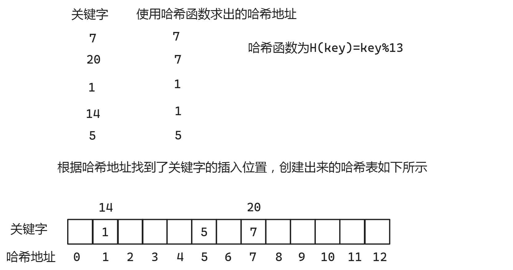

​												图6.5.1.1

从图9.7.1中可以发现，关键字1和14共用1个哈希地址，关键字7和20共用1个哈希地址，当多个关键字共用1个哈希地址时，这种情况叫做哈希冲突。当多个关键字共用1个哈希地址时，这些关键字叫做同义词。如图6.5.1.1所示，1和14是同义词，7和20是同义词。哈希冲突是不允许出现的。因为哈希表的构建需要用到数组，哈希地址对应的就是数组的下标，每个数组下标只能存放一个关键字。如何解决哈希冲突？最常用的方法为链地址法。链地址法是使用数组+若干个单链表来实现哈希表，数组的下标对应的是哈希地址，数组中不存放关键字，数组中存放的是单链表中第一个哈希结点的地址，单链表中每个哈希结点的数据域存放的是关键字的值，指针域存放下一个哈希结点的地址。如何使用链地址法在哈希表中插入关键字？先使用哈希函数计算出关键字的哈希地址，然后将关键字插入哈希地址对应的单链表中，同义词都存储在一个单链表中。如图6.5.1.2是使用链地址法创建的哈希表。关键字的插入顺序为7,20,1,14,5。哈希表的表长是13，因为小于或者等于哈希表表长的最大素数是13，所以哈希函数为H（key） = key % 13。单链表使用头插法。如图6.5.1.2所示，ht[1]保存的是哈希结点14的地址，因此ht[1]指向哈希结点14，ht[5]保存的是哈希结点5的地址，因此ht[5]指向哈希结点5，ht[7]保存的是哈希结点20的地址，因此ht[7]指向哈希结点20。

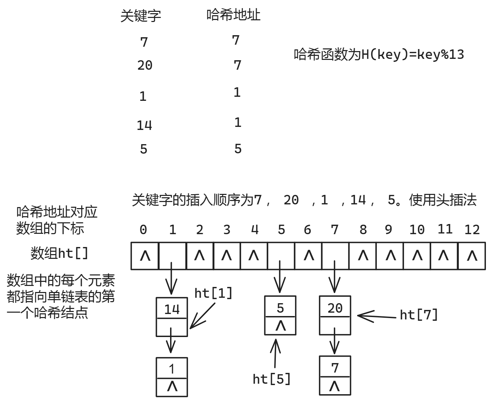

​													图6.5.1.2

使用头插法在哈希表中插入元素的过程如图6.5.1.3所示，哈希函数为H（key） = key % 13。因为H（14） = 14 % 13 = 1。因此关键字14需要插入在下标1对应的单链表中，ht[1]指向下标1对应的单链表中第一个结点。因为H（20） = 20 % 13 = 7。因此关键字20需要插入在下标7对应的单链表中，ht[7]指向下标7对应的单链表中第一个结点。

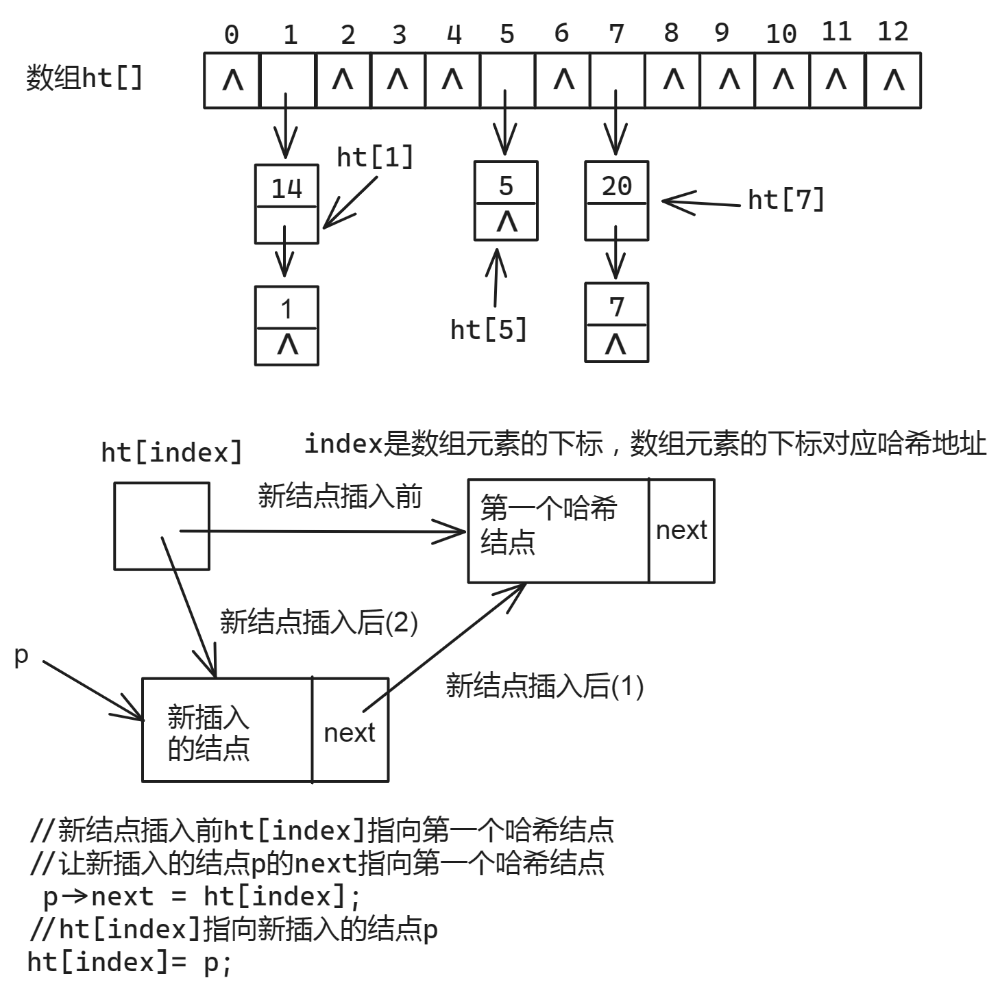

​													图6.5.1.3

在哈希表中删除元素的过程如图6.5.1.4所示：删除元素之前需要先求出关键字的哈希地址index，然后在下标index对应的单链表中删除关键字。

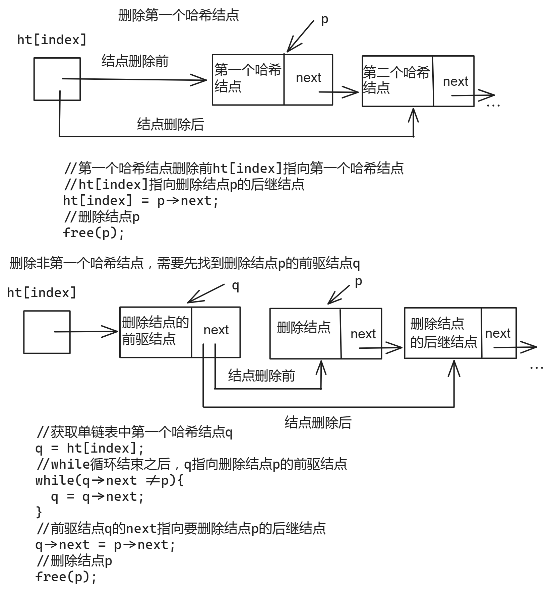

​												图6.5.1.4


### 6.5.2 哈希表的代码实现

使用链地址法实现哈希表代码如下：

```c
#include <stdio.h>
#include <malloc.h>
//Num是哈希表中数组可以存储的元素的个数，表长使用素数
#define Num 13
//定义哈希结点
typedef struct HashNode{
	int data;//数据域
	struct HashNode * next;//指针域
}HashNode;

//初始化哈希表中的数组,将哈希表中的数组中的每一个元素的值都设置为NULL
void InitHashTable(HashNode* HashTable[]){
	for(int i=0;i<Num;i++){
		HashTable[i] = NULL;
	}
}

//定义Hash函数，使用除留余数法
int hash(int key){
	return key % Num;
}
//使用头插法将数据插入在头结点的后面
void insertHashTable(HashNode* HashTable[],int key){
	//调用hash函数求出key在哈希表中插入的位置
	int index = hash(key);
	//创建1个新结点
	HashNode* p = (HashNode*)malloc(sizeof(HashNode));
	p->data = key;
	//HashTable[index]指向单链表中第一个哈希结点，新插入的结点p的next指向第一个哈希结点
	p->next = HashTable[index];
	//HashTable[index]指向新插入的结点p
	HashTable[index] = p;
}
//打印哈希表
void print(HashNode* HashTable[]){
	for(int i=0;i < Num;i++){
		//获取第一个哈希结点的地址，p指向第一个哈希结点
		HashNode *p = HashTable[i];
		//输出i的值
		printf("%d: ",i);
		//遍历单链表
		while(p!=NULL){
			//输出哈希结点data的值
			printf("%d ",p->data);
			//指针p向后移动1个位置，p指向下一个哈希结点
			p = p->next;
		}
		//换行
		printf("/n");	
	}
}
//查询哈希表
HashNode* selectHashTable(HashNode* HashTable[],int key){
	//查询当前的key值在哈希表中的存储位置
	int index = hash(key);
	//p指向单链表中的第一个哈希结点
	HashNode * p = HashTable[index];
	//在单链表中查找data为key的哈希结点
	//当p为NULL时，说明哈希表中没有key。当p->data==key时说明找到了key，这两种情况发生时while循环结束
	while(p!=NULL &&p->data!=key){
		//指针p向后移动1个位置，p指向下一个哈希结点
		p = p->next;
	}
	//程序执行到这里p可能为NULL，p也可能指向查询到的哈希结点
	return p;
}

//删除哈希表中的哈希结点
//分三种情况考虑:(1)要删除的结点是单链表中第一个哈希结点(2)要删除的结点不是单链表中第一个哈希结点
//(3)要删除的结点不存在
void deleteHashNode(HashNode* HashTable[],int key){
	//查询key在哈希表中是否存在
	HashNode * p = selectHashTable(HashTable,key);
	//如果p为NULL说明key在哈希表中不存在
	if(p==NULL){
		return;
	}
	//程序执行到这里说明p不为NULL，key在哈希表中存在，此时p指向要删除的哈希结点
	//查询要删除的哈希结点在哈希表中的下标
	int index = hash(key);
	//获取单链表中第一个哈希结点q
	HashNode * q =  HashTable[index];
	//如果要删除的结点是单链表中第一个哈希结点,HashTable[index]指向删除结点p的后继结点
	if(q==p){
		HashTable[index] = p->next;
		//删除结点p
		free(p);
		return;
	}
	//如果要删除的结点不是单链表中第一个哈希结点，则要查找要删除的结点p的前驱结点
	while(q->next !=p){
		q = q->next;
	}
	//程序执行到这里q指向要删除结点p的前驱结点
	//前驱结点q的next指向要删除结点p的后继结点
	q->next = p->next;
	//删除结点p
	free(p);
}
int main(){
	//定义指针数组HashTable，数组中存放的是第一个哈希结点的地址，数组中每个元素看作单链表的头结点
	HashNode* HashTable[Num];
	//哈希表初始化
	InitHashTable(HashTable);
	//定义数组arr
	int arr[] ={7,20,1,14,5};
	//求数组arr的元素个数
	int n = sizeof(arr)/sizeof(int);
	//定义for循环，将数据插入哈希表
	for(int i = 0;i < n;i++){
		insertHashTable(HashTable,arr[i]);
	}
	//打印哈希表
	print(HashTable);
	printf("/n");
	//查询哈希表
	int key = 1;
	//查询key是否存在
	HashNode * p = selectHashTable(HashTable,key);
	if(p==NULL){
		printf("%d不存在/n",key);
	}else{
		printf("%d存在/n",key);
	}
	//删除结点
	deleteHashNode(HashTable,14);
	deleteHashNode(HashTable,1);
	//打印哈希表
	print(HashTable);
	return 0;
}
```


